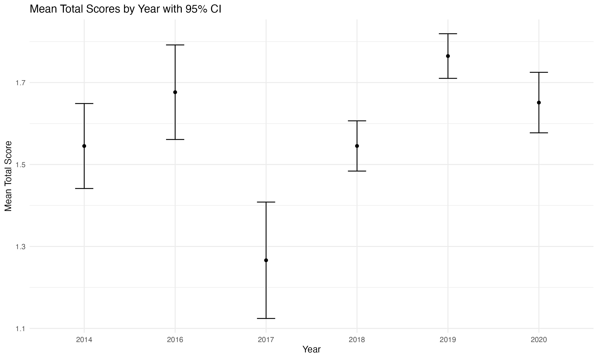

```{r packages, include=FALSE}
packages = c("tidyverse", "viridis", "colorspace","gghalves","ggthemes","skimr","Superpower","tidyr", "psych", "dplyr", "ggplot2", "sjmisc", "janitor", "rcompanion", "lsr", "papaja", "afex", "ltm","forestplot","trackdown","effsize","misty")

## Now load or install&load all
package.check <- lapply(
  packages,
  FUN = function(x) {
    if (!require(x, character.only = TRUE)) {
      install.packages(x, dependencies = TRUE)
      library(x, character.only = TRUE)
    }
  }
)
```

```{r setup, echo = FALSE}

# Loading data from source
url <- "https://raw.githubusercontent.com/jorowags/crep_griskevicius/main/All%20data%20without%20extension%20variables.csv"
data <- read.csv(url)
orig.data <- data
```

```{r, echo=FALSE}
data[data == ""] <- NA              
```

**Corresponding author**:

Ljiljana B. Lazarević, Faculty of Philosophy, University of Belgrade Čika Ljubina 18-20, 11000 Belgrade, Serbia Email: [ljiljana.lazarevic\@f.bg.ac.rs](mailto:ljiljana.lazarevic@f.bg.ac.rs) Phone: +381 64 1287 614

**Author contribution:** to be filled in

**Conflict of interest statement:** The authors report no conflict of interest.

**Funding statement:** This project was funded in part by NSF Award 2141930 to J. Wagge.

**Ethics committee approval:** This research was approved under an "umbrella" ethics proposal at the Institutional Review Board of the Department of Psychology, University of Belgrade (Protocol #2021-069). At each site where there was a local ethics board and where ethics approval was required, the local board approved the study. This study complied with the ethics code outlined in the Declaration of Helsinki.

**Acknowledgment:** The authors would like to thank all students, supervisors, and reviewers who contributed to this CREP project. The authors would like to specifically thank Drs. Mark Brandt and Hans IJzerman for their vision and early dedication to the CREP.

```{r, include = FALSE}

# Descriptive statistics for project characteristics
# Frequency tables for project code, survey language, countries, institute code, setting, and condition
frq(data$project_code)
frq(data$survey_language)
frq(data$country)
frq(data$institute_code)
frq(data$setting)
frq(data$condition)

# Counting number of unique projects, survey languages, institutes, and countries to report in manuscript
n_projects <- length(unique(data$project_code[data$project_code != "NANA"]))
n_survey_language <- length(unique(data$survey_language[data$survey_language != "NANA"]))
n_institutes <- length(unique(data$institute_code[data$institute_code != "NANA"]))
n_country <- length(unique(data$country[data$country != "NANA"]))
```

## Introduction 

The Collaborative Replications and Education Project (Wagge, Brandt, et al., 2019), or CREP, is an initiative seeking to improve undergraduate training in research methods. CREP’s role includes selecting studies to be closely replicated by students, structuring the methods for the replication, reviewing projects both before and after data collection, and facilitating the publication of a pooled analysis (such as the present paper). Authors agree that replications are regarded as a gold standard warranting reliability of published findings (Open Science Collaboration, 2015). In addition, it was found that for students conducting replication of highly-cited studies is perceived as exciting, and it also gives them the real opportunity to make substantial contributions to the field (Grahe et al., 2012; Frank et al., 2012). 

CREP participants include students and instructors at institutions worldwide^[As of October 2023, 480 projects at 174 institutions in 29 countries have been initiated.]. CREP is an alternative to the traditional undergraduate research experience offering several advantages. First, the CREP model, utilized by students and instructors worldwide, allows students to learn about best practices by directly replicating published work by scholars in their field. This active learning experience--also known in teaching literature as mastery experience or high-impact learning practice --can be an important predictor of academic achievement (Loo & Choy, 2013). Second, students get to participate in authentic scientific research (Grahe, 2017) that may eventually be published in a pooled analysis and will also be openly available on the Open Science Framework (which is an open-source management tool that facilitates open and transparent collaboration in scientific research) to meta-analytic researchers in the future. Furthermore, students have the option of performing a “replication+” study to add their own additional research question, condition, or measure to the replication study (assuming it does not interfere with the direct replication). Moreover, students learn the importance of open science practices such as preregistration, replication, open methods, and open data, all of which are foundational to research integrity (Kidwell et al., 2016). Finally, students engage with reviewers (i.e., CREP team members) external to their institution, allowing for opportunities for collaboration and learning. To date, several CREP studies have been published (e.g., Ghelfi et al., 2020; Leighton et al., 2018; Wagge, Baciu, et al., 2019), and others have been included in meta-analyses (Lehmann et al., 2018), which testifies to the project’s ability to make substantial contributions to psychological science.

The present report documents a pooled analysis of data collected by teams who signed up to replicate one of CREP’s earliest selections for replication: Experiment 1 from Griskevicius et al. (2010).


### The original study: Promoting pro-environmental behavior through status competition 

Griskevicius and colleagues (2010) reported the results of three experiments suggesting that status competition can promote pro-environmental behavior. Per CREP procedures (see details in Methods - CREP Procedures), only one study in a multi-study paper is typically selected for replication. In this case, the CREP team selected the first experiment from Griskevicius et al. (2010) as it was the focal study that was conceptually replicated and extended in their subsequent experiments (see Methods for justification). Specifically, the original authors showed that activating status motives (desires for social status and prestige) leads people to choose “green” (environmentally-friendly) products over more luxurious non-green products (Study 1). The authors predicted that reading the status story would increase the likelihood of choosing prosocial (green) products. In the absence of status motives (i.e., in the two control conditions), non-green products were viewed as more desirable than their green counterparts. A composite “green” score was calculated by adding up the number of “green” choices the participant made (no green choices - 0; all green choices - 3). However, after status motives were induced, participants were substantially more likely to choose green products (*d* = 0.47). In summary, Griskevicius and colleagues (2010) found that activating status motives inclines people to choose pro-environmental products over more luxurious non-green products, potentially in efforts to signal prosocial, self-sacrificing behavior. Authors interpreted their findings with respect to the "competitive altruism" hypothesis (see Van Vugt et al., 2007), which explains that individuals attempt to appear more altruistic when competing for status. Publicly showing pro-environmental behavior suggests to others that you care and that you are willing and able to bear costs (such as paying more for a less luxurious product) to benefit others; these altruistic tendencies are valued by others and consequently confer prestige and status (Griskevicius et al., 2010). 

Experiment 1 examined how activating a status motive would influence respondents to choose between two products that cost the same amount, but one is a relatively luxurious, non-green product and the other is a less-luxurious, pro-environmental product. This multi-lab study aims to determine the robustness of the effect obtained by Griskevicius et al (2010) and to estimate the effect size more precisely. If the original study results are replicated, we would see, in this replication, that respondents in the social status condition would choose the less-luxurious but green product over the more luxurious but non-green product. Despite being published almost 15 years ago, the study still attracts a lot of attention and it has been cited almost 2,500 times. 

## Method

### CREP Procedures

This paper was selected for replication by following the standard CREP selection process, outlined by Wagge and colleagues (Wagge, Brandt, et al., 2019). This process that took place in 2013 resulted in the selection of several studies, including Experiment 1 from Griskevicius et al. (2010). 

Once the focal study was selected, the CREP leadership team sent an email to the corresponding author of the original work. The CREP team communicated its process and goals and asked for input on possible extension hypotheses and guidance for replication teams. The key components of this correspondence are available here: https://osf.io/vdo0i/wiki/home/. There are two key points from the correspondence: first, the main author noted that the effect may not replicate if participants did not equate “green” choices with prosocial behavior; second, the original first author noted that the connection between “green” choices and status was unique to politically liberal groups. The former will provide us with a lens through which we will interpret our results, while the latter provides an explanation for why many student teams included political ideology in their extension hypotheses.

In 2014, groups signed up for the project and prepared OSF project pages for pre-data collection review. These pre-data collection project pages had to include materials, a planned analytical strategy, a video documenting the procedure, and local Institutional Review Board (IRB) approval. The project pages were examined by two reviewers and the executive reviewer, at which point, projects were either approved or sent back for revisions until approval could be granted. Groups were asked to pre-register project pages prior to data collection. After data collection was completed, project pages were again reviewed by two reviewers and the executive reviewer. At this stage, project pages were revised to include the dataset, a short report describing the obtained results, and a signed completion pledge confirming that the research followed ethical guidelines and the predefined study protocol. Following a positive review, individual projects were deemed complete. 

#### Target sample size

Per early CREP policies, the required sample size was set as a rule of thumb to be at least half of the original N. For this study, the targeted sample size should have been 84 (half of the original N of 168), but unfortunately, in the documentation file, there was a typo (N = 82). Thus, the target sample size for each group was set to 82 respondents.

#### Differences from the original study

The original study was conducted in a lab, where participants were tested in small groups. Replications were conducted both in the lab and online. Some groups conducted direct replications, and some groups included extension variables (e.g., pro-environmental literacy, political ideology), but after the original protocol was completed. Characteristics of the replications can be found at https://osf.io/gt39p.

### Disclosures

#### Preregistrations

Each lab preregistered its materials, protocol, and analytical strategy on the OSF prior to data collection. Additionally, this meta-analysis was pre-registered: https://osf.io/ach3n.

#### Data, Materials, and Resources

The authors of the original study provided materials for replication. All groups who completed projects uploaded their data, analyses, and a short description of their results to their OSF project page. All datasets, materials, analytical scripts, and other materials can be found on the central project OSF page (https://osf.io/rh2nw/). The complete, anonymized dataset is available here: https://osf.io/3xrdf. A codebook for our merged data set with all variables collected as part of the project is available at https://osf.io/7nkhq/.

#### Reporting

A description of the sample size, data exclusions, manipulations, and measures are reported in the study.

#### Ethical approval

Data were collected in accordance with the 1964 Declaration of Helsinki. Overarching IRB approval for this study was obtained from the IRB of the Department of Psychology, University of Belgrade, Serbia (https://osf.io/pcwhg/). In addition, as part of the CREP procedure, all groups obtained local IRB approval when necessary.

### Sample

```{r, echo = TRUE, include = FALSE}
frq(data$gender)
describe(data$age)

gender <- table(data$gender)

n.gender.women <- as.numeric(gender[1])
n.gender.men <- as.numeric(gender[3])
n.gender.gendervariant <- as.numeric(gender[2])
n.gender.nonbinarytrans <- as.numeric(gender[4])
n.gender.prefernot <- as.numeric(gender[6])
n.gender.other <- as.numeric(gender[5])

n.gender.else <- n.gender.gendervariant+n.gender.nonbinarytrans+n.gender.other+n.gender.prefernot

n.gender.na <- as.numeric(sum(is.na(data$gender)))

mean.age <- round(mean(data$age, na.rm = TRUE), digits = 2)
n.age.na <- as.numeric(sum(is.na(data$age)))
sd.age <- round(sd(data$age, na.rm = TRUE), digits = 2)

```

From 2014 to 2020, 49 groups from nine different countries expressed interest in conducting a CREP replication of Griskevicius et al. (2010). Of these 49 groups, 25 did not contribute data to the final analysis: specifically, three did not create their OSF page, four did not begin data collection, five did not complete data collection, eleven did not provide their data, one did not provide their codebook, and one did not follow the CREP procedure. The final sample of completed projects included data collected by 24 groups from 6 different countries: USA, UK, Germany, Canada, the Netherlands, and Iceland. The overview of groups participating in this project can be found at https://osf.io/vc5rh. Overall, the present project included approximately 30 reviewers, 3 CREP assistants, and 3 executive reviewers.

The final  data set consisted of data collected from `r count(orig.data)` participants, by `r n_projects` different student groups. All individual data sets are available here: **[INSERT LINK WHEN READY]**. Each student group recruited at least 82 respondents, with the exception of one group that recruited 70 participants (due to the COVID-19 outbreak that interfered with the project). Nine groups failed to collect data on at least one of the following: age, gender, or race/ethnicity. Details about the missing data are available here: https://osf.io/vc5rh. 

A total of 21 participants were excluded prior to publicly posting the compiled dataset because they reported ages of 16 (*n* = 3) or 17 (*n* = 18); these exclusions resulted in a total final dataset of `r count(orig.data)` participants. The final sample consisted of `r n.gender.women` individuals who identified as women and `r n.gender.men` who identified as men; `r n.gender.else` participants identified as gender variant/non-conforming, “other”, “prefer not to say,” or transgender/non-binary. An additional `r n.gender.na` participants did not indicate their gender. The mean reported age for participants was `r mean.age` years (*SD* = `r sd.age`), though age was not collected for `r n.age.na` of the participants.

```{r, include = FALSE}
frq(data$recoded_race)
race.table <- table(data$recoded_race)

n.race.na <- as.numeric(sum(is.na(data$recoded_race)))
n.race.african <- as.numeric(race.table[1])
n.race.hispanic <- as.numeric(race.table[5])
n.race.indigenous <- as.numeric(race.table[2])
n.race.asian <- as.numeric(race.table[3])
n.race.black <- as.numeric(race.table[4])
n.race.middleeastern <- as.numeric(race.table[6])
n.race.multiracial <- as.numeric(race.table[7])
n.race.pacific <- as.numeric(race.table[8])
n.race.other <- as.numeric(race.table[9])
n.race.white <- as.numeric(race.table[10])

n.total.reported.race <- n.race.african + n.race.hispanic + n.race.asian + n.race.black + n.race.indigenous + n.race.middleeastern + n.race.multiracial + n.race.other + n.race.pacific + n.race.white

prop.race.white <- round(100*(n.race.white / n.total.reported.race), digits = 2)
prop.race.black <- round(100*(n.race.black + n.race.african) / n.total.reported.race, digits = 2)
prop.race.asian <- round(100*(n.race.asian / n.total.reported.race), digits = 2)
prop.race.hispanic <- round(100*(n.race.hispanic / n.total.reported.race), digits = 2)
prop.race.middleeastern <- round(100*(n.race.middleeastern / n.total.reported.race), digits = 2)
prop.race.multiracial <- round(100*(n.race.multiracial / n.total.reported.race), digits = 2)
prop.race.pacific <- round(100*(n.race.pacific / n.total.reported.race), digits = 2)
prop.race.other <- round(100*(n.race.other / n.total.reported.race), digits = 2)
prop.race.na <- round(100*(n.race.na) / (n.race.na + n.total.reported.race), digits = 2)

```

Demographic information about participant race/ethnicity was reported by some sites and not others, and within each site, the question varied in how it was asked^[Regarding demographics, the original study reported only information about gender of the participants (male and female). ]. Therefore, we recoded the original race information to include the following categories: White (*n* = `r n.race.white`, `r prop.race.white`%), Black (*n* = `r n.race.black`, `r prop.race.black`%), Asian (*n* = `r n.race.asian`, `r prop.race.asian`%), Hispanic/Latino (*n* = `r n.race.hispanic`, `r prop.race.hispanic`%), Middle Eastern (*n* = `r n.race.middleeastern`, `r prop.race.middleeastern`%), Multiracial (*n* = `r n.race.multiracial`, `r prop.race.multiracial`%), Native Hawaiian or Pacific Islander (*n* = `r n.race.pacific`, `r prop.race.pacific`%), and "other" (*n* = `r n.race.other`, `r prop.race.other`%). These reported percentages do not include the participants who either did not report their race/ethnicity or were not asked this question (*n* = `r n.race.na`, `r prop.race.na`% of the total).

### Procedure

The experiment was designed as a between-subject and included two conditions: one in which participants read a “cover” story designed to elicit “a desire for social status” (Griskevicius et al., 2010, p. 395), and a control condition, that is one with a control story that elicited similar affect, but not status motives. To eliminate potential suspicions, participants were instructed that they will participate in a study investigating memory and that they would be asked to recall information later in the session. To ensure that some particular aspect of the story second control condition in which participants did not read the story was included. In all conditions, participants were asked to choose between three pairs of products (a car, a dishwasher, and soap), in which each product was offered in proenvironmental (green) and a conventional (the more luxurious nongreen) form. For each choice, the two products were equal in price, were manufactured by the same company and also were described by key features of the product. Stories were the same as in the original study, see Griskevicius et al. (2010) for details.

Data were collected in the lab and online, using various survey platforms (e.g., Qualtrics). Each group documented the mode of data collection that they used. Respondents were recruited from both student and general populations. Descriptions of individual datasets, along with all deviations are available at https://osf.io/t8h3k.

Any additional variables were included after the main part of the study, that is, at the end of the survey.

### Treatment of missing data, data preparation, and data analysis

We excluded participants without responses for the dependent variables. To create a merged dataset, we accessed all individual datasets through each team’s OSF page if they were available, and contacted teams directly for their data if it was not. When necessary, we also contacted groups to obtain information on whether the dataset was raw or transformed and to obtain codebooks. Any missing data was left as is. 

We conducted the same analyses as the original paper: for each product (car, soap, and dishwasher) we reported percentages by condition, Chi-square tests, and Phi coefficients. We also computed a composite green score and ran an ANOVA across conditions (story, no story, and control story) and reported effect size and post-hoc comparisons using the HSD test.

One advantage of the multi-lab approach is that natural variation in the data collection process across different labs can be leveraged to test for moderators or boundary conditions (Kline et al., 2018). Accordingly, we also performed several exploratory analyses.  We ran 2 x 2 factorial ANOVAs to determine whether political orientation (liberal/conservative) or political party (democrat/republican) interacts with condition (control/status). We ran an ANOVA to explore whether different settings (online/lab) yielded different results. Second, as per the recommendation of the original authors, we tested the moderating role of political orientation.Third, we explored whether the main effects replicated in other countries in which we collected data, and tested potential differences between the US and other countries. Fourth, the long-lasting nature of our project (data collection was done between 2014 and 2020) enabled testing whether the effects differed across time. Lastly, the original authors stated that it would be worth testing for potential gender differences, thus, as part of our exploratory analyses we explored gender differences in status motives using a 2 x 2 factorial ANOVA (gender: woman or man; condition: control vs. status). All analyses were done using R markdown and R Studio (RStudio Team, 2020, R Core Team, 2021).

## Results

### Confirmatory Analyses

#### Green car

```{r, include = FALSE}
# From Experiment 1: 
# Original paper: 37.2% of participants chose the green
# car in the control condition, 54.5% of participants chose it in the
# status condition, chi2(1, N = 168) = 4.56, p = .033, phi = .165

# Combine no story & control story into a new variable, control

data$new_condition <- recode(data$condition, "control story" = "Control", "no story" = "Control", "status story" = "Status")

# Our results
# Percentage selected green car
# Percentage selected green car by condition 
car_table <- table(data$new_condition, data$greencar)
prop.table(car_table, 1)
print(car_table)
  
# Chi square test with Phi
chisq.car <- chisq.test(car_table)

# Create reported values for r snippets
chisq.car.stat <- round(as.numeric(chisq.car[1]), digits = 2)
chisq.car.p <- round(as.numeric(chisq.car[3]), digits = 2)
chisq.car.df <- as.numeric(chisq.car[2])
car.phi <- round(phi(car_table, digits = 3), digits = 3)

n.control.car.no <- as.numeric(car_table[1,1])
n.control.car.yes <- as.numeric(car_table[1,2])
n.status.car.no <- as.numeric(car_table[2,1])
n.status.car.yes <- as.numeric(car_table[2,2])

total.car.yes <- n.control.car.yes + n.status.car.yes
total.car.no <- n.control.car.no + n.status.car.no
total.car.n <- total.car.yes + total.car.no

prop.status.car.yes <- round(100*n.status.car.yes/(n.status.car.yes + n.status.car.no), digits = 2)
prop.control.car.yes <- round(100*n.control.car.yes/(n.control.car.yes + n.control.car.no), digits = 2)

```

The original paper found that participants selected the green car more often in the status condition (54.5%) than in the control condition (37.2%), $\chi^2$(1, N = 168) = 4.56, *p* = .033, $\phi$ = .165. In our sample, `r prop.control.car.yes`% of control participants selected the green car, compared to `r prop.status.car.yes`% of the status participants. We did not detect an effect of condition on green car selection, $\chi^2$(`r chisq.car.df`, N = `r total.car.n`) = `r chisq.car.stat`, *p* = `r chisq.car.p`, $\phi$ = `r car.phi`.

#### Green cleaner

```{r, include = FALSE}
# Original paper: choice of the green cleaner increased from 25.7% in the
# control condition to 41.8% in the status condition, chisq(1, N =
# 168) = 4.52, p = .034, phi = .164

# Our results: 
# Percentage selected green soap by condition
soap_table <- table(data$new_condition, data$greensoap)
print(soap_table)
prop.table(soap_table, 1)
  
# Chi square test
chisq.soap <- chisq.test(soap_table)
  
# Phi coefficient
phi(soap_table, digits = 3)

# Create reported values for r snippets
chisq.soap.stat <- round(as.numeric(chisq.soap[1]), digits = 2)
chisq.soap.p <- round(as.numeric(chisq.soap[3]), digits = 2)
chisq.soap.df <- as.numeric(chisq.soap[2])
soap.phi <- round(phi(soap_table, digits = 3), digits = 3)

n.control.soap.no <- as.numeric(soap_table[1,1])
n.control.soap.yes <- as.numeric(soap_table[1,2])
n.status.soap.no <- as.numeric(soap_table[2,1])
n.status.soap.yes <- as.numeric(soap_table[2,2])

total.soap.yes <- n.control.soap.yes + n.status.soap.yes
total.soap.no <- n.control.soap.no + n.status.soap.no
total.soap.n <- total.soap.yes + total.soap.no

prop.status.soap.yes <- round(100*n.status.soap.yes/(n.status.soap.yes + n.status.soap.no), digits = 2)
prop.control.soap.yes <- round(100*n.control.soap.yes/(n.control.soap.yes + n.control.soap.no), digits = 2)


```

Similarly, the original paper found that participants in the status condition selected the green soap more frequently than participants in the control condition (41.8% and 25.7%, respectively), $\chi^2$(1, N = 168) = 4.52, *p* = .034, $\phi$ = .164. In our sample, `r prop.control.soap.yes`% of the control and `r prop.status.soap.yes`% of the status participants selected the green soap. As with the "car" selection, we did not detect an effect of condition on the choice of cleaner, $\chi^2$(`r chisq.soap.df`, N = `r total.soap.n`) = `r chisq.soap.stat`, *p* = `r chisq.soap.p`, $\phi$ = `r soap.phi`.

#### Green dishwasher

```{r, include = FALSE}
# Original paper: Choice of the green dishwasher
# also increased from 34.5% in the control condition to 49.1% in the
# status condition, chisq(1, N = 168) = 3.30, p = .069, eff size .140

# Our results: 
# Percentage selected green dishwasher by condition
dishwasher_table <- table(data$new_condition, data$greendishwasher)
print(dishwasher_table)
prop.table(dishwasher_table, 1)
  
# Chi square test
chisq.dishwasher <- chisq.test(dishwasher_table)
  
# Phi coefficient
phi(dishwasher_table, digits = 3)

# Create reported values for r snippets
chisq.dishwasher.stat <- round(as.numeric(chisq.dishwasher[1]), digits = 2)
chisq.dishwasher.p <- round(as.numeric(chisq.dishwasher[3]), digits = 2)
chisq.dishwasher.df <- as.numeric(chisq.dishwasher[2])
dishwasher.phi <- round(phi(dishwasher_table, digits = 3), digits = 3)

n.control.dishwasher.no <- as.numeric(dishwasher_table[1,1])
n.control.dishwasher.yes <- as.numeric(dishwasher_table[1,2])
n.status.dishwasher.no <- as.numeric(dishwasher_table[2,1])
n.status.dishwasher.yes <- as.numeric(dishwasher_table[2,2])

total.dishwasher.yes <- n.control.dishwasher.yes + n.status.dishwasher.yes
total.dishwasher.no <- n.control.dishwasher.no + n.status.dishwasher.no
total.dishwasher.n <- total.dishwasher.yes + total.dishwasher.no

prop.status.dishwasher.yes <- round(100*n.status.dishwasher.yes/(n.status.dishwasher.yes + n.status.dishwasher.no), digits = 2)
prop.control.dishwasher.yes <- round(100*n.control.dishwasher.yes/(n.control.dishwasher.yes + n.control.dishwasher.no), digits = 2)
```

Finally, in the original paper, participants selected the green dishwasher more in the status condition than the control condition (49.1% and 34.5%, respectively), $\chi^2$(1, N = 168) = 3.30, *p* = .069, $\phi$ = .140. We found no such effect when comparing the control participants who selected the green dishwasher (`r prop.control.dishwasher.yes`%) to the status condition participants who did the same (`r prop.status.dishwasher.yes`%), $\chi^2$(`r chisq.dishwasher.df`, N = `r total.dishwasher.n`) = `r chisq.dishwasher.stat`, *p* = `r chisq.dishwasher.p`, $\phi$ = `r dishwasher.phi`.


#### Composite Green Score

```{r, include = FALSE}
# Original paper: In
# addition to examining the influence of status motives on each
# product individually, we also analyzed the effect of status when the
# three products were combined into a composite. As predicted, a
# one-way analysis of variance (ANOVA) on the product composite
# showed a significant effect of status, F(1, 166) = 8.53, p = .004,
# d = 0.47.

# Our results:


# Compute composite green score; recode Y as 1 and N as 0 for green products

data$greencar <- recode(data$greencar, "Yes" = 1, "No" = 0)
data$greendishwasher <- recode(data$greendishwasher, "Yes" = 1, "No" = 0)
data$greensoap <- recode(data$greensoap, "Yes" = 1, "No" = 0)

data$total <- data$greencar + data$greendishwasher + data$greensoap
describe(data$total)
mean.composite <- round(mean(data$total, na.rm = TRUE),digit = 2)
sd.composite <-round(sd(data$total, na.rm = TRUE), digits = 3)

# Do ANOVA by condition (status, no story, control story)
ungrouped.aov <- aov(data$total ~ condition, data = data)
summary(ungrouped.aov)
ungrouped.out <- apa_print(ungrouped.aov)

# post hoc testing
tukey.ungrouped <- TukeyHSD(ungrouped.aov)

# Ungrouped bar graph
ggplot(data[!is.na(data$condition), ], mapping=aes(x=condition, y=total))+
  stat_summary(fun.data=mean_sdl, geom="bar") +
  stat_summary(fun.data=mean_cl_boot, geom="errorbar", width = 0.3)

# Do ANOVA by new condition (control v status)
grouped.aov <- aov(data$total ~ new_condition, data = data)
summary(grouped.aov)
apa.grouped.out <- apa_print(grouped.aov)
apa.grouped.eta <- apa.grouped.out$table$estimate

data_grouped_d <- data
data_grouped_d$new_condition <- as.factor(data_grouped_d$new_condition)
data_grouped_d <- subset(data_grouped_d, !is.na(new_condition))
data_grouped_d$total<- as.numeric(data_grouped_d$total)
grouped.d <- cohen.d(data_grouped_d$total ~ data_grouped_d$new_condition)
grouped.d <- round(as.numeric(grouped.d[3]),2)

# Subset the data for the green/not green choices
choicevars <- c("greencar", "greensoap", "greendishwasher")
choice.data <- data[choicevars]

cron <- cronbach.alpha(choice.data, standardized = FALSE, na.rm = TRUE)
cron.x <- cron[1]
cron.x <- as.numeric(cron.x)
cron.x <- round(cron.x, digits = 2)

```

Internal consistency of the three items (i.e., products) was low (Cronbach's alpha = `r cron.x`) which was expected (Rammstedt & Beierlein, 2014; Malkewitz et al., 2023). Despite this, we followed the procedure used in the original study and computed a composite green score by assigning a score of "1" to all "green" selections and a score of "0" to all non-"green" selections. Because participants made a dichotomous choice for each of the three products, scores ranged from 0 (no "green" products) to 3 (all "green" products). The mean composite score was `r mean.composite` (*SD* = `r sd.composite`). The distribution of composite scores can be seen in Figure 1.

```{r, include = FALSE}
# Michał figure code
# load data
df <- read.csv('goingGreenReplicationData.txt')

# create green preference index
df$greenScore <- rowSums(apply(df[, 9:11], 2, str_count, 'Yes'))

### create Figure 1
g1 <- ggplot(df, aes(x = condition, y = greenScore))+
  scale_color_viridis(discrete = T,
                      option = 'viridis',
                      begin = .4,
                      end = .8)+
  scale_fill_viridis(discrete = T,
                     option = 'viridis',
                     begin = .4,
                     end = .8)+
  geom_point(
  aes(color = condition),
  position = position_jitter(width = .1),
  size = .55,
  alpha = .4)+
  stat_summary(fun = mean,
               geom = "point", 
               shape = 21, 
               size = 6,
               col = "black",
               fill = "yellow")+
  geom_half_boxplot(aes(fill = condition),
                    alpha = .4,
                    side = 'r',
                    outlier.shape = NA,
                    center = T,
                    position = position_nudge(x = .15),
                    errorbar.draw = F,
                    width = .2)+
  geom_half_violin(aes(fill = condition),
                   alpha = .4,
                   side = 'r',
                   bw = .3,
                   position = position_nudge(x = .3))+
  geom_rangeframe()+
  theme_tufte()+
  scale_x_discrete(labels = c('CONTROL STORY', 'NO STORY', 'STATUS STORY'))+
  xlab("CONDITION")+
  ylab("GREEN SCORE")+
  theme(
    aspect.ratio = .75,
    legend.position = 'none',
    text = element_text(size = 24, family = "sans"),
    axis.title = element_text(size = 20, face = 'bold')
  )+
  coord_flip()
g1

# Figure note:
# The rain cloud diagram shows the distribution of responses under different conditions. Yellow dots represent mean values surrounded by individual data points with jitter. Vertical lines in the centers of the boxplots indicate the medians. Shaded areas around them correspond to interquartile ranges, and whiskers encompass 1.5 times the interquartile ranges. The shaded areas above the boxplots indicate the density of the data.

ggsave(g1, filename = 'fig1.png', units = 'cm',
       height = 20, width = 28, dpi = 300)

```


The original paper by Griskevicius and colleagues (2010) reported a significant effect of status on the composite score when the status prime condition was compared to both control conditions (control story and no story) together, *F*(1, 166) = 8.53, *p* = .004, *d* = 0.47. The same test on our data did not reveal a significant effect, `r apa.grouped.out$statistic`, $\eta^2$ = `r apa.grouped.eta`, *d* = `r grouped.d`. Notably, this composite score has low reliability with a Cronbach's alpha of 0.38, therefore it is unsurprising that we did not find an effect. The original paper did not report a measure of reliability for the composite score. However, when we performed this analysis without combining the control conditions, we found a small effect, `r ungrouped.out$statistic`, $\eta^2$ = `r ungrouped.out$table$estimate`. Post-hoc testing using Tukey's HSD correction for multiple pairwise comparisons resulted in no pairwise comparisons with a *p* \< .05 (no story/control = `r round(tukey.ungrouped$condition[10], digits = 2)`, status story and control story conditions = `r round(tukey.ungrouped$condition[11], digits = 2)`, status story/no story = `r round(tukey.ungrouped$condition[12], digits = 2)`).

The rest of our analyses combine the "control story" and "no story" conditions into one control group, consistent with the analyses performed by Griskevicius et al. (2010).

### Exploratory Analyses

```{r, include= FALSE}

## SETTING FOR RESEARCH
# Make a variable that combines lab, lab individual and lab groups and compare results across that with in-person

data$Groups.New <- 0
data$Groups.New <- ifelse(data$setting=="Online",1,0)
frq(data$Groups.New)

# Chi square test of independence for green car across lab/in-person
test.groups.car <- chisq.test(table(data$Groups.New, data$greencar))
test.groups.car
chisq.groups.car.p <- round(as.numeric(test.groups.car[3]), digits = 2)

# Chi square test of independence for green soap across lab/in-person
test.groups.soap <- chisq.test(table(data$Groups.New, data$greensoap))
test.groups.soap
chisq.groups.soap.p <- round(as.numeric(test.groups.soap[3]), digits = 2)

# Chi square test of independence for green dishwasher across lab/in-person
test.groups.dishwasher <- chisq.test(table(data$Groups.New, data$greendishwasher))
test.groups.dishwasher
chisq.groups.dishwasher.p <- round(as.numeric(test.groups.dishwasher[3]), digits = 2)

# 2 x 2 ANOVA comparing composite score across conditions (status and control) and settings (lab and online)
aov.out.2 <- aov(total ~ Groups.New * new_condition, data = data)
apa_anova.2 <- apa_print(aov.out.2)

mean.online <- mean(data$total[data$Groups.New=="1"], na.rm = TRUE)
mean.lab <- mean(data$total[data$Groups.New=="0"], na.rm = TRUE)
sd.online <- sd(data$total[data$Groups.New=="1"], na.rm = TRUE)
sd.lab <- sd(data$total[data$Groups.New=="0"], na.rm = TRUE)

mean.control <- mean(data$total[data$new_condition=="Control"], na.rm = TRUE)
mean.status <- mean(data$total[data$new_condition=="Status"], na.rm = TRUE)
sd.control <- sd(data$total[data$new_condition=="Control"], na.rm = TRUE)
sd.status <- sd(data$total[data$new_condition=="Status"], na.rm = TRUE)

n.online <- sum(data$Groups.New == 1, na.rm = TRUE)
n.lab <- sum(data$Groups.New == 0, na.rm = TRUE)


```

*Lab vs. Online*. To determine whether there were differences in results across different testing settings, we first collapsed all reported lab settings (group, individual, and just "lab") into one variable level. We then conducted chi-square tests of independence using a dichotomous setting variable (lab [*N* = `r n.lab`] versus online [*N* = `r n.online`]). We found no relationship between green choice and setting for any of the three types of products (*p*s of `r chisq.groups.car.p`, `r chisq.groups.soap.p`, and `r chisq.groups.dishwasher.p` for the green car, soap, and dishwasher, respectively).

To see if there was an interaction between condition and setting, we conducted a 2 (condition: status versus control) x 2 (lab versus online) ANOVA using composite score as a dependent variable. We were unable to detect a mean difference in composite score between those who completed the study in the lab (*M* = `r round(mean.lab, digits = 2)`), *SD* = `r round(sd.lab, digits = 2)`) and those who completed the study online (*M* = `r round(mean.online, digits = 2)`), *SD* = `r round(sd.online, digits = 2)`), `r apa_anova.2$statistic$Groups_New`, $\eta^2$ = `r apa_anova.2$table$estimate[1]`. As we found earlier, there was also no main effect of condition; the mean scores for participants in the grouped control condition (*M* = `r round(mean.control, digits = 2)`, *SD* = `r round(sd.control, digits = 2)`) did not differ from those in the status condition (*M* = `r round(mean.status, digits = 2)`, *SD* = `r round(sd.status, digits = 2)`), `r apa_anova.2$statistic$new_condition`, $\eta^2$ = `r apa_anova.2$table$estimate[2]`. There was also no interaction between the two variables, `r apa_anova.2$statistic$Groups_New_new_condition`, $\eta^2$ = `r apa_anova.2$table$estimate[3]`.

*Political orientation*. When the CREP team first contacted the original authors about the replication, they recommended examining political orientation as a possible extension variable. Therefore, many groups decided to add a question about political orientation (liberal/conservative) and others added a question about the political party (Republican/Democrat/Independent); some groups added both questions, and some groups added questions with responses that were more fitting to their particular country of origin (e.g., Canada) (see Table X on our supplement for more information). We decided to use these data to test whether green selections differed for liberals and conservatives. Some institutions measured this with a scale (from very liberal to very conservative, for example), while others measured it with categorical response types (e.g., liberal, conservative, neutral). We collapsed over these responses to create a novel variable with two levels: a "liberal" level that included all responses indicating any degree of being liberal, and a "conservative" level that included all responses indicating any degree of being conservative. We excluded any "neutral" or "other" responses from this variable. 

```{r, include = FALSE}
n.conservative = sum(data$LiborCon=='Conservative', na.rm = TRUE)
n.liberal = sum(data$LiborCon=='Liberal', na.rm = TRUE)
```

Using this method of collapsing data, we found that n = `r n.conservative` participants were classified as conservative, while n = `r n.liberal` participants were classified as liberal.

```{r, include = FALSE}
# Insert 2 x 2 factorial ANOVA with condition & political orientation on composite green score

aov.out <- aov(total ~ LiborCon * new_condition, data = data)
apa_anova <- apa_print(aov.out)

mean.liberal <- mean(data$total[data$LiborCon=="Liberal"], na.rm = TRUE)
mean.conservative <- mean(data$total[data$LiborCon=="Conservative"], na.rm = TRUE)
sd.liberal <- sd(data$total[data$LiborCon=="Liberal"], na.rm = TRUE)
sd.conservative <- sd(data$total[data$LiborCon=="Conservative"], na.rm = TRUE)

mean.control <- mean(data$total[data$new_condition=="Control"], na.rm = TRUE)
mean.status <- mean(data$total[data$new_condition=="Status"], na.rm = TRUE)
sd.control <- sd(data$total[data$new_condition=="Control"], na.rm = TRUE)
sd.status <- sd(data$total[data$new_condition=="Status"], na.rm = TRUE)

# Let's report if there are any differences between the two control conditions - "no story" and "control"
aov.outUP <- aov(total ~ LiborCon * condition, data = data)
apa_anovaUP <- apa_print(aov.outUP)

LiborConNs <- table(data$LiborCon, data$new_condition)

```

#### Liberal/conservative

Because we wanted to examine political-party-esque effects in other countries, we looked at liberal/conservative… Additionally, Because the distinction between liberal and conservative does not always capture the same information as political party (CITATION),...  We conducted a 2 x 2 factorial ANOVA (political orientation: liberal vs. conservative; condition: control vs. experimental) to determine whether political orientation interacted with the condition in predicting its association with the composite green score. We found a main effect of political orientation such that participants who identified as liberal selected significantly more green products on average (*M* = `r round(mean.liberal, digits = 2)`, *SD* = `r round(sd.liberal, digits = 2)`) than participants who identified as conservative (*M* = `r round(mean.conservative, digits = 2)`, *SD* = `r round(sd.conservative, digits = 2)`), `r apa_anova$statistic$LiborCon`, $\eta^2$ = `r apa_anova$table$estimate[1]`. As we found earlier, there was also no main effect of condition; the mean scores for participants in the grouped control condition (*M* = `r round(mean.control, digits = 2)`, *SD* = `r round(sd.control, digits = 2)`) did not differ from those in the status condition (*M* = `r round(mean.status, digits = 2)`, *SD* = `r round(sd.status, digits = 2)`), `r apa_anova$statistic$new_condition`, $\eta^2$ = `r apa_anova$table$estimate[2]`. There was also no interaction between the two variables, `r apa_anova$statistic$LiborCon_new_condition`, $\eta^2$ = `r apa_anova$table$estimate[3]`.

We found a similar pattern of results when the control conditions (no story and control story) were ungrouped: a main effect of liberal/conservative (`r apa_anovaUP$statistic$LiborCon`, $\eta^2$ = `r apa_anovaUP$table$estimate[1]`), no main effect of status condition (`r apa_anovaUP$statistic$condition`, $\eta^2$ = `r apa_anovaUP$table$estimate[2]`), and no interaction between the two (`r apa_anovaUP$statistic$LiborCon_condition`, $\eta^2$ = `r apa_anovaUP$table$estimate[3]`).

```{r, include = FALSE}
n.republican = sum(data$RorD=='Republican', na.rm = TRUE)
n.democrat = sum(data$RorD=='Democrat', na.rm = TRUE)
```

```{r, include = FALSE}
# Insert 2 x 2 factorial ANOVA with condition & political party on composite green score

aov.out2 <- aov(total ~ RorD * new_condition, data = data)
apa_anova2 <- apa_print(aov.out2)

RorDeta <- etaSquared(aov.out2)

mean.rep <- mean(data$total[data$RorD=="Republican"], na.rm = TRUE)
mean.dem <- mean(data$total[data$RorD=="Democrat"], na.rm = TRUE)

sd.rep <- sd(data$total[data$RorD=="Republican"], na.rm = TRUE)
sd.dem <- sd(data$total[data$RorD=="Democrat"], na.rm = TRUE)

RorDtable <- table(data$RorD, data$new_condition)
```

#### Democrat/republican

Similarly, for political party ("Democrat" or "Republican"), we conducted a 2 x 2 factorial ANOVA (political party: Democrat n = [`r n.democrat`] vs. Republican [`r n.republican`]; condition: control vs. status) including only participants from the United States. 

Importantly, we did not have adequate power to detect the interactions tested here. Using the *Superpower* package (Lakens et al., 2021) in R, we determined that we would have needed at least 418 participants *per cell* to detect an interaction effect between political party and condition. In the four cells created by political party and condition (Republican/Status (N = `r RorDtable[4]`) or Democrat/Status (N = `r RorDtable[3]`), (Republican/Control (N  = `r RorDtable[2]`) or Democrat/Control (N = `r RorDtable[1]`) our cell sizes did not reach this threshold. Because of these issues with power, we did not further reduce power by conducting a test with ungrouped control conditions.

We found a main effect of political party such that participants who identified as Democrat selected significantly more green products (*M* = `r round(mean.dem, digits = 2)`, *SD* = `r round(sd.dem, digits = 2)`) than participants who identified as Republican (*M* = `r round(mean.rep, digits = 2)`, *SD* = `r round(sd.rep, digits = 2)`), `r apa_anova2$statistic$RorD`, $\eta^2$ = `r round(RorDeta[1,2], digits = 2)`. We did not detect an interaction between political party and condition, `r apa_anova2$statistic$RorD_new_condition`, $\eta^2$ = `r round(RorDeta[3,2], digits = 2)`, and as expected from our power analysis mentioned in the previous paragraph, we detected no main effect of condition (control: *M* = `r round(mean.control, digits = 2)`, *SD* = `r round(sd.control, digits = 2)`); status: *M* = `r round(mean.status, digits = 2)`, *SD* = `r round(sd.status, digits = 2)`), `r apa_anova2$statistic$new_condition`, $\eta^2$ = `r round(RorDeta[2,2], digits = 2)`.

```{r, include = FALSE}
## LOCATION - US/OTHER
# Make a variable to see if there are differences for US versus elsewhere on prefs
data$US_or_other <- recode(data$country, "USA" = "USA", "The Netherlands" = "other", "Germany" = "other", "UK" = "other", "Iceland" = "other", "Canada" = "other")
test.location.car <- chisq.test(table(data$US_or_other, data$greencar))
test.location.car
table(data$US_or_other, data$greencar)

test.location.soap <- chisq.test(table(data$US_or_other, data$greensoap))
test.location.soap
table(data$US_or_other, data$greensoap)

test.location.dishwasher <- chisq.test(table(data$US_or_other, data$greendishwasher))
test.location.dishwasher
table(data$US_or_other, data$greendishwasher)

# Looks like there are stronger preferences for green items outside of the US. Will break down relationship between items and condition both in the US and outside

# Subset just the US participants
usa.data <- data[which(data$US_or_other == 'USA'),]
other.location.data <- data[which(data$US_or_other != 'USA'),]

# Do chi squares for just the US participants
test.groups.car <- chisq.test(table(usa.data$new_condition, usa.data$greencar))
test.groups.car
usa.car.table <- table(usa.data$new_condition, usa.data$greencar)
chisq.groups.usa.car.stat <-round(as.numeric(test.groups.car[1]), digits = 2)
chisq.groups.usa.car.p <- round(as.numeric(test.groups.car[3]), digits = 2)
chisq.groups.usa.car.df <- round(as.numeric(test.groups.car[2]), digits = 2)
total.usa.car.n <- as.numeric(usa.car.table[1] + usa.car.table[2] + usa.car.table[3] + usa.car.table[4])

test.groups.soap <- chisq.test(table(usa.data$new_condition, usa.data$greensoap))
test.groups.soap
usa.soap.table <- table(usa.data$new_condition, usa.data$greensoap)
chisq.groups.usa.soap.stat <-round(as.numeric(test.groups.soap[1]), digits = 2)
chisq.groups.usa.soap.p <- round(as.numeric(test.groups.soap[3]), digits = 2)
chisq.groups.usa.soap.df <- round(as.numeric(test.groups.soap[2]), digits = 2)
total.usa.soap.n <- as.numeric(usa.soap.table[1] + usa.soap.table[2] + usa.soap.table[3] + usa.soap.table[4])

test.groups.dishwasher <- chisq.test(table(usa.data$new_condition, usa.data$greendishwasher))
test.groups.dishwasher
usa.dishwasher.table <- table(usa.data$new_condition, usa.data$greendishwasher)
chisq.groups.usa.dishwasher.stat <-round(as.numeric(test.groups.dishwasher[1]), digits = 2)
chisq.groups.usa.dishwasher.p <- round(as.numeric(test.groups.dishwasher[3]), digits = 2)
chisq.groups.usa.dishwasher.df <- round(as.numeric(test.groups.dishwasher[2]), digits = 2)
total.usa.dishwasher.n <- as.numeric(usa.dishwasher.table[1] + usa.dishwasher.table[2] + usa.dishwasher.table[3] + usa.dishwasher.table[4])

# Do chi squares for just the "other" participants
test.groups.car2 <- chisq.test(table(other.location.data$new_condition, other.location.data$greencar))
test.groups.car2
table(other.location.data$new_condition, other.location.data$greencar)

test.groups.soap2 <- chisq.test(table(other.location.data$new_condition, other.location.data$greensoap))
test.groups.soap2
table(other.location.data$new_condition, other.location.data$greensoap)

test.groups.dishwasher2 <- chisq.test(table(other.location.data$new_condition, other.location.data$greendishwasher))
test.groups.dishwasher2
table(other.location.data$new_condition, other.location.data$greendishwasher)

# Looks like people outside of the US just like the green products more; no interaction with status prime

# control conditions + US/other -> composite?
test.grouped.location <- aov(total ~ US_or_other * new_condition, data = data)
summary(test.grouped.location)
p_value_me_location <-summary(test.grouped.location)[[1]]$`Pr(>F)`[1]
p_value_me_condition <-summary(test.grouped.location)[[1]]$`Pr(>F)`[2]
p_value_me_int <-summary(test.grouped.location)[[1]]$`Pr(>F)`[3]
loc.eta <- etaSquared(test.grouped.location)

other.green.m <- round(mean(data$total[data$US_or_other=="other"], na.rm = TRUE), digits = 2)
other.green.sd <- round(sd(data$total[data$US_or_other=="other"], na.rm = TRUE), digits = 2)
USA.green.m <- round(mean(data$total[data$US_or_other=="USA"], na.rm = TRUE), digits = 2)
USA.green.sd <- round(sd(data$total[data$US_or_other=="USA"], na.rm = TRUE), digits = 2)

apa.anovaUL <- apa_print(test.grouped.location)

n.USA <- sum(data$country == "USA", na.rm = TRUE)


```

*US vs. others*. The original study was conducted only with individuals in the United States. Here, we conducted an exploratory analysis to determine whether the tested effects differed for US-based participants versus participants from other countries. For US-based participants only (*N* = `r n.USA`), we found no association between condition (control versus status) and green car selection ($\chi^2$(`r chisq.groups.usa.car.df`, N = `r total.usa.car.n`)) = `r chisq.groups.usa.car.stat`, *p* = `r chisq.groups.usa.car.p`, $\phi$ = `r round(phi(usa.car.table), digits = 2)`), green cleaner selection ($\chi^2$(`r chisq.groups.usa.soap.df`, N = `r total.usa.soap.n`)) = `r chisq.groups.usa.soap.stat`, *p* = `r chisq.groups.usa.soap.p`, $\phi$ = `r round(phi(usa.soap.table), digits = 2)`), or green dishwasher ($\chi^2$(`r chisq.groups.usa.dishwasher.df`, N = `r total.usa.dishwasher.n`)) = `r chisq.groups.usa.dishwasher.stat`, *p* = `r chisq.groups.usa.dishwasher.p`, $\phi$ = `r round(phi(usa.dishwasher.table), digits = 2)`) selection.

We then conducted a 2 x 2 ANOVA to test whether there was a main effect of condition (control or status) or interaction with geographic setting (US or non-US). We detected no significant main effect of condition (*p* = `r round(p_value_me_condition, digits = 2)`) or interaction (*p* = `r round(p_value_me_int, digits = 2)`). We found a small main effect of location, such that individuals from non-US countries selected significantly more green products (*M* = `r other.green.m`, *SD* = `r other.green.sd`) than individuals from the United States (*M* = `r USA.green.m`, *SD* = `r USA.green.sd`), `r apa.anovaUL$statistic$US_or_other`, $\eta^2$ = `r round(loc.eta[1,2], digits = 2)`.

*Stability of effect over time*. To determine if any effects differed across years, we examined effects across projects from different years, as determined by their project codes assigned at the time they signed up for the study (e.g. project #14-3 was initiated in 2014). With year treated as a factor, we examined whether we could detect any differences in composite green scores across conditions (control and status). As demonstrated by Figure 2, there does not appear to be any meaningful change in effect size over time.

```{r, include = FALSE}

# Calculate effect sizes over time -> Projects that start with 14, then 15, etc.

# First subset the projects by year

df.14.projects <- c("#14-3","#14-4")
df.14.subset <- subset(data, project %in% df.14.projects)

df.16.projects <- c("#16-18")
df.16.subset <- subset(data, project %in% df.16.projects)

df.17.projects <- c("#17-33")
df.17.subset <- subset(data, project %in% df.17.projects)

df.18.projects <- c("#18-10","#18-17","#18-20","#18-23","18-30","#18-37")
df.18.subset <- subset(data, project %in% df.18.projects)

df.19.projects <- c("#19-04","#19-24","#19-25","#19-33","#19-35","#19-52","#19-56")
df.19.subset <- subset(data, project %in% df.19.projects)

df.20.projects <- c("#20-04","#20-13","#20-22","#20-34","#20-56","#20-58","#20-59")
df.20.subset <- subset(data, project %in% df.20.projects)


# Then get effect sizes for each project year and store their estimates & bounds
# 2014
data$total <- as.numeric(data$total)
cohen.14 <- psych::cohen.d(total ~ new_condition, data = df.14.subset)
cohen.14.lower <- round(cohen.14$cohen.d[1], digits = 2)
cohen.14.estimate <- round(cohen.14$cohen.d[2], digits = 2)
cohen.14.upper <- round(cohen.14$cohen.d[3], digits = 2)

# 2016
cohen.16 <- psych::cohen.d(total ~ new_condition, data = df.16.subset)
cohen.16.lower <- round(cohen.16$cohen.d[1], digits = 2)
cohen.16.estimate <- round(cohen.16$cohen.d[2], digits = 2)
cohen.16.upper <- round(cohen.16$cohen.d[3], digits = 2)

# 2017
cohen.17 <- psych::cohen.d(total ~ new_condition, data = df.17.subset)
cohen.17.lower <- round(cohen.17$cohen.d[1], digits = 2)
cohen.17.estimate <- round(cohen.17$cohen.d[2], digits = 2)
cohen.17.upper <- round(cohen.17$cohen.d[3], digits = 2)

# 2018
cohen.18 <- psych::cohen.d(total ~ new_condition, data = df.18.subset)
cohen.18.lower <- round(cohen.18$cohen.d[1], digits = 2)
cohen.18.estimate <- round(cohen.18$cohen.d[2], digits = 2)
cohen.18.upper <- round(cohen.18$cohen.d[3], digits = 2)

# 2019
cohen.19 <- psych::cohen.d(total ~ new_condition, data = df.19.subset)
cohen.19.lower <- round(cohen.19$cohen.d[1], digits = 2)
cohen.19.estimate <- round(cohen.19$cohen.d[2], digits = 2)
cohen.19.upper <- round(cohen.19$cohen.d[3], digits = 2)

# 2020
cohen.20 <- psych::cohen.d(total ~ new_condition, data = df.20.subset)
cohen.20.lower <- round(cohen.20$cohen.d[1], digits = 2)
cohen.20.estimate <- round(cohen.20$cohen.d[2], digits = 2)
cohen.20.upper <- round(cohen.20$cohen.d[3], digits = 2)

# Original Paper
cohen.original.lower <- .46
cohen.original.estimate <- .46
cohen.original.upper <- .46

# Create a forest plot with effect sizes
effect.time <- 
  structure(list(
    mean  = c(NA,cohen.original.estimate, cohen.14.estimate,cohen.16.estimate, cohen.17.estimate, cohen.18.estimate, cohen.19.estimate, cohen.20.estimate), 
    lower = c(NA,cohen.original.lower, cohen.14.lower,cohen.16.lower,cohen.17.lower, cohen.18.lower, cohen.19.lower, cohen.20.lower),
    upper = c(NA, cohen.original.upper, cohen.14.upper, cohen.16.upper, cohen.17.upper, cohen.18.upper, cohen.19.upper, cohen.20.upper)),
    .Names = c("estimate", "lower", "upper"), 
    row.names = c(NA, "Original Study (2010)","2014", "2016", "2017", "2018", "2019", "2020"), 
    class = "data.frame")

tabletext<-cbind(
  c("Year", "Original Study (2010)", "2014 (2 groups, N = 288)", "2016 (1 group, N = 306)", "2017 (1 groups, N = 169)", "2018 (5 groups, N = 900)", "2019 (7 groups, N = 1245)", "2020 (7 groups, N = 692)"))

png(file='forestplot.png') # Open PNG device with specific file name

forestplot(tabletext, 
           hrzl_lines = list("2" = gpar(lwd=2),
                             "9" = gpar(lwd=2)),
           line.margin = .1,
           xticks = c(-1.00, -.50, 0, .50, 1.00),
           lwd.zero = 1, 
           graph.pos = 2,
            effect.time,new_page = TRUE,
           is.summary=FALSE,
           clip=c(-1,1), 
           title="Effect of Condition (Control/Status) on Composite Green Score \n by Project Initation Year",
           xlog=FALSE, 
           col=fpColors(box="black",line="black", summary="black"))

dev.off()
```


```{r, include = FALSE, echo = TRUE}
# Insert 2 x 2 factorial ANOVA with condition & gender on composite green score

# Filter out participants who don't identify as Male or Female
mf_data <- subset(data, gender == "Male" | gender == "Female")

aov.out3 <- aov(total ~ gender * new_condition, data = mf_data)
apa_anova3 <- apa_print(aov.out3)

mfeta <- etaSquared(aov.out3)

mean.male <- mean(mf_data$total[mf_data$gender=="Male"], na.rm = TRUE)
mean.female <- mean(mf_data$total[mf_data$gender=="Female"], na.rm = TRUE)

sd.male <- sd(mf_data$total[mf_data$gender=="Male"], na.rm = TRUE)
sd.female <- sd(mf_data$total[mf_data$gender=="Female"], na.rm = TRUE)

mftable <- table(mf_data$gender, mf_data$new_condition)

# do ungrouped condition, same thing
aov.outUG <- aov(total ~ gender * condition, data = mf_data)
summary(aov.outUG)
apa_anovaUG <- apa_print(aov.outUG)
mfetaUG <- etaSquared(aov.outUG)

mean.nostory <- round(mean(mf_data$total[mf_data$condition=="no story"], na.rm = TRUE), digits = 2)
mean.control <- round(mean(mf_data$total[mf_data$condition=="control story"], na.rm = TRUE), digits = 2)
mean.status <- round(mean(mf_data$total[mf_data$condition=="status story"], na.rm = TRUE), digits = 2)


sd.nostory <- round(sd(mf_data$total[mf_data$condition=="no story"], na.rm = TRUE), digits = 2)
sd.control <- round(sd(mf_data$total[mf_data$condition=="control story"], na.rm = TRUE), digits = 2)
sd.status <- round(sd(mf_data$total[mf_data$condition=="status story"], na.rm = TRUE), digits = 2)

tukeyUG <- TukeyHSD(aov.outUG)
```

*Gender differences*. Gender differences. In their original paper, Griskevicius and colleagues (2010) stated that exploring gender differences would be interesting in future studies. Although they did not find any gender differences, Griskevicius et al., (2010) hypothesized that men could be more likely to engage in pro-environmental “show-off” behavior than women, since men are generally more concerned about status motives. Their findings suggested that in both men and women status motives influenced product selection similarly, but suggested that this should be explored further. Because of our additional statistical power, we sought to test these potential gender differences as part of our exploratory analyses.

To test this question, we conducted a 2 x 2 factorial ANOVA (gender: woman or man; condition: control vs. status). We found a main effect of gender, such that participants who identified as women selected significantly more green products (*M* = `r round(mean.female, digits = 2)`, *SD* = `r round(sd.female, digits = 2)`) than participants who identified as men (*M* = `r round(mean.male, digits = 2)`, *SD* = `r round(sd.male, digits = 2)`), `r apa_anova3$statistic$gender`, $\eta^2$ = `r round(mfeta[1,2], digits = 2)`. We did not detect an interaction between gender and condition, `r apa_anova3$statistic$gender_new_condition`, $\eta^2$ = `r round(mfeta[3,2], digits = 2)`.

When we conducted a 2 x 3 factorial ANOVA with the independent conditions (control, status, and no story). We found an effect of condition, `r apa_anovaUG$statistic$condition`, $\eta^2$ = `r round(mfetaUG[2,2], digits = 2)`. Post-hoc testing with Tukey's HSD correction revealed significant differences between the "no story" condition and the other two conditions (95% CI of the difference for no story v. control: [`r round(tukeyUG$condition[1,2], digits = 2)`, `r round(tukeyUG$condition[1,3], digits = 2)`], *p* = `r round(tukeyUG$condition[1,4], digits = 2)`); 95% CI of the difference for no story v. status: [`r round(tukeyUG$condition[3,2], digits = 2)`, `r round(tukeyUG$condition[3,3], digits = 2)`], *p* = `r round(tukeyUG$condition[3,4], digits = 2)`). There was no difference between the control story and the status story conditions, *p* = `r round(tukeyUG$condition[2,4], digits = 2)`). Participants in the "no story" condition made more "green" choices (*M* = `r mean.nostory`, *SD* = `r sd.nostory`) than participants in the control condition (*M* = `r mean.control`, *SD* = `r sd.control`) or status condition (*M* = `r mean.status`, *SD* = `r sd.status`). This effect was not detected when the ungrouped conditions were examined in the entire data set; it was detected only when we excluded participants who did not respond to the question about gender or listed a gender other than "Male" or "Female."

```{r eval=FALSE, include=FALSE}
# power analysis with Superpower
design  <-  ANOVA_design(
  design = "2b*2b",
  n = round(739/4, 0), # our cell size assuming we had EQUAL cell sizes - a very non-conservative approach (because we had between 81 and 322 participants per cell with the total sample of 739)
  mu = c(1.90, 1.38, 1.95, 1.15), # means for each cell (condition x political orientation)
  sd = 1.02) 

ANOVA_exact(design, alpha_level = 0.05)

# plot power simulation
plot_power(design,
           alpha_level = 0.05,
           desired_power = 80,
           min_n = 100,
           max_n = 500)$plot_ANOVA

# 418 participants per cell needed for .80 power to detect this interaction, assuming conventional alpha levels of .05
```

## Discussion

Griskevicius and colleagues’ original study (2010) suggested that pro-environmental behavior can be promoted using status competition. Griskevicius et al. (2010) link this finding to the “competitive altruism” hypothesis, which proposes a connection between altruistic behavior and public good (Hardy & Van Vugt, 2006). That is, earning a good reputation via prosocial and pro-environmental behavior and action, and demonstrating an ability and willingness to bear costs for the public good can increase an individual’s status in a group. The original study showed that the selection of all three green products (green car, green cleaner, green dishwasher) was higher in the status condition compared to the control condition.

In this multi-lab replication study, we recruited a large sample of participants across six different countries. We employed the same analytical strategy as the original study. As part of our pre-registered confirmatory analysis, we tested whether an effect existed when the green score was calculated as a composite; this analysis did not result in a statistically significant effect. We also analyzed separately if an effect existed for each of the green vs. non-green products. For all three products, we failed to detect a significant effect. Similar to the original study, we tested whether the two control conditions differed from one another, and found no reliable differences between them, although there appeared to be potential differences between both “story” conditions (status and control) and the “no story” control such that exposure to any story resulted in fewer “green” choices. Thus, overall, we did not replicate the main conclusion of Experiment 1 from Griskevicius et al. (2010), and with a much more highly powered analysis (original n = 168, present n = `r count(orig.data)`) find no evidence in support of the original hypothesis. In addition to a much larger sample size, a strength of this study is that data were collected in 6 different countries, providing additional support for our conclusions. Therefore, it may be concluded that our findings do not corroborate the results obtained in the original study.

One possible explanation for our difference in results is that our control participants selected the green products at much higher rates than in the original study. Our control participants' rates of selecting the green car, soap, and dishwasher were `r prop.control.car.yes`%, `r prop.control.soap.yes`%, and `r prop.control.dishwasher.yes`%, respectively, while the original control participants' rates were much lower at 37.2%, 25.7%, and 34.5%. There could be a ceiling effect with green product choices, such that a certain proportion of the population will never choose to buy green products; likewise, perhaps green products were so new in 2010 that a smaller group of the population would buy them when given the choice. In this case, perhaps status primes moved some folks over the fence, but by the time our data collection occurred the people who *could* have been persuaded by a status prime were already making these choices. 

Given this possible alternative explanation, we examined whether there appeared to be any overall pattern in the total composite score over time. As shown in the figure below, some years do differ from others but the early years (2014 and 2016) are not significantly different from the last two years (2021 and 2022). 



```{r green_nice, include = FALSE, echo=FALSE}
# site #19-25 examined whether participants rated the people who owned the green products as nicer, more altruistic, and more caring. Adding that analysis here

# Loading data from source
url2 <- "https://raw.githubusercontent.com/jorowags/crep_griskevicius/main/data_w_extension_variables.csv"
data.ext <- read.csv(url2)

# Subset project 19-25
ext.1925 <- subset(data.ext, project == "#19-25")

# add up niceness, caring, and altruism score for green products
ext.1925$nice.green.total <- ext.1925$X1925_NiceGreenCar + ext.1925$X1925_NiceGreenCleaner + ext.1925$X1925_NiceGreenDishwasher
ext.1925$nice.notgreen.total <- ext.1925$X1925_NiceNonGreenCar + ext.1925$X1925_NiceNonGreenCleaner + ext.1925$X1925_NiceNonGreenDishwasher

ext.1925$caring.green.total <- ext.1925$X1925_CaringGreenCar + ext.1925$X1925_CaringGreenCleaner + ext.1925$X1925_CaringGreenDishwasher
ext.1925$caring.notgreen.total <- ext.1925$X1925_CaringNonGreenCar + ext.1925$X1925_CaringNonGreenCleaner + ext.1925$X1925_CaringNonGreenDishwasher

ext.1925$altruism.green.total <- ext.1925$X1925_AltruismGreenCar + ext.1925$X1925_AltruismGreenCleaner + ext.1925$X1925_AltruismGreenDishwasher
ext.1925$altruism.notgreen.total <- ext.1925$X1925_AltruismNonGreenCar + ext.1925$X1925_AltruismNonGreenCleaner + ext.1925$X1925_AltruismNonGreenDishwasher


# do paired-samples t-test on "nice"
# lower scores indicate greater ratings of altruism, 1 totally agree that the typical owner has this quality to 9 totally disagree (see https://osf.io/kwugc)
nice.t.1925 <- t.test(ext.1925$nice.green.total, ext.1925$nice.notgreen.total, paired = TRUE, alternative = "two.sided")
nice.d.1925 <- cohens.d(ext.1925$nice.green.total, ext.1925$nice.notgreen.total, paired = TRUE, alternative = "two.sided")
nice.green.mean <- format(round(mean(ext.1925$nice.green.total, na.rm = TRUE), 2), nsmall = 2)
nice.notgreen.mean <- format(round(mean(ext.1925$nice.notgreen.total, na.rm = TRUE), 2), nsmall = 2)
nice.green.sd <- format(round(sd(ext.1925$nice.green.total, na.rm = TRUE), 2), nsmall = 2)
nice.notgreen.sd <- format(round(sd(ext.1925$nice.notgreen.total, na.rm = TRUE), 2), nsmall = 2)

caring.t.1925 <- t.test(ext.1925$caring.green.total, ext.1925$caring.notgreen.total, paired = TRUE, alternative = "two.sided")
caring.d.1925 <- cohens.d(ext.1925$caring.green.total, ext.1925$caring.notgreen.total, paired = TRUE, alternative = "two.sided")
caring.green.mean <- format(round(mean(ext.1925$caring.green.total, na.rm = TRUE), 2), nsmall = 2)
caring.notgreen.mean <- format(round(mean(ext.1925$caring.notgreen.total, na.rm = TRUE), 2), nsmall = 2)
caring.green.sd <- format(round(sd(ext.1925$caring.green.total, na.rm = TRUE), 2), nsmall = 2)
caring.notgreen.sd <- format(round(sd(ext.1925$caring.notgreen.total, na.rm = TRUE), 2), nsmall = 2)

altruism.t.1925 <- t.test(ext.1925$altruism.green.total, ext.1925$altruism.notgreen.total, paired = TRUE, alternative = "two.sided")
altruism.d.1925 <- cohens.d(ext.1925$altruism.green.total, ext.1925$altruism.notgreen.total, paired = TRUE, alternative = "two.sided")
altruism.green.mean <- format(round(mean(ext.1925$altruism.green.total, na.rm = TRUE), 2), nsmall = 2)
altruism.notgreen.mean <- format(round(mean(ext.1925$altruism.notgreen.total, na.rm = TRUE), 2), nsmall = 2)
altruism.green.sd <- format(round(sd(ext.1925$altruism.green.total, na.rm = TRUE), 2), nsmall = 2)
altruism.notgreen.sd <- format(round(sd(ext.1925$altruism.notgreen.total, na.rm = TRUE), 2), nsmall = 2)


```
Anticipating this issue, one group added an extension variable to determine whether participants found owners of the green products in the study to be more nice, caring, or altruistic than owners of the non-green products. They had participants rate these characteristics from 1 (totally agree that the owner has this quality) to 9 (totally disagree that the owner has this quality), and found that participants rated the owners of green products as nicer (*M* = `r nice.green.mean`, *SD* = `r nice.green.sd`) than owners of non-green products (*M* = `r nice.notgreen.mean`, *SD* = `r nice.notgreen.sd`), *t*(`r nice.t.1925$parameter`) = `r format(round(nice.t.1925$statistic, 2), nsmall = 2)`, *p* < .001, *d* = `r format(round(nice.d.1925$result$d, 2), nsmall = 2)`. Likewise, participants rated green product owners as more caring (*M* = `r caring.green.mean`, *SD* = `r caring.green.sd`) than non-green product owners (*M* = `r caring.notgreen.mean`, *SD* = `r caring.notgreen.sd`), *t*(`r caring.t.1925$parameter`) = `r format(round(caring.t.1925$statistic, 2), nsmall = 2)`, *p* < .001, *d* = `r format(round(caring.d.1925$result$d, 2), nsmall = 2)`, and more altruistic (*M* = `r altruism.green.mean`, *SD* = `r altruism.green.sd`) than non-green product owners (*M* = `r altruism.notgreen.mean`, *SD* = `r altruism.notgreen.sd`) as well, *t*(`r altruism.t.1925$parameter`) = `r format(round(altruism.t.1925$statistic, 2), nsmall = 2)`, *p* < .001, *d* = `r format(round(altruism.d.1925$result$d, 2), nsmall = 2)`. This site did not replicate the main findings of the original study, thereby weakening the argument that the effects might not replicate because participants might not find these products to be associated with prosocial behavior.

Per the recommendation of the original authors, we performed exploratory analyses to test whether political orientation significantly moderates the effect of status motives on pro-environmental choices. In this study, some testing sites collected data on political orientation and/or political party as extension variables. Whether we defined political orientation as liberal-conservative or Democrat-Republican, we found that liberals and Democrats selected more green products than conservatives and Republicans. This effect did not, however, interact with any effect of status motives.

One difference between the original study and many team replications was that in the original study, participants came into the lab in small groups and were seated at computers with partitions between them. We were curious whether this quasi-social setting could contribute to our different results. Therefore, we also explored whether the setting in which participants were tested (lab – presumably at least somewhat social – versus online) influenced the results. Online data collection has become increasingly popular over the last decade and offers several advantages over traditional lab settings, such as reduced costs, more effective testing, increased generalizability of results, and more efficient (i.e., automated) data collection (Dandurand et al., 2008; Gosling et al., 2004; Nayak & Narayan, 2019). Consistent with findings demonstrating that online studies tend to yield similar results to lab studies (e.g., Riva et al., 2003), we found no differences between data collected online versus in a laboratory. However, we have no way of knowing whether participants who completed the study online were truly alone in their setting, and have no way of knowing whether participants who completed the study in the laboratory just one or many people around them. Therefore, this explanation for the difference in our results could be a direction for future research.

It is important to note that the original study was conducted in the United States, while this multi-site replication project collected data in five other countries: Canada, Netherlands, UK, Germany, and Iceland. We found no significant differences in findings between the samples from different countries. Still, we believe this finding is expected as all countries belong to the group of the so-called WEIRD (Western, Educated, Industrialized, Rich, and Democratic; Henrich et al., 2010) states, and highly sustainable countries with sound environmental policies according to the Fragile State Index (Fund for Peace, 2022).

Another feature of this multi-site replication study is that data collection lasted several years, which gave us the opportunity to explore whether the tested effects changed over time. We did not find substantial differences in effect sizes obtained from replication studies completed between 2014 and 2020. 
Finally, in their paper, Griskevicius and associates stated that gender differences in status motives would be worth exploring. Our findings suggest that women are more inclined toward green products than men, but a moderating effect of gender on the relationship between experimental condition and product preference was not obtained. 

### Limitations of the study

The present study is not without limitations. First, as stated previously, all of the countries in which the study was conducted are WEIRD and highly sustainable countries. Our findings suggest that status motives do not lead people to pursue pro-environmental products. However, we cannot assume that this finding is generalizable to all populations. One possibility is that participants from non-WEIRD and fragile countries, many of which have recently increased efforts to promote pro-environmental behaviors (e.g., Diaz et al., 2020), could be more sensitive to any potential relation between social status and pro-environmental action. Therefore, it will be worth exploring in future work whether the results of the original study would replicate in non-WEIRD and countries that are considered as fragile.

Second, we tested moderation effects only for those variables for which we had sufficient statistical power. Thus, most of the extension variables that were measured could not be used in analyses. To more thoroughly explore the role of extension variables in the effects being replicated, future CREP studies could pose stricter guidelines on the usage of extension variables in student groups. 

### Conclusion

One goal for this project was to provide a medium for students to engage in high-quality replication research while contributing to the field. Student-led projects can and do offer adequate rigor, the quality of the studies was also insured by continuous and careful supervision of senior researchers (faculty members, two reviewers, one CREP board member), recommendations from the original first author, and documentation of the research process (e.g., Grahe et al., 2020; Wagge et al., 2019; Wagge et al., 2023). 

The primary goal of this project, however, was to determine whether pro-environmental behavior could be promoted through status competition. This study presents a large sample multi-site replication of the Griskevicius et al (2010) study, performed by student teams at various institutions. Overall, our study did not replicate previous work and found no evidence that pro-environmental behavior can be promoted by inducing status motives. Though these findings do not negate the theoretical assertions of Griskevicius et al, they do suggest extensive boundary conditions. Given our lack of demonstrating reliable findings, this theory should be reconsidered to identify what populations might still demonstrate the effect, or why the effect has diminished. In the time that passed between the original study and the replications (ranging from 4-10 years) since the original finding, more focus has been directed toward climate change and environmental choices. It is possible that the changes in awareness regarding this topic moderated the manifestation of the effect. 


## References

Dandurand, F., Shultz, T. R., & Onishi, K. H. (2008). Comparing online and lab methods in a problem-solving experiment. Behavior Research Methods, 40(2), 428–434. https://doi.org/10.3758/BRM.40.2.428 

Díaz, M. F., Charry, A., Sellitti, S., Ruzzante, M., Enciso, K., & Burkart, S. (2020). Psychological factors influencing pro-environmental behavior in developing countries: Evidence from Colombian and Nicaraguan students. Frontiers in Psychology, 11, 580730. https://doi.org/10.3389/fpsyg.2020.580730 

Frank, M. C., & Saxe, R. (2012). Teaching Replication. Perspectives on Psychological Science, 7(6), 600–604. https://doi.org/10.1177/1745691612460686

Fund for Peace (2022). Fragile State Index 2022 - Annual Report. Retrieved from https://fragilestatesindex.org/2022/07/13/fragile-states-index-2022-annual-report/ 

Ghelfi, E., Christopherson, C. D., Urry, H. L., Lenne, R. L., Legate, N., Ann Fischer, M., Wagemans, F. M. A., Wiggins, B., Barrett, T., Bornstein, M., de Haan, B., Guberman, J., Issa, N., Kim, J., Na, E., O’Brien, J., Paulk, A., Peck, T., Sashihara, M., … Sullivan, D. (2020). Reexamining the effect of gustatory disgust on moral judgment: A multilab direct replication of Eskine, Kacinik, and Prinz (2011). Advances in Methods and Practices in Psychological Science, 3(1), 3–23. https://doi.org/10.1177/2515245919881152

Gosling, S. D., Vazire, S., Srivastava, S., & John, O. P. (2004). Should We Trust Web-Based Studies? A Comparative Analysis of Six Preconceptions About Internet Questionnaires. American Psychologist, 59(2), 93–104. https://doi.org/10.1037/0003-066X.59.2.93

Grahe, J. E. (2017). Authentic research projects benefit students, their instructors, and science. In How we teach now: The GSTA guide to student-centered teaching. (pp. 352–368). Society for the Teaching of Psychology.

Grahe, J. E., Cuccolo, K., Leighton, D. C., & Cramblet Alvarez, L. D. (2020). Open science promotes diverse, just, and sustainable research and educational outcomes. Psychology Learning & Teaching, 19(1), 5–20. https://doi.org/10.1177/1475725719869164 

Grahe, J. E., Reifman, A., Hermann, A. D., Walker, M., Oleson, K. C., Nario-Redmond, M., & Wiebe, R. P. (2012). Harnessing the undiscovered resource of student research projects. Perspectives on Psychological Science, 7(6), 605-607. https://doi.org/10.1177/1745691612459057

Griskevicius, V., Tybur, J. M., & Van den Bergh, B. (2010). Going green to be seen: Status, reputation, and conspicuous conservation. Journal of Personality and Social Psychology, 98(3), 392–404. https://doi.org/10.1037/a0017346

Hardy, C. L., & Van Vugt, M. (2006). Nice guys finish first: The competitive altruism hypothesis. Personality and Social Psychology Bulletin, 32(10), 1402–1413. https://doi.org/10.1177/0146167206291006 

Henrich, J., Heine, S. J., & Norenzayan, A. (2010). The weirdest people in the world?. Behavioral and Brain Sciences, 33(2-3), 61-83. https://doi.org/10.1017/s0140525x0999152x 

Kidwell, M. C., Lazarević, L. B., Baranski, E., Hardwicke, T. E., Piechowski, S., Falkenberg, L.-S., Kennett, C., Slowik, A., Sonnleitner, C., Hess-Holden, C., Errington, T. M., Fiedler, S., & Nosek, B. A. (2016). Badges to acknowledge open practices: A simple, low-Cost, effective method for increasing transparency. PLOS Biology, 14(5), e1002456. https://doi.org/10.1371/journal.pbio.1002456

Klein, R. A., Vianello, M., Hasselman, F., Adams, B. G., Adams Jr, R. B., Alper, S., ... & Sowden, W. (2018). Many Labs 2: Investigating variation in replicability across samples and settings. Advances in Methods and Practices in Psychological Science, 1(4), 443-490.

Lakens, D., & Caldwell, A. R. (2021). Simulation-Based Power Analysis for Factorial Analysis of Variance Designs. Advances in Methods and Practices in Psychological Science, 4(1), 251524592095150. https://doi.org/10.1177/2515245920951503

Lehmann, G. K., Elliot, A. J., & Calin-Jageman, R. J. (2018). Meta-analysis of the effect of red on perceived attractiveness. Evolutionary Psychology, 16(4), 1474704918802412. https://doi.org/10.1177/1474704918802412

Leighton, D. C., Legate, N., LePine, S., Anderson, S. F., & Grahe, J. (2018). Self-esteem, self-disclosure, self-expression, and connection on Facebook: A collaborative replication meta-analysis. Psi Chi Journal of Psychological Research, 23(2), 98–109. https://doi.org/10.24839/2325-7342.JN23.2.98

Loo, C. W., & Choy, J. L. F. (2013). Sources of self-efficacy influencing academic performance of engineering students. American Journal of Educational Research, 1(3), 86-92.

Malkewitz, C. P., Schwall, P., Meesters, C., & Hardt, J. (2023). Estimating reliability: A comparison of Cronbach's α, McDonald's ωt and the greatest lower bound. Social Sciences & Humanities Open, 7(1), 100368.

Nayak, M. S. D. P., & Narayan, K. A. (2019). Strengths and weaknesses of online surveys. Technology, 6(7), 0837-2405053138.

Open Science Collaboration. (2015). Estimating the reproducibility of psychological science. Science, 349(6251), aac4716.

Rammstedt, B. & Beierlein, C. (2014). Can't We Make It Any Shorter?. Journal of Individual Differences, 35(4), 212-220.

R Core Team. (2021). R: A Language and Environment for Statistical Computing. R Foundation for Statistical Computing. https://www.R-project.org/

Riva, G., Teruzzi, T., & Anolli, L. (2003). The use of the Internet in psychology research: Comparison of online and offline questionnaires. CyberPsychology & Behavior, 6(1), 73–80. https://doi.org/10.1089/109493103321167983

RStudio Team. (2020). RStudio: Integrated Development Environment for R. RStudio, PBC. http://www.rstudio.com/

Van Vugt, M., Roberts, G., & Hardy, C. (2007). Competitive altruism: Development of reputation-based cooperation in groups. In R. Dunbar & L. Barrett (Eds.), Handbook of evolutionary psychology (pp. 531–540). Oxford, England: Oxford University Press. https://doi.org/10.1093/oxfordhb/9780198568308.013.0036

Wagge, J. R., Baciu, C., Banas, K., Nadler, J. T., Schwarz, S., Weisberg, Y., IJzerman, H., Legate, N., & Grahe, J. (2019). A demonstration of the Collaborative Replication and Education Project: Replication attempts of the red-romance effect. Collabra: Psychology, 5(1), 5. https://doi.org/10.1525/collabra.177

Wagge, J. R., Brandt, M. J., Lazarevic, L. B., Legate, N., Christopherson, C., Wiggins, B., & Grahe, J. E. (2019). Publishing research with undergraduate students via replication work: The Collaborative Replications and Education Project. Frontiers in Psychology, 10, 247. https://doi.org/10.3389/fpsyg.2019.00247

Wagge, J. R., Hurst, M. A., Brandt, M. J., Lazarevic, L. B., Legate, N., & Grahe, J. E. (2023). Teaching research in principle and in practice: What do psychology instructors think of research projects in their courses? Psychology Learning & Teaching, 22(1), 4–19. https://doi.org/10.1177/14757257221101942