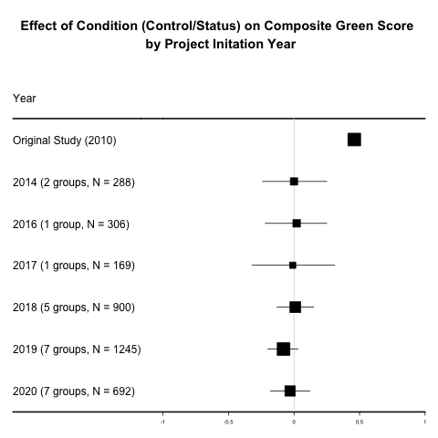

```{r packages, include=FALSE}
packages = c("tidyverse", "viridis", "colorspace","gghalves","ggthemes","skimr","Superpower","tidyr", "psych", "dplyr", "ggplot2", "sjmisc", "janitor", "rcompanion", "lsr", "papaja", "afex", "ltm","forestplot","trackdown")

## Now load or install&load all
package.check <- lapply(
  packages,
  FUN = function(x) {
    if (!require(x, character.only = TRUE)) {
      install.packages(x, dependencies = TRUE)
      library(x, character.only = TRUE)
    }
  }
)
```

```{r setup, echo = FALSE}

# Loading data from source
url <- "https://raw.githubusercontent.com/jorowags/crep_griskevicius/main/All%20data%20without%20extension%20variables.csv"
data <- read.csv(url)
orig.data <- data
```

```{r, echo=FALSE}
data[data == ""] <- NA              
```

**Corresponding author**:

Ljiljana B. Lazarević, Faculty of Philosophy, University of Belgrade Čika Ljubina 18-20, 11000 Belgrade, Serbia Email: [ljiljana.lazarevic\@f.bg.ac.rs](mailto:ljiljana.lazarevic@f.bg.ac.rs) Phone: +381 64 1287 614

**Author contribution:** to be filled in

**Conflict of interest statement:** The authors report no conflict of interest.

**Funding statement:** This project was funded in part by NSF Award 2141930 to J. Wagge.

**Ethics committee approval:** This research was approved under an "umbrella" ethics proposal at the Institutional Review Board of the Department of Psychology, University of Belgrade (Protocol #2021-069). At each site where there was a local ethics board and where ethics approval was required, the local board approved the study. This study complied with the ethics code outlined in the Declaration of Helsinki.

**Acknowledgment:** The authors would like to thank all students, supervisors, and reviewers who contributed to this CREP project. The authors would like to specifically thank Drs. Jon Grahe, Mark Brandt, and Hans IJzerman for their vision and early dedication to the CREP.

```{r, include = FALSE}

# Descriptive statistics for project characteristics
# Frequency tables for project code, survey language, countries, institute code, setting, and condition
frq(data$project_code)
frq(data$survey_language)
frq(data$country)
frq(data$institute_code)
frq(data$setting)
frq(data$condition)

# Counting number of unique projects, survey languages, institutes, and countries to report in manuscript
n_projects <- length(unique(data$project_code[data$project_code != "NANA"]))
n_survey_language <- length(unique(data$survey_language[data$survey_language != "NANA"]))
n_institutes <- length(unique(data$institute_code[data$institute_code != "NANA"]))
n_country <- length(unique(data$country[data$country != "NANA"]))
```

## Introduction 

The Collaborative Replications and Education Project (Wagge, Brandt, et al., 2019), or CREP, is one of several initiatives seeking to improve undergraduate training in research methods. CREP’s role includes selecting studies to be closely replicated by students, structuring the methods for the replication, reviewing projects both before and after data collection, and facilitating the publication of a pooled analysis (such as the present paper). While CREP primarily has a pedagogical mission, we hope to also advance science by providing additional evidence for the boundaries of published effects.

CREP participants are students and instructors at institutions around the world. We offer CREP as one alternative to the traditional undergraduate research project; while different models may work better for some instructors, institutions, and students, the CREP offers some benefits that other models may not. First, students learn methods by directly replicating the work of scholars in the field. Second, students get to participate in authentic research (Grahe, 2017) that may eventually be published in a pooled analysis and will also be available on the Open Science Framework (osf.io) to meta-analytic researchers in the future. Third, students learn the importance of many key open science practices and issues such as preregistration, replication, open methods, and open data (Kidwell et al., 2016). Fourth, students engage with reviewers (CREP team members) external to their institution. Until now, several CREP studies have been published (e.g., Ghelfi et al., 2020; Leighton et al., 2018; Wagge, Baciu, et al., 2019), and others have been included in meta-analyses (Lehmann et al., 2018), which testifies to the quality of the project.

The present report documents a pooled analysis of data collected by teams who signed up to replicate one of CREP's earliest selections for replication: Experiment 1 from Griskevicius et al. (2010).

### The original study: Status competition and pro-environmental behavior

Can pro-environmental behavior be promoted by inducing status competition? Griskevicius and colleagues (2010) tried to answer this question and reported the results of three experiments suggesting that status competition can promote pro-environmental behavior. Namely, the authors of the original study showed that activating status motives incites people to choose “green” (environmentally-friendly) products over more luxurious non-green products (Study 1), and that this effect is specific to public behavior (Study 2) and cases in which green products are more costly than the alternative instead of the “cheap” (i.e. low-status) option. In other words, Griskevicius and his associates claimed that green purchases are motivated by competitive altruism:  the attempt to appear more altruistic when competing for status. Showing publicly pro-environmental behavior suggests to others that you care; these altruistic tendencies are valued by others, conferring prestige and status. 

Per CREP procedures (described in more detail in the next section), only one study in a multi-study paper is typically selected for replication. In this case, the CREP team selected the first experiment fromGriskevicius et al. (2010) because it was the focal study that was conceptually replicated and extended in their next two experiments. Experiment 1 investigated how activating a status motive influenced respondents to choose between relatively luxurious non-green and less-luxurious pro-environmental products. Importantly, the prices of both groups of products were equal. The experiment included three conditions: one condition activating status motives through a story, and two control conditions (control . Non-green products were selected to be more desirable than their green counterparts. In the experimental condition, participants read a cover “status” story that had been shown to elicit “a desire for social status” (Griskevicius et al., 2010, p. 395); the authors predicted that it would increase the likelihood of choosing prosocial (green) products compared to control In the first control condition, participants read a story that elicited similar levels of affect, but did not elicit status motives. The second control condition did not include a cover story, and participants simply selected among products. Participants were given choices between three products: a car, a dishwasher, and soap, and a composite “green” score was calculated by adding up the number of “green” choices the participant made (no green choices = 0; all green choices = 3). The original study, using a one-way analysis of variance (ANOVA) on the product composite, found a large effect of status prime (*d* = 0.47). To summarize, the first experiment from Griskevicius et al. (2010) suggested that activating status motives inclines people towards choosing pro-environmental products over more luxurious nongreen products that might signal prosocial, self-sacrificing behavior.

## Method

### CREP Procedures

This paper was selected for replication by following the standard CREP selection process, outlined by Wagge and colleagues (Wagge, Brandt, et al., 2019). Briefly, in 2013, CREP volunteers located citations for the most-cited 2010 papers from ten different flagship empirical journals in psychology and its subdisciplines. In this way, CREP was able to narrow down the pool for selection while also guaranteeing that the paper we selected was both recent and high-interest. The goal was not to find the best paper for replication in terms of the field’s specific needs, but rather to find a set of recent, high-interest papers – good candidates for replication. Once the pool of citations had been gathered, CREP coders read the Method section for each paper and indicated whether it was feasible for student teams to replicate in a semester on a scale of 1 (low) - 5 (high) and also whether they thought it would be interesting to students, again, on a scale of 1 (low) - 5 (high). The feasibility ratings were used to narrow down a final pool, while the interest ratings were used in the final decision-making process if all other factors were weighted equally. Documentation of the coding process can be found here: https://osf.io/9kzje/wiki/home/. 

Once a final pool of papers was narrowed down, CREP recruited psychology professors to look again at the feasibility and interest to narrow it down more, and then the CREP leadership team engaged in internal conversation to select the study or studies that would be selected that year. The process in 2013 resulted in several selected studies, including Experiment 1 from Griskevicius and colleagues.

Once this study was selected, the CREP leadership team sent an email to Dr. Griskevicius as the corresponding author of the original work. The CREP team communicated our process and goals and asked for input on possible extension hypotheses and guidance for replication teams. The key parts of the correspondence from Dr. Griskevicius are available here: https://osf.io/vdo0i/wiki/home/. There are two key points from this correspondence:  first, Dr. Griskevicius noted that the effect may not replicate if participants didn’t equate “green” choices with prosocial behavior; second, Dr. Griskevicius noted that the connection between “green” choices and status was unique to politically liberal groups. The first note will provide us with a lens through which we will interpret our results, while the second provides some context for why many student teams included political ideology in extension hypotheses.

### CREP Project Process

Once the study became available for replication in 2014, groups signed up for the project and prepared OSF project pages for pre-data collection review. These pre-data collection project pages had to include materials, analytical strategy, a video documenting the procedure, and IRB approval. The project pages were reviewed by two reviewers and the executive reviewer, at which point projects were either approved or sent back for revisions until approval could be granted. Groups were asked to pre-register project pages before data collection. After data collection was completed, project pages were reviewed again by two reviewers and the executive reviewer. At this stage, project pages were revised to include the dataset, a short report about the obtained results, and a completion pledge. Following a positive review, replication was considered successful and the project was considered complete. Early on in CREP, teams were awarded $300 - $500 upon completion, depending on the difficulty of the study. The Griskevicius et al. (2010) replication earned $300 and was awarded to only one team included in this analysis (#14-03).

### Datasets included in the study

From 2013 to  2020, 49 groups from nine different countries expressed interest in conducting a CREP replication of Griskevicius et al. (2010). Of these 49 groups, 25 groups did not contribute data to the final analysis: eleven groups did not provide their data, one group did not provide their codebook, five groups did not complete data collection, four groups did not begin data collection, three groups did not create their OSF page, and one group did not follow the CREP procedure. The final sample of completed projects included data collected by 24 groups from 6 different countries: USA, UK, Germany, Canada, Netherlands, and Iceland. The overview of groups participating in this project is can be found at <https://osf.io/vc5rh>. Over the years, this particular project included about 30 reviewers, 3 CREP assistants, and 3 executive reviewers.

#### Target sample size

The target sample size for each group was set to 82 respondents. Per early CREP policies, the required sample size was at least half of the original N. For this study, the targeted sample size should have been 84 (half of the original N of 168), but unfortunately, in the documentation file, there was a typo (N = 82). However, with multiple groups collecting data, and in this particular case with `r count(orig.data)` participants, we have adequate statistical power to detect a small focal effect.

#### Differences from the original study

The original study was conducted in a lab, where participants were tested in small groups. Replications were conducted both in the lab and online. Some groups conducted direct replications, and some groups included extension variables. Characteristics of the replications can be found at <https://osf.io/gt39p>.

### Disclosures

#### Preregistrations

Each lab preregistered its materials, protocol, and analytical strategy on Open Science Framework (OSF) before data collection. Additionally, this meta-analysis was pre-registered: <https://osf.io/ach3n>.

#### Data, Materials, and Resources

The authors of the original study provided materials for replications. All groups who completed projects uploaded their data, analyses, and a short description of results to their OSF project page. All datasets, materials, analytical scripts, and other materials can be found on the central project OSF page (<https://osf.io/rh2nw/>). The complete codebook for the dataset is available at <https://osf.io/7nkhq/>.

#### Reporting

We report how we determined our sample size, all data exclusions, all manipulations, and all measures in the study.

#### Ethical approval

Data were collected in accordance with the Declaration of Helsinki. This research was approved under an "umbrella" ethics proposal at the University of Belgrade, Serbia. Overarching IRB approval was obtained from the IRB of the Department of Psychology, University of Belgrade, Serbia (<https://osf.io/pcwhg/>). In addition, all groups obtained local IRB approvals when needed.

### Sample

```{r, echo = TRUE, include = FALSE}
frq(data$gender)
describe(data$age)

gender <- table(data$gender)

n.gender.women <- as.numeric(gender[1])
n.gender.men <- as.numeric(gender[3])
n.gender.gendervariant <- as.numeric(gender[2])
n.gender.nonbinarytrans <- as.numeric(gender[4])
n.gender.prefernot <- as.numeric(gender[6])
n.gender.other <- as.numeric(gender[5])

n.gender.else <- n.gender.gendervariant+n.gender.nonbinarytrans+n.gender.other+n.gender.prefernot

n.gender.na <- as.numeric(sum(is.na(data$gender)))

mean.age <- round(mean(data$age, na.rm = TRUE), digits = 2)
n.age.na <- as.numeric(sum(is.na(data$age)))
sd.age <- round(sd(data$age, na.rm = TRUE), digits = 2)

```

Data were collected by student groups in the USA, UK, Germany, Canada, the Netherlands, and Iceland who participated in the CREP project. In total, the final  data set contained data collected from `r count(orig.data)` participants by `r n_projects` groups. All individual data sets are available here: **[INSERT LINK WHEN READY]**. All groups collected at least 82 respondents, except for one that collected 70 participants. Nine groups did not collect data on at least one of the following: age, gender, or race/ethnicity. Details about the missing data are available here: <https://osf.io/vc5rh>. The complete, anonymized dataset is available here: <https://osf.io/3xrdf>.

We removed 21 participants prior to posting the public compiled dataset because they reported ages of 16 (n = 3) or 17 (n = 18), for a total final dataset with `r count(orig.data)` participants. The final sample included `r n.gender.women` women and `r n.gender.men` men with `r n.gender.else` participants reporting a gender of gender variant/non-conforming, "other," "prefer not to say," or transgender/non-binary. An additional `r n.gender.na` participants did not indicate their gender, either by choice or because the survey they completed did not request this information. The mean reported age for participants was `r mean.age` years (*SD* = `r sd.age`), while for `r n.age.na` age was not reported.

```{r, include = FALSE}
frq(data$recoded_race)
race.table <- table(data$recoded_race)

n.race.na <- as.numeric(sum(is.na(data$recoded_race)))
n.race.african <- as.numeric(race.table[1])
n.race.hispanic <- as.numeric(race.table[5])
n.race.indigenous <- as.numeric(race.table[2])
n.race.asian <- as.numeric(race.table[3])
n.race.black <- as.numeric(race.table[4])
n.race.middleeastern <- as.numeric(race.table[6])
n.race.multiracial <- as.numeric(race.table[7])
n.race.pacific <- as.numeric(race.table[8])
n.race.other <- as.numeric(race.table[9])
n.race.white <- as.numeric(race.table[10])

n.total.reported.race <- n.race.african + n.race.hispanic + n.race.asian + n.race.black + n.race.indigenous + n.race.middleeastern + n.race.multiracial + n.race.other + n.race.pacific + n.race.white

prop.race.white <- round(100*(n.race.white / n.total.reported.race), digits = 2)
prop.race.black <- round(100*(n.race.black + n.race.african) / n.total.reported.race, digits = 2)
prop.race.asian <- round(100*(n.race.asian / n.total.reported.race), digits = 2)
prop.race.hispanic <- round(100*(n.race.hispanic / n.total.reported.race), digits = 2)
prop.race.middleeastern <- round(100*(n.race.middleeastern / n.total.reported.race), digits = 2)
prop.race.multiracial <- round(100*(n.race.multiracial / n.total.reported.race), digits = 2)
prop.race.pacific <- round(100*(n.race.pacific / n.total.reported.race), digits = 2)
prop.race.other <- round(100*(n.race.other / n.total.reported.race), digits = 2)
prop.race.na <- round(100*(n.race.na) / (n.race.na + n.total.reported.race), digits = 2)

```

Information about participant race/ethnicity was reported by some sites and not others, and within each site, the question could vary in how it was asked. We, therefore, recoded the original race information to include the following categories: White (*n* = `r n.race.white`, `r prop.race.white`%), Black (*n* = `r n.race.black`, `r prop.race.black`%), Asian (*n* = `r n.race.asian`, `r prop.race.asian`%), Hispanic/Latino (*n* = `r n.race.hispanic`, `r prop.race.hispanic`%), Middle Eastern (*n* = `r n.race.middleeastern`, `r prop.race.middleeastern`%), Multiracial (*n* = `r n.race.multiracial`, `r prop.race.multiracial`%), Native Hawaiian or Pacific Islander (*n* = `r n.race.pacific`, `r prop.race.pacific`%), and "other" (*n* = `r n.race.other`, `r prop.race.other`%). These reported percentages do not include the participants who either did not report their race/ethnicity or were not asked this question (*n* = `r n.race.na`, `r prop.race.na`% of the total).

### Procedure

Data were collected in the lab, or online. Each group documented the type of data collection. Respondents were recruited from the student or general population. Each group underwent a pre-data-collection review procedure by CREP reviewers and executive reviewers and made preregistration for their project. After data collection was completed, project pages were again reviewed (post-data-collection review) by the executive reviewer and CREP reviewers. Descriptions of individual datasets, along with all deviations are available at <https://osf.io/t8h3k>.

### Treatment of missing data, data preparation, and data analysis

We excluded participants without responses for the dependent variables. To create a merged dataset, we accessed all individual datasets through each team's OSF page when this was available, and contacted teams directly for their data when it was not. When necessary, we also contacted groups to obtain information on whether the dataset was raw or transformed and to obtain codebooks. We left missing data as missing. The merged dataset is available on the OSF project page (<https://osf.io/3xrdf>). A codebook for our merged data set with all variables collected as part of the project is available at <https://osf.io/7nkhq/>. 

We conducted the same analyses as the original paper: for each product (car, soap, and dishwater) we reported percentages by condition, Chi-square tests, and Phi coefficients. We also computed a composite green score and run ANOVA across conditions (story, no story, and control story) and report effect size and posthoc comparisons using the LSD test.

We also performed several exploratory analyses. First, the original study conducted data collection in a computer lab and tested participants in small groups; therefore, we used ANOVA to explore differences between settings (online/lab, testing in-group/testing individually). Second, we tested the moderating role of political orientation. We also ran 2 x 2 factorial ANOVAs to determine whether political orientation (liberal/conservative) or political party (democrat/republican) interacts with the condition (control/status) in its association with the composite green score. Third, we explored whether the main effects replicated in other countries in which we collected data, and tested potential differences between the US and other countries. Fourth, the long-lasting nature of our project enabled testing if the effect differs across time. Lastly, the original authors stated that it would be worth testing for potential gender differences, thus, as part of our exploratory analyses we studied gender differences in status motives by running a 2 x 2 factorial ANOVA (gender: female or male; condition: control vs. status). 

## Results

### Confirmatory Analyses

#### Composite Green Score

```{r, include = FALSE}
# Original paper: In
# addition to examining the influence of status motives on each
# product individually, we also analyzed the effect of status when the
# three products were combined into a composite. As predicted, a
# one-way analysis of variance (ANOVA) on the product composite
# showed a significant effect of status, F(1, 166) = 8.53, p = .004,
# d = 0.47.

# Our results:
# Combine no story & control story into a new variable, control

data$new_condition <- recode(data$condition, "control story" = "Control", "no story" = "Control", "status story" = "Status")

# Compute composite green score; recode Y as 1 and N as 0 for green products

data$greencar <- recode(data$greencar, "Yes" = 1, "No" = 0)
data$greendishwasher <- recode(data$greendishwasher, "Yes" = 1, "No" = 0)
data$greensoap <- recode(data$greensoap, "Yes" = 1, "No" = 0)

data$total <- data$greencar + data$greendishwasher + data$greensoap
describe(data$total)
mean.composite <- round(mean(data$total, na.rm = TRUE),digit = 2)
sd.composite <-round(sd(data$total, na.rm = TRUE), digits = 3)

# Do ANOVA by condition (status, no story, control story)
ungrouped.aov <- aov(data$total ~ condition, data = data)
summary(ungrouped.aov)
ungrouped.out <- apa_print(ungrouped.aov)

# post hoc testing
tukey.ungrouped <- TukeyHSD(ungrouped.aov)

# Ungrouped bar graph
ggplot(data[!is.na(data$condition), ], mapping=aes(x=condition, y=total))+
  stat_summary(fun.data=mean_sdl, geom="bar") +
  stat_summary(fun.data=mean_cl_boot, geom="errorbar", width = 0.3)

# Do ANOVA by new condition (control v status)
grouped.aov <- aov(data$total ~ new_condition, data = data)
summary(grouped.aov)
apa.grouped.out <- apa_print(grouped.aov)
apa.grouped.eta <- apa.grouped.out$table$estimate

data$total<- as.numeric(data$total)

# Subset the data for the green/not green choices
choicevars <- c("greencar", "greensoap", "greendishwasher")
choice.data <- data[choicevars]

cron <- cronbach.alpha(choice.data, standardized = FALSE, na.rm = TRUE)
cron.x <- cron[1]
cron.x <- as.numeric(cron.x)
cron.x <- round(cron.x, digits = 2)

```

Despite low internal consistency of the three items (Cronbach's alpha = `r cron.x`), we followed the procedure used in the original study and computed a composite green score by assigning the value "1" to all "green" selections and a score of "0" to all non-"green" selections. Because participants had three dichotomous choices for three products, scores ranged from 0 (no "green" products) to 3 (all "green" products). The mean composite score was `r mean.composite` (*SD* = `r sd.composite`). A distribution of composite scores can be seen in Figure 1.

```{r, include = FALSE}
# Michał figure code
# load data
df <- read.csv('goingGreenReplicationData.txt')

# create green preference index
df$greenScore <- rowSums(apply(df[, 9:11], 2, str_count, 'Yes'))

### create Figure 1
g1 <- ggplot(df, aes(x = condition, y = greenScore))+
  scale_color_viridis(discrete = T,
                      option = 'viridis',
                      begin = .4,
                      end = .8)+
  scale_fill_viridis(discrete = T,
                     option = 'viridis',
                     begin = .4,
                     end = .8)+
  geom_point(
  aes(color = condition),
  position = position_jitter(width = .1),
  size = .55,
  alpha = .4)+
  stat_summary(fun = mean,
               geom = "point", 
               shape = 21, 
               size = 6,
               col = "black",
               fill = "yellow")+
  geom_half_boxplot(aes(fill = condition),
                    alpha = .4,
                    side = 'r',
                    outlier.shape = NA,
                    center = T,
                    position = position_nudge(x = .15),
                    errorbar.draw = F,
                    width = .2)+
  geom_half_violin(aes(fill = condition),
                   alpha = .4,
                   side = 'r',
                   bw = .3,
                   position = position_nudge(x = .3))+
  geom_rangeframe()+
  theme_tufte()+
  scale_x_discrete(labels = c('CONTROL STORY', 'NO STORY', 'STATUS STORY'))+
  xlab("CONDITION")+
  ylab("GREEN SCORE")+
  theme(
    aspect.ratio = .75,
    legend.position = 'none',
    text = element_text(size = 24, family = "sans"),
    axis.title = element_text(size = 20, face = 'bold')
  )+
  coord_flip()
g1

# Figure note:
# The rain cloud diagram shows the distribution of responses under different conditions. Yellow dots represent mean values surrounded by individual data points with jitter. Vertical lines in the centers of the boxplots indicate the medians. Shaded areas around them correspond to interquartile ranges, and whiskers encompass 1.5 times the interquartile ranges. The shaded areas above the boxplots indicate the density of the data.

ggsave(g1, filename = 'fig1.png', units = 'cm',
       height = 20, width = 28, dpi = 300)

```


The original paper by Griskevicius and colleagues reported a significant effect of status on the composite score when the status prime condition was compared to both control conditions (control story and no story) together, *F*(1, 166) = 8.53, *p* = .004, *d* = 0.47. The same test using our data did not reveal a significant effect, `r apa.grouped.out$statistic`, $\eta^2$ = `r apa.grouped.eta`. However, when we examined our three conditions (control story, status story, and no story), a small effect was found, `r ungrouped.out$statistic`, $\eta^2$ = `r ungrouped.out$table$estimate`. Post-hoc testing using Tukey's HSD correction for multiple pairwise comparisons resulted in no pairwise comparisons with a *p* \< .05 (no story/control = `r round(tukey.ungrouped$condition[10], digits = 2)`, status story/control = `r round(tukey.ungrouped$condition[11], digits = 2)`, status story/no story = `r round(tukey.ungrouped$condition[12], digits = 2)`).

The rest of our analyses combine the "control story" and "no story" conditions into one control group.

#### Green car

```{r, include = FALSE}
# From Experiment 1: 
# Original paper: 37.2% of participants chose the green
# car in the control condition, 54.5% of participants chose it in the
# status condition, chi2(1, N = 168) = 4.56, p = .033, phi = .165

# Our results
# Percentage selected green car


# Percentage selected green car by condition 
car_table <- table(data$new_condition, data$greencar)
prop.table(car_table, 1)
print(car_table)
  
# Chi square test with Phi
chisq.car <- chisq.test(car_table)

# Create reported values for r snippets
chisq.car.stat <- round(as.numeric(chisq.car[1]), digits = 2)
chisq.car.p <- round(as.numeric(chisq.car[3]), digits = 2)
chisq.car.df <- as.numeric(chisq.car[2])
car.phi <- round(phi(car_table, digits = 3), digits = 3)

n.control.car.no <- as.numeric(car_table[1,1])
n.control.car.yes <- as.numeric(car_table[1,2])
n.status.car.no <- as.numeric(car_table[2,1])
n.status.car.yes <- as.numeric(car_table[2,2])

total.car.yes <- n.control.car.yes + n.status.car.yes
total.car.no <- n.control.car.no + n.status.car.no
total.car.n <- total.car.yes + total.car.no

prop.status.car.yes <- round(100*n.status.car.yes/(n.status.car.yes + n.status.car.no), digits = 2)
prop.control.car.yes <- round(100*n.control.car.yes/(n.control.car.yes + n.control.car.no), digits = 2)

```

The original paper found that the green car selection was higher in the status condition (54.5%) than in the control condition (37.2%), $\chi^2$(1, N = 168) = 4.56, *p* = .033, $\phi$ = .165. In our sample, `r prop.control.car.yes`% of control participants selected the green car, compared to `r prop.status.car.yes`% of the status participants. We were unable to detect an effect of condition on green selection, $\chi^2$(`r chisq.car.df`, N = `r total.car.n`) = `r chisq.car.stat`, *p* = `r chisq.car.p`, $\phi$ = `r car.phi`.

#### Green cleaner

```{r, include = FALSE}
# Original paper: choice of the green cleaner increased from 25.7% in the
# control condition to 41.8% in the status condition, chisq(1, N =
# 168) = 4.52, p = .034, phi = .164

# Our results: 
# Percentage selected green soap by condition
soap_table <- table(data$new_condition, data$greensoap)
print(soap_table)
prop.table(soap_table, 1)
  
# Chi square test
chisq.soap <- chisq.test(soap_table)
  
# Phi coefficient
phi(soap_table, digits = 3)

# Create reported values for r snippets
chisq.soap.stat <- round(as.numeric(chisq.soap[1]), digits = 2)
chisq.soap.p <- round(as.numeric(chisq.soap[3]), digits = 2)
chisq.soap.df <- as.numeric(chisq.soap[2])
soap.phi <- round(phi(soap_table, digits = 3), digits = 3)

n.control.soap.no <- as.numeric(soap_table[1,1])
n.control.soap.yes <- as.numeric(soap_table[1,2])
n.status.soap.no <- as.numeric(soap_table[2,1])
n.status.soap.yes <- as.numeric(soap_table[2,2])

total.soap.yes <- n.control.soap.yes + n.status.soap.yes
total.soap.no <- n.control.soap.no + n.status.soap.no
total.soap.n <- total.soap.yes + total.soap.no

prop.status.soap.yes <- round(100*n.status.soap.yes/(n.status.soap.yes + n.status.soap.no), digits = 2)
prop.control.soap.yes <- round(100*n.control.soap.yes/(n.control.soap.yes + n.control.soap.no), digits = 2)


```

Similarly, the original paper found that participants in the status condition selected the green cleaner more frequently than participants in the control condition (41.8% and 25.7%, respectively), $\chi^2$(1, N = 168) = 4.52, *p* = .034, $\phi$ = .164. In our sample, `r prop.control.soap.yes`% of the control and `r prop.status.soap.yes`% of the status participants selected the green cleaner. As with the "car" selection, we were unable to detect an effect of condition on the choice of cleaner, $\chi^2$(`r chisq.soap.df`, N = `r total.soap.n`) = `r chisq.soap.stat`, *p* = `r chisq.soap.p`, $\phi$ = `r soap.phi`.

#### Green dishwasher

```{r, include = FALSE}
# Original paper: Choice of the green dishwasher
# also increased from 34.5% in the control condition to 49.1% in the
# status condition, chisq(1, N = 168) = 3.30, p = .069, eff size .140

# Our results: 
# Percentage selected green dishwasher by condition
dishwasher_table <- table(data$new_condition, data$greendishwasher)
print(dishwasher_table)
prop.table(dishwasher_table, 1)
  
# Chi square test
chisq.dishwasher <- chisq.test(dishwasher_table)
  
# Phi coefficient
phi(dishwasher_table, digits = 3)

# Create reported values for r snippets
chisq.dishwasher.stat <- round(as.numeric(chisq.dishwasher[1]), digits = 2)
chisq.dishwasher.p <- round(as.numeric(chisq.dishwasher[3]), digits = 2)
chisq.dishwasher.df <- as.numeric(chisq.dishwasher[2])
dishwasher.phi <- round(phi(dishwasher_table, digits = 3), digits = 3)

n.control.dishwasher.no <- as.numeric(dishwasher_table[1,1])
n.control.dishwasher.yes <- as.numeric(dishwasher_table[1,2])
n.status.dishwasher.no <- as.numeric(dishwasher_table[2,1])
n.status.dishwasher.yes <- as.numeric(dishwasher_table[2,2])

total.dishwasher.yes <- n.control.dishwasher.yes + n.status.dishwasher.yes
total.dishwasher.no <- n.control.dishwasher.no + n.status.dishwasher.no
total.dishwasher.n <- total.dishwasher.yes + total.dishwasher.no

prop.status.dishwasher.yes <- round(100*n.status.dishwasher.yes/(n.status.dishwasher.yes + n.status.dishwasher.no), digits = 2)
prop.control.dishwasher.yes <- round(100*n.control.dishwasher.yes/(n.control.dishwasher.yes + n.control.dishwasher.no), digits = 2)
```

Finally, in the original paper the selection of the green dishwasher was more likely in the status condition than the control condition (49.1% and 34.5%, respectively), $\chi^2$(1, N = 168) = 3.30, *p* = .069, $\phi$ = .140, while we found no such effect when comparing the `r prop.control.dishwasher.yes`% of control participants who selected the green dishwasher to the `r prop.status.dishwasher.yes`% of status prime participants who did the same, $\chi^2$(`r chisq.dishwasher.df`, N = `r total.dishwasher.n`) = `r chisq.dishwasher.stat`, *p* = `r chisq.dishwasher.p`, $\phi$ = `r dishwasher.phi`.

### Exploratory Analyses

```{r, include= FALSE}

## SETTING FOR RESEARCH
# Make a variable that combines lab, lab individual and lab groups and compare results across that with in-person

data$Groups.New <- 0
data$Groups.New <- ifelse(data$setting=="Online",1,0)
frq(data$Groups.New)

# Chi square test of independence for green car across lab/in-person
test.groups.car <- chisq.test(table(data$Groups.New, data$greencar))
test.groups.car
chisq.groups.car.p <- round(as.numeric(test.groups.car[3]), digits = 2)

# Chi square test of independence for green soap across lab/in-person
test.groups.soap <- chisq.test(table(data$Groups.New, data$greensoap))
test.groups.soap
chisq.groups.soap.p <- round(as.numeric(test.groups.soap[3]), digits = 2)

# Chi square test of independence for green dishwasher across lab/in-person
test.groups.dishwasher <- chisq.test(table(data$Groups.New, data$greendishwasher))
test.groups.dishwasher
chisq.groups.dishwasher.p <- round(as.numeric(test.groups.dishwasher[3]), digits = 2)

```

*Lab vs. Online*. To determine if there were differences in setting type, we first collapsed all reported lab settings (group, individual, and just "lab") into one variable level, and then conducted chi-square tests of independence using a dichotomous setting variable (lab versus online). We found no relationship between green choice and setting type for all three types of product (*p*s of `r chisq.groups.car.p`, `r chisq.groups.soap.p`, and `r chisq.groups.dishwasher.p` for the green car, soap, and dishwasher, respectively).

*Political orientation*. When the CREP team first contacted the original authors about the replication, they recommended examining political orientation as a possible extension variable. Therefore, many groups decided to add a question about political orientation (liberal/conservative) and others added a question about political party (Republican/Democrat/Independent); some groups added both questions, and some groups added questions with responses that were more fitting to their particular country (e.g., Canada). We decided to use this data to compare liberal/conservative on green selections. Some institutions measured this with a scale (from very liberal to very conservative, for example), while others measured it with categorical response types (e.g., liberal, conservative, neutral). We collapsed over these responses to create a variable with one category for "liberal" that included all responses indicating any degree of being liberal, another category for "conservative" that included any response indicating being conservative and excluded any "neutral" or "other" responses from this variable.

```{r, include = FALSE}
n.conservative = sum(data$LiborCon=='Conservative', na.rm = TRUE)
n.liberal = sum(data$LiborCon=='Liberal', na.rm = TRUE)
```

Using this method of collapsing data, we found that n = `r n.conservative` participants identified as conservative, while n = `r n.liberal` participants identified as liberal.

```{r, include = FALSE}
# Insert 2 x 2 factorial ANOVA with condition & political orientation on composite green score

aov.out <- aov(total ~ LiborCon * new_condition, data = data)
apa_anova <- apa_print(aov.out)

mean.liberal <- mean(data$total[data$LiborCon=="Liberal"], na.rm = TRUE)
mean.conservative <- mean(data$total[data$LiborCon=="Conservative"], na.rm = TRUE)
sd.liberal <- sd(data$total[data$LiborCon=="Liberal"], na.rm = TRUE)
sd.conservative <- sd(data$total[data$LiborCon=="Conservative"], na.rm = TRUE)

mean.control <- mean(data$total[data$new_condition=="Control"], na.rm = TRUE)
mean.status <- mean(data$total[data$new_condition=="Status"], na.rm = TRUE)
sd.control <- sd(data$total[data$new_condition=="Control"], na.rm = TRUE)
sd.status <- sd(data$total[data$new_condition=="Status"], na.rm = TRUE)

# Let's report if there are any differences between the two control conditions - "no story" and "control"
aov.outUP <- aov(total ~ LiborCon * condition, data = data)
apa_anovaUP <- apa_print(aov.outUP)

```

#### Liberal/conservative

We conducted a 2 x 2 factorial ANOVA (political orientation: liberal vs. conservative; condition: control vs. experimental) to determine whether political orientation interacted with condition in its association with the composite green score. As predicted, we did find a main effect of political orientation such that participants who identified as liberal selected significantly more green products on average (*M* = `r round(mean.liberal, digits = 2)`, *SD* = `r round(sd.liberal, digits = 2)`) than participants who identified as conservative (*M* = `r round(mean.conservative, digits = 2)`, *SD* = `r round(sd.conservative, digits = 2)`), `r apa_anova$statistic$LiborCon`, $\eta^2$ = `r apa_anova$table$estimate[1]`. As we found earlier, there was also no main effect of condition; the mean scores for participants in the grouped control condition (*M* = `r round(mean.control, digits = 2)`, *SD* = `r round(sd.control, digits = 2)`) did not differ from those in the status condition (*M* = `r round(mean.status, digits = 2)`, *SD* = `r round(sd.status, digits = 2)`), `r apa_anova$statistic$new_condition`, $\eta^2$ = `r apa_anova$table$estimate[2]`. There was also no interaction between the two variables, `r apa_anova$statistic$LiborCon_new_condition`, $\eta^2$ = `r apa_anova$table$estimate[3]`.

We found a similar pattern of results when the control conditions (no story and control story) were ungrouped: a main effect of liberal/conservative (`r apa_anovaUP$statistic$LiborCon`, $\eta^2$ = `r apa_anovaUP$table$estimate[1]`), no main effect of ungrouped condition (`r apa_anovaUP$statistic$condition`, $\eta^2$ = `r apa_anovaUP$table$estimate[2]`), and no interaction between the variables (`r apa_anovaUP$statistic$LiborCon_condition`, $\eta^2$ = `r apa_anovaUP$table$estimate[3]`).

```{r, include = FALSE}
n.republican = sum(data$RorD=='Republican', na.rm = TRUE)
n.democrat = sum(data$RorD=='Democrat', na.rm = TRUE)
```

```{r, include = FALSE}
# Insert 2 x 2 factorial ANOVA with condition & political party on composite green score

aov.out2 <- aov(total ~ RorD * new_condition, data = data)
apa_anova2 <- apa_print(aov.out2)

RorDeta <- etaSquared(aov.out2)

mean.rep <- mean(data$total[data$RorD=="Republican"], na.rm = TRUE)
mean.dem <- mean(data$total[data$RorD=="Democrat"], na.rm = TRUE)

sd.rep <- sd(data$total[data$RorD=="Republican"], na.rm = TRUE)
sd.dem <- sd(data$total[data$RorD=="Democrat"], na.rm = TRUE)

RorDtable <- table(data$RorD, data$new_condition)
```

#### Democrat/republican

Similarly, for political party ("Democrat" or "Republican"), we conducted a 2 x 2 factorial ANOVA (political party: Democrat vs. Republican; condition: control vs. status). When we grouped participants into "Republican" (*n* = `r n.republican`) and "Democrat" (*n* = `r n.democrat`) categories, we did find a main effect of political party such that participants who identified as Democrat selected significantly more green products (*M* = `r round(mean.dem, digits = 2)`, *SD* = `r round(sd.dem, digits = 2)`) than participants who identified as Republican (*M* = `r round(mean.rep, digits = 2)`, *SD* = `r round(sd.rep, digits = 2)`), `r apa_anova2$statistic$RorD`, $\eta^2$ = `r round(RorDeta[1,2], digits = 2)`. We were unable to detect an interaction between political party and condition, `r apa_anova2$statistic$RorD_new_condition`, $\eta^2$ = `r round(RorDeta[3,2], digits = 2)`, and as reported in the "Liberal/Conservative" subsection above, we found no main effect of condition (control: *M* = `r round(mean.control, digits = 2)`, *SD* = `r round(sd.control, digits = 2)`); status: *M* = `r round(mean.status, digits = 2)`, *SD* = `r round(sd.status, digits = 2)`), `r apa_anova2$statistic$new_condition`, $\eta^2$ = `r round(RorDeta[2,2], digits = 2)`.

Importantly, we did not have adequate power to detect any interaction effects. Using the *Superpower* package in R, we determined that we would need at least 418 participants *per cell* to detect an interaction effect between political party and condition. In our four cells created by the two variables political party (Republican or Democrat) and condition (status or control), our cell sizes were `r RorDtable[1]`, `r RorDtable[2]`, `r RorDtable[3]`, and `r RorDtable[4]`, respectively. Because of these issues with power, we did not conduct a test with ungrouped control conditions.

```{r, include = FALSE}
## LOCATION - US/OTHER
# Make a variable to see if there are differences for US versus elsewhere on prefs
data$US_or_other <- recode(data$country, "USA" = "USA", "The Netherlands" = "other", "Germany" = "other", "UK" = "other", "Iceland" = "other", "Canada" = "other")
test.location.car <- chisq.test(table(data$US_or_other, data$greencar))
test.location.car
table(data$US_or_other, data$greencar)

test.location.soap <- chisq.test(table(data$US_or_other, data$greensoap))
test.location.soap
table(data$US_or_other, data$greensoap)

test.location.dishwasher <- chisq.test(table(data$US_or_other, data$greendishwasher))
test.location.dishwasher
table(data$US_or_other, data$greendishwasher)

# Looks like there are stronger preferences for green items outside of the US. Will break down relationship between items and condition both in the US and outside

# Subset just the US participants
usa.data <- data[which(data$US_or_other == 'USA'),]
other.location.data <- data[which(data$US_or_other != 'USA'),]

# Do chi squares for just the US participants
test.groups.car <- chisq.test(table(usa.data$new_condition, usa.data$greencar))
test.groups.car
usa.car.table <- table(usa.data$new_condition, usa.data$greencar)
chisq.groups.usa.car.stat <-round(as.numeric(test.groups.car[1]), digits = 2)
chisq.groups.usa.car.p <- round(as.numeric(test.groups.car[3]), digits = 2)
chisq.groups.usa.car.df <- round(as.numeric(test.groups.car[2]), digits = 2)
total.usa.car.n <- as.numeric(usa.car.table[1] + usa.car.table[2] + usa.car.table[3] + usa.car.table[4])

test.groups.soap <- chisq.test(table(usa.data$new_condition, usa.data$greensoap))
test.groups.soap
usa.soap.table <- table(usa.data$new_condition, usa.data$greensoap)
chisq.groups.usa.soap.stat <-round(as.numeric(test.groups.soap[1]), digits = 2)
chisq.groups.usa.soap.p <- round(as.numeric(test.groups.soap[3]), digits = 2)
chisq.groups.usa.soap.df <- round(as.numeric(test.groups.soap[2]), digits = 2)
total.usa.soap.n <- as.numeric(usa.soap.table[1] + usa.soap.table[2] + usa.soap.table[3] + usa.soap.table[4])

test.groups.dishwasher <- chisq.test(table(usa.data$new_condition, usa.data$greendishwasher))
test.groups.dishwasher
usa.dishwasher.table <- table(usa.data$new_condition, usa.data$greendishwasher)
chisq.groups.usa.dishwasher.stat <-round(as.numeric(test.groups.dishwasher[1]), digits = 2)
chisq.groups.usa.dishwasher.p <- round(as.numeric(test.groups.dishwasher[3]), digits = 2)
chisq.groups.usa.dishwasher.df <- round(as.numeric(test.groups.dishwasher[2]), digits = 2)
total.usa.dishwasher.n <- as.numeric(usa.dishwasher.table[1] + usa.dishwasher.table[2] + usa.dishwasher.table[3] + usa.dishwasher.table[4])

# Do chi squares for just the "other" participants
test.groups.car2 <- chisq.test(table(other.location.data$new_condition, other.location.data$greencar))
test.groups.car2
table(other.location.data$new_condition, other.location.data$greencar)

test.groups.soap2 <- chisq.test(table(other.location.data$new_condition, other.location.data$greensoap))
test.groups.soap2
table(other.location.data$new_condition, other.location.data$greensoap)

test.groups.dishwasher2 <- chisq.test(table(other.location.data$new_condition, other.location.data$greendishwasher))
test.groups.dishwasher2
table(other.location.data$new_condition, other.location.data$greendishwasher)

# Looks like people outside of the US just like the green products more; no interaction with status prime

# Ungrouped control conditions + US/other -> composite?
test.ungrouped.location <- aov(total ~ US_or_other * condition, data = data)
summary(test.ungrouped.location)
p_value_me_location <-summary(test.ungrouped.location)[[1]]$`Pr(>F)`[1]
p_value_me_condition <-summary(test.ungrouped.location)[[1]]$`Pr(>F)`[2]
p_value_me_int <-summary(test.ungrouped.location)[[1]]$`Pr(>F)`[3]
loc.eta <- etaSquared(test.ungrouped.location)

other.green.m <- round(mean(data$total[data$US_or_other=="other"], na.rm = TRUE), digits = 2)
other.green.sd <- round(sd(data$total[data$US_or_other=="other"], na.rm = TRUE), digits = 2)
USA.green.m <- round(mean(data$total[data$US_or_other=="USA"], na.rm = TRUE), digits = 2)
USA.green.sd <- round(sd(data$total[data$US_or_other=="USA"], na.rm = TRUE), digits = 2)

apa.anovaUL <- apa_print(test.ungrouped.location)


```

*US vs. others*. The original study was conducted only with individuals in the United States. Here, we conducted an exploratory test of the data to determine whether there was an association between condition and green choice for only US-based participants. For US-based participants, we found no association between condition (two levels: control and status) and green car selection ($\chi^2$(`r chisq.groups.usa.car.df`, N = `r total.usa.car.n`)) = `r chisq.groups.usa.car.stat`, *p* = `r chisq.groups.usa.car.p`, $\phi$ = `r round(phi(usa.car.table), digits = 2)`), green cleaner selection ($\chi^2$(`r chisq.groups.usa.soap.df`, N = `r total.usa.soap.n`)) = `r chisq.groups.usa.soap.stat`, *p* = `r chisq.groups.usa.soap.p`, $\phi$ = `r round(phi(usa.soap.table), digits = 2)`), or green dishwasher ($\chi^2$(`r chisq.groups.usa.dishwasher.df`, N = `r total.usa.dishwasher.n`)) = `r chisq.groups.usa.dishwasher.stat`, *p* = `r chisq.groups.usa.dishwasher.p`, $\phi$ = `r round(phi(usa.dishwasher.table), digits = 2)`) selection.

We then conducted a 2 x 3 ANOVA to test whether there was a main effect of ungrouped condition (status story plus both types of control: no story and control story) or interaction with geographic setting (US/non-US), and detected no main effect of ungrouped condition (*p* = `r round(p_value_me_location, digits = 2)`) or interaction (*p* = `r round(p_value_me_int, digits = 2)`). We did find a small main effect of location, such that individuals from non-US countries selected significantly more green products (*M* = `r other.green.m`, *SD* = `r other.green.sd`) than individuals from the United States (*M* = `r USA.green.m`, *SD* = `r USA.green.sd`), `r apa.anovaUL$statistic$US_or_other`, $\eta^2$ = `r round(loc.eta[1,2], digits = 2)`.

*Stability of effect over time*. To see if there was an effect that differed across time, we examined effects across projects from different years, as determined by their project codes assigned at the time they signed up for the study (e.g. project #14-3 was initiated in 2014). For each project year, we examined whether we could detect any differences in composite green scores across conditions (control and status). As demonstrated by Figure 2, there doesn't appear to be any meaningful change in effect size over time, such that an effect could be detected at an early point in time but not later or vice versa.

```{r, include = FALSE}

# Calculate effect sizes over time -> Projects that start with 14, then 15, etc.

# First subset the projects by year

df.14.projects <- c("#14-3","#14-4")
df.14.subset <- subset(data, project %in% df.14.projects)

df.16.projects <- c("#16-18")
df.16.subset <- subset(data, project %in% df.16.projects)

df.17.projects <- c("#17-33")
df.17.subset <- subset(data, project %in% df.17.projects)

df.18.projects <- c("#18-10","#18-17","#18-20","#18-23","18-30","#18-37")
df.18.subset <- subset(data, project %in% df.18.projects)

df.19.projects <- c("#19-04","#19-24","#19-25","#19-33","#19-35","#19-52","#19-56")
df.19.subset <- subset(data, project %in% df.19.projects)

df.20.projects <- c("#20-04","#20-13","#20-22","#20-34","#20-56","#20-58","#20-59")
df.20.subset <- subset(data, project %in% df.20.projects)

# Then get effect sizes for each project year and store their estimates & bounds
# 2014
cohen.14 <- cohen.d(total ~ new_condition, data = df.14.subset)
cohen.14.lower <- round(cohen.14$cohen.d[1], digits = 2)
cohen.14.estimate <- round(cohen.14$cohen.d[2], digits = 2)
cohen.14.upper <- round(cohen.14$cohen.d[3], digits = 2)

# 2016
cohen.16 <- cohen.d(total ~ new_condition, data = df.16.subset)
cohen.16.lower <- round(cohen.16$cohen.d[1], digits = 2)
cohen.16.estimate <- round(cohen.16$cohen.d[2], digits = 2)
cohen.16.upper <- round(cohen.16$cohen.d[3], digits = 2)

# 2017
cohen.17 <- cohen.d(total ~ new_condition, data = df.17.subset)
cohen.17.lower <- round(cohen.17$cohen.d[1], digits = 2)
cohen.17.estimate <- round(cohen.17$cohen.d[2], digits = 2)
cohen.17.upper <- round(cohen.17$cohen.d[3], digits = 2)

# 2018
cohen.18 <- cohen.d(total ~ new_condition, data = df.18.subset)
cohen.18.lower <- round(cohen.18$cohen.d[1], digits = 2)
cohen.18.estimate <- round(cohen.18$cohen.d[2], digits = 2)
cohen.18.upper <- round(cohen.18$cohen.d[3], digits = 2)

# 2019
cohen.19 <- cohen.d(total ~ new_condition, data = df.19.subset)
cohen.19.lower <- round(cohen.19$cohen.d[1], digits = 2)
cohen.19.estimate <- round(cohen.19$cohen.d[2], digits = 2)
cohen.19.upper <- round(cohen.19$cohen.d[3], digits = 2)

# 2020
cohen.20 <- cohen.d(total ~ new_condition, data = df.20.subset)
cohen.20.lower <- round(cohen.20$cohen.d[1], digits = 2)
cohen.20.estimate <- round(cohen.20$cohen.d[2], digits = 2)
cohen.20.upper <- round(cohen.20$cohen.d[3], digits = 2)

# Create a forest plot with effect sizes
effect.time <- 
  structure(list(
    mean  = c(NA,cohen.14.estimate,cohen.16.estimate,cohen.17.estimate,cohen.18.estimate, cohen.19.estimate,cohen.20.estimate), 
    lower = c(NA,cohen.14.lower,cohen.16.lower,cohen.17.lower, cohen.18.lower, cohen.19.lower, cohen.20.lower),
    upper = c(NA, cohen.14.upper, cohen.16.upper, cohen.17.upper, cohen.18.upper, cohen.19.upper, cohen.20.upper)),
    .Names = c("estimate", "lower", "upper"), 
    row.names = c(NA,"2014", "2016", "2017", "2018", "2019", "2020"), 
    class = "data.frame")

tabletext<-cbind(
  c("Year", "2014", "2016", "2017", "2018", "2019", "2020"))

png(file='forestplot.png') # Open PNG device with specific file name

forestplot(tabletext, 
           hrzl_lines = list("2" = gpar(lwd=2),
                             "8" = gpar(lwd=2)),
           line.margin = .1,
           xticks = c(-1.00, -.50, 0, .50, 1.00),
           lwd.zero = 1, 
           graph.pos = 2,
            effect.time,new_page = TRUE,
           is.summary=FALSE,
           clip=c(-1,1), 
           title="Effect of Condition (Control/Status) on Composite Green Score \n by Project Initation Year",
           xlog=FALSE, 
           col=fpColors(box="black",line="black", summary="black"))

dev.off()
```




```{r, include = FALSE, echo = TRUE}
# Insert 2 x 2 factorial ANOVA with condition & gender on composite green score

# Filter out participants who don't identify as Male or Female
mf_data <- subset(data, gender == "Male" | gender == "Female")

aov.out3 <- aov(total ~ gender * new_condition, data = mf_data)
apa_anova3 <- apa_print(aov.out3)

mfeta <- etaSquared(aov.out3)

mean.male <- mean(mf_data$total[mf_data$gender=="Male"], na.rm = TRUE)
mean.female <- mean(mf_data$total[mf_data$gender=="Female"], na.rm = TRUE)

sd.male <- sd(mf_data$total[mf_data$gender=="Male"], na.rm = TRUE)
sd.female <- sd(mf_data$total[mf_data$gender=="Female"], na.rm = TRUE)

mftable <- table(mf_data$gender, mf_data$new_condition)

# do ungrouped condition, same thing
aov.outUG <- aov(total ~ gender * condition, data = mf_data)
summary(aov.outUG)
apa_anovaUG <- apa_print(aov.outUG)
mfetaUG <- etaSquared(aov.outUG)

mean.nostory <- round(mean(mf_data$total[mf_data$condition=="no story"], na.rm = TRUE), digits = 2)
mean.control <- round(mean(mf_data$total[mf_data$condition=="control story"], na.rm = TRUE), digits = 2)
mean.status <- round(mean(mf_data$total[mf_data$condition=="status story"], na.rm = TRUE), digits = 2)


sd.nostory <- round(sd(mf_data$total[mf_data$condition=="no story"], na.rm = TRUE), digits = 2)
sd.control <- round(sd(mf_data$total[mf_data$condition=="control story"], na.rm = TRUE), digits = 2)
sd.status <- round(sd(mf_data$total[mf_data$condition=="status story"], na.rm = TRUE), digits = 2)

tukeyUG <- TukeyHSD(aov.outUG)
```

*Gender differences*. In their original paper, Griskevicius stated that exploring gender differences would be relevant in future studies. They hypothesized that men could be more likely to engage in proenvironmental “show-off” behavior than women since men could be more concerned about status motive. Their findings suggested that in both men and women status motives influenced product selection similarly, but suggested that this should be explored further. Since our study is high-powered we sought to test these differences and as part of our exploratory analyses, we examine potential gender differences. 

We conducted a 2 x 2 factorial ANOVA (gender: female or male; condition: control vs. status). We did find a main effect of gender such that participants who identified as female selected significantly more green products (*M* = `r round(mean.female, digits = 2)`, *SD* = `r round(sd.female, digits = 2)`) than participants who identified as male (*M* = `r round(mean.male, digits = 2)`, *SD* = `r round(sd.male, digits = 2)`), `r apa_anova3$statistic$gender`, $\eta^2$ = `r round(mfeta[1,2], digits = 2)`. We were unable to detect an interaction between gender and condition, `r apa_anova3$statistic$gender_new_condition`, $\eta^2$ = `r round(mfeta[3,2], digits = 2)`.

When we conducted a 2 x 3 factorial ANOVA with the conditions (control and status) ungrouped (control, status, and no story), we found a similar pattern of results except we did find an effect the of story, `r apa_anovaUG$statistic$condition`, $\eta^2$ = `r round(mfetaUG[2,2], digits = 2)`. Post-hoc testing with Tukey's HSD correction revealed significant differences between the "no story" condition and the other two conditions (95% CI of the difference for no story v. control: [`r round(tukeyUG$condition[1,2], digits = 2)`, `r round(tukeyUG$condition[1,3], digits = 2)`], *p* = `r round(tukeyUG$condition[1,4], digits = 2)`); 95% CI of the difference for no story v. status: [`r round(tukeyUG$condition[3,2], digits = 2)`, `r round(tukeyUG$condition[3,3], digits = 2)`], *p* = `r round(tukeyUG$condition[3,4], digits = 2)`). There was virtually no difference between the control story and the status story, *p* = `r round(tukeyUG$condition[2,4], digits = 2)`). Participants in the "no story" condition made more "green" choices (*M* = `r mean.nostory`, *SD* = `r sd.nostory`) than participants in the control condition (*M* = `r mean.control`, *SD* = `r sd.control`) or status condition (*M* = `r mean.status`, *SD* = `r sd.status`). This effect was not detected when the ungrouped conditions were examined in the entire data set; it was detected only when participants were excluded who did not respond to the question about gender or listed a gender other than "Male" or "Female."

```{r eval=FALSE, include=FALSE}
# power analysis with Superpower
design  <-  ANOVA_design(
  design = "2b*2b",
  n = round(739/4, 0), # our cell size assuming we had EQUAL cell sizes - a very non-conservative approach (because we had between 81 and 322 participants per cell with the total sample of 739)
  mu = c(1.90, 1.38, 1.95, 1.15), # means for each cell (condition x political orientation)
  sd = 1.02) 

ANOVA_exact(design, alpha_level = 0.05)

# plot power simulation
plot_power(design,
           alpha_level = 0.05,
           desired_power = 80,
           min_n = 100,
           max_n = 500)$plot_ANOVA

# 418 participants per cell needed for .80 power to detect this interaction, assuming conventional alpha levels of .05
```

## Discussion

The original study conducted by Griskevicius et al. (2010) suggested that pro-environmental behavior can be promoted using status competition. Griskevicius and his associates link this to the competitive altruism hypothesis which proposes a connection between altruistic behavior and public good (Hardy & Van Vugt, 2006) as a starting point. That is, earning a good reputation via prosocial and pro-environmental behavior and action can increase an individual’s status in a group. The original study also showed that selection of all three green products (green car, green cleaner, green dishwasher) was higher in the status condition compared to the control condition.

In this multi-lab replication study, we followed the same analytical strategy as the original study. As part of our pre-registered confirmatory analysis, we tested whether an effect exists when the green score is calculated as a composite; this analysis did not result in a statistically significant effect. We also analyzed separately if an effect exists for each of the green vs. non-green products. For all three products, we failed to detect a significant effect. Similar to what was done in the original study, we tested whether the two control conditions differ, and found no reliable differences between them, although there appeared to be potential differences between both “story” conditions (status and control) and the “no story” control such that exposure to any story resulted in fewer “green” choices. Overall, our findings do not replicate the main conclusion of Experiment 1 from Griskevicius et al. (2010). One strength of this study is that data were collected in 6 different countries, on a very large sample which gives additional support to our conclusions. 

Per the recommendation of the original authors, exploratory analyses included testing if political orientation significantly moderates the main effect. In this study, data on political orientation and/or political party were collected as extension variables. When political orientation was defined as liberal-conservative we detected a main effect of political orientation on the selection of green products, but the main effect of condition was absent. When political party (Republican vs. Conservative) was tested as moderator, a main effect of political party was detected (i.e., people who identified as democrat more often select green products), but the moderation effect of political party on product selection was absent again. 

We also explored whether the test setting might have influenced the results. Different from the original study which was conducted in-lab, more than half of the groups participating in this project collected data online. This is not a surprise since online data collection has become increasingly popular and offers several advantages, like reducing cost and increasing the effectiveness of the testing, the generalizability of results to wider populations, automatization of the data collection process, etc. (Dandurand et al., 2008; Gosling et al., 2004). In addition, findings show that the reliabilities of the studies where data are collected online are of equivalent quality as lab studies (e.g., Riva et al., 2003). Thus, our findings that there were no differences between the datasets where data were collected online and in a laboratory do not come as surprise and are in line with previous studies.  

The original study was conducted in the United States, while this multi-site replication study collected data in five other countries, i.e., Canada, Netherlands, UK, Germany, and Iceland. Our findings showed no differences between the samples from different countries. Still, we believe this finding is expected as all countries belong to the group of the so-called WEIRD (Western, Educated, Industrialized, Rich, and Democratic; Henrich et al., 2010) states. 

Another feature of this multi-site replication study is that data collection lasted several years, which gave us the opportunity to explore if the effect sizes change over time. Our findings did not show substantial differences in effect sizes throughout time. 

Finally, in their paper, Griskevicius and associates stated that gender differences in status motives would be worth exploring. Our findings suggest that women are more inclined toward green products, but a moderating effect of gender on the relationship between experimental condition and product preference was not obtained. Therefore, our findings corroborate the results obtained in the original study. 

*Limitations of the study*

Although this multi-site replication study was conducted on a very large sample, and in several countries, we should note some limitations. First, all countries in which the study was conducted are WEIRD countries. Our findings suggest that people overall are more inclined toward consuming pro-environmental products, but this was not related to the status that might be associated with it. In other words, their selection was not elicited by status motives. It could be that participants from non-WEIRD countries which start to develop, implement and promote individual pro-environmental behaviors would be more sensitive to obtaining higher social status via prosocial and pro-environmental action. Therefore, it could be worth exploring whether results of the original study would replicate in non-WEIRD countries. 

Second, we tested moderation effects only for those variables that had sufficient power. Thus, most of the extension variables that were used by different groups could not be used in meta-analytical analyses. To be able to more thoroughly explore the role of extension variables in testing effects being replicated, future CREP studies could pose stricter guidelines on the usage of extension variables in student groups. 
**Conclusion**

This high-powered multi-site replication of the Griskevicius et al (2010) study performed by student teams did not replicate the main finding of the study that pro-environmental behavior can be promoted by inducing status competition. Despite being conducted by students, the quality of the studies has been insured by continuous and careful supervision of senior researchers (faculty member, two reviewers, CREP board member), involvement of original authors, and rigorous documentation of the research process (see also Wagge et al., 2019). In addition to independent testing of the robustness of the effect from the original study that CREP offers, students through carefully planned pedagogical means obtain high-quality research opportunities which can also contribute to the advancement of psychological science (Grahe et al., 2020; Wagge et al., 2023).

## References

Dandurand, F., Shultz, T. R., & Onishi, K. H. (2008). Comparing online and lab methods in a problem-solving experiment. *Behavior Research Methods, 40*(2), 428-434.

Ghelfi, E., Christopherson, C. D., Urry, H. L., Lenne, R. L., Legate, N., Ann Fischer, M., Wagemans, F. M. A., Wiggins, B., Barrett, T., Bornstein, M., de Haan, B., Guberman, J., Issa, N., Kim, J., Na, E., O'Brien, J., Paulk, A., Peck, T., Sashihara, M., ... Sullivan, D. (2020). Reexamining the effect of gustatory disgust on moral judgment: A multilab direct replication of Eskine, Kacinik, and Prinz (2011). *Advances in Methods and Practices in Psychological Science*, *3*(1), 3--23. <https://doi.org/10.1177/2515245919881152>

Gosling, S. D., Vazire, S., Srivastava, S., & John, O. P. (2004). Should We Trust Web-Based Studies? A Comparative Analysis of Six Preconceptions About Internet Questionnaires. *American Psychologist, 59*(2), 93–104. https://doi.org/10.1037/0003-066X.59.2.93

Grahe, J. E. (2017). Authentic research projects benefit students, their instructors, and science. In How we teach now: The GSTA guide to student-centered teaching. (pp. 352–368). Society for the Teaching of Psychology.

Grahe, J. E., Cuccolo, K., Leighton, D. C., & Cramblet Alvarez, L. D. (2020). Open science promotes diverse, just, and sustainable research and educational outcomes. *Psychology Learning & Teaching, 19*(1), 5–20.

Griskevicius, V., Tybur, J. M., & Van den Bergh, B. (2010). Going green to be seen: Status, reputation, and conspicuous conservation. *Journal of Personality and Social Psychology*, *98*(3), 392--404. <https://doi.org/10.1037/a0017346>

Hardy, C. L., & Van Vugt, M. (2006). Nice guys finish first: The competitive altruism hypothesis. *Personality and Social Psychology Bulletin, 32,* 1402–1413.

Henrich, J., Heine, S. J., & Norenzayan, A. (2010). The weirdest people in the world?. *Behavioral and Brain sciences, 33*(2-3), 61-83. doi:10.1017/S0140525X0999152X

Kidwell, M. C., Lazarević, L. B., Baranski, E., Hardwicke, T. E., Piechowski, S., Falkenberg, L.-S., Kennett, C., Slowik, A., Sonnleitner, C., Hess-Holden, C., Errington, T. M., Fiedler, S., & Nosek, B. A. (2016). Badges to acknowledge open practices: A simple, low-Cost, effective method for increasing transparency. *PLOS Biology*, *14*(5), e1002456. <https://doi.org/10.1371/journal.pbio.1002456>

Lehmann, G. K., Elliot, A. J., & Calin-Jageman, R. J. (2018). Meta-analysis of the effect of red on perceived attractiveness. *Evolutionary Psychology*, *16*(4), 1474704918802412. <https://doi.org/10.1177/1474704918802412>

Leighton, D. C., Legate, N., LePine, S., Anderson, S. F., & Grahe, J. (2018). Self-esteem, self-disclosure, self-expression, and connection on Facebook: A collaborative replication meta-analysis. *Psi Chi Journal of Psychological Research*, *23*(2), 98--109. <https://doi.org/10.24839/2325-7342.JN23.2.98>

R Core Team. (2021). *R: A Language and Environment for Statistical Computing*. R Foundation for Statistical Computing. <https://www.R-project.org/>

Riva, G., Teruzzi, T., & Anolli, L. (2003). The use of the Internet in psychology research: Comparison of online and offline questionnaires. *CyberPsychology & Behavior, 6*(1), 73–80. https://doi.org/10.1089/109493103321167983

RStudio Team. (2020). *RStudio: Integrated Development Environment for R*. RStudio, PBC. <http://www.rstudio.com/>

Wagge, J. R., Baciu, C., Banas, K., Nadler, J. T., Schwarz, S., Weisberg, Y., IJzerman, H., Legate, N., & Grahe, J. (2019). A demonstration of the Collaborative Replication and Education Project: Replication attempts of the red-romance effect. *Collabra: Psychology*, *5*(1), 5. <https://doi.org/10.1525/collabra.177>

Wagge, J. R., Brandt, M. J., Lazarevic, L. B., Legate, N., Christopherson, C., Wiggins, B., & Grahe, J. E. (2019). Publishing research with undergraduate students via replication work: The Collaborative Replications and Education Project. *Frontiers in Psychology*, *10*, 247. <https://doi.org/10.3389/fpsyg.2019.00247>

Wagge, J. R., Hurst, M. A., Brandt, M. J., Lazarevic, L. B., Legate, N., & Grahe, J. E. (2023). Teaching research in principle and in practice: What do psychology instructors think of research projects in their courses? *Psychology Learning & Teaching, 22*(1), 4–19. https://doi.org/10.1177/14757257221101942
