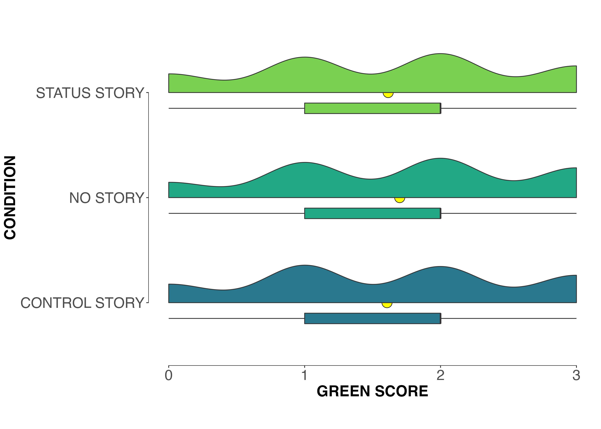
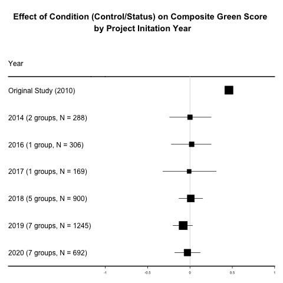
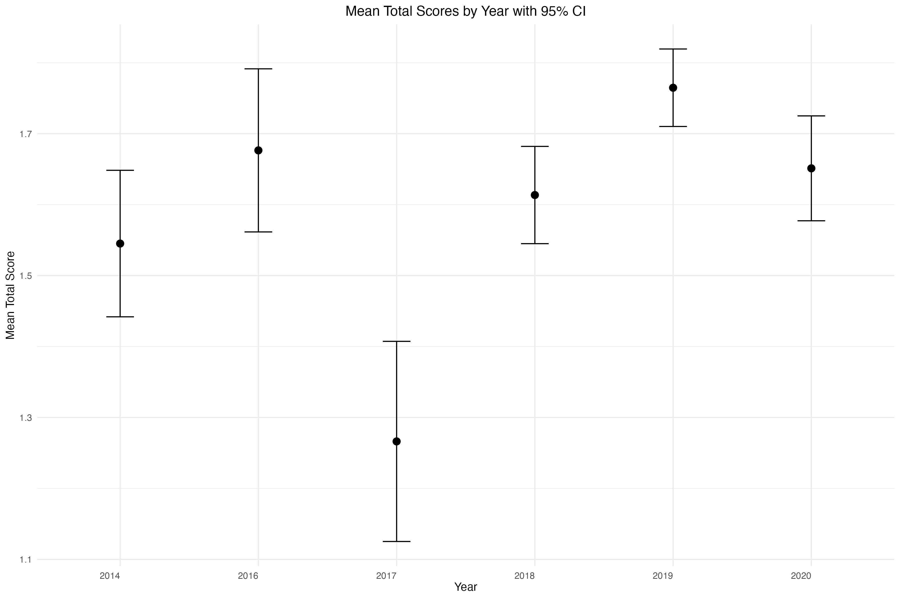

```{r packages, include=FALSE}
packages = c("tidyverse", "viridis", "colorspace","gghalves","ggthemes","skimr","Superpower","tidyr", "psych", "dplyr", "ggplot2", "sjmisc", "janitor", "rcompanion", "lsr", "papaja", "afex", "ltm","forestplot","trackdown","effsize","misty")

## Now load or install&load all
package.check <- lapply(
  packages,
  FUN = function(x) {
    if (!require(x, character.only = TRUE)) {
      install.packages(x, dependencies = TRUE)
      library(x, character.only = TRUE)
    }
  }
)
```

```{r setup, echo = FALSE, include = FALSE}

# Loading data from source
url <- "https://raw.githubusercontent.com/jorowags/crep_griskevicius/main/All%20data%20without%20extension%20variables.csv"
data <- read.csv(url)
orig.data <- data

# Define a function to format the p-values
format_p <- function(p_value) {
  if (p_value < .001) {
    return("*p* < .001")
  } else {
    return(paste0("*p* = ", round(p_value, 3)))
  }
}

data[data == ""] <- NA  

```

**Corresponding author**:

Ljiljana B. Lazarević, Faculty of Philosophy, University of Belgrade Čika Ljubina 18-20, 11000 Belgrade, Serbia Email: [ljiljana.lazarevic\@f.bg.ac.rs](mailto:ljiljana.lazarevic@f.bg.ac.rs) Phone: +381 64 1287 614

**Author contribution:** to be filled in

**Conflict of interest statement:** The authors report no conflict of interest.

**Funding statement:** This project was funded in part by NSF Award 2141930 to J. Wagge.

**Ethics committee approval:** This research was approved under an "umbrella" ethics proposal at the Institutional Review Board of the Department of Psychology, University of Belgrade (Protocol #2021-069). At each site where there was a local ethics board and where ethics approval was required, the local board approved the study. This study complied with the ethics code outlined in the Declaration of Helsinki.

**Acknowledgment:** The authors would like to thank all students, supervisors, and reviewers who contributed to this CREP project. The authors would like to specifically thank Drs. Mark Brandt and Hans IJzerman for their vision and early dedication to the CREP.

**Author contribution:**

Conceptualization: LBL, JRW, JG, and SL

Data curation: LBL, JRW, BB, VS, MF, and JG

Formal analysis: JRW, MF, and AL

Funding acquisition: JRW

Investigation: SCW, PD, AJK, KT, JT, JHF, SCW, NS, EH, LB, CDC, AG, JR, KS, and ADP

Methodology: LBL, JRW, and MF

Project Administration: LBL, BB, SCW, AJK, JHF, SCW, MBP, EH, JG, and CDC

Resources: SCW, PD, AJK, KT, JT, JHF, SCW, EH, LB, JG, AG and ADP

Supervision: LBL, VS, SCW, AJK, SCW, EH, JG, CDC, and MCR

Validation: JRW, BB, and VS

Visualization: JWR, MF

Writing - Original draft: LBL and JWR

Writing - Review and Editing: LBL, JWR, MF, AL, SCW, PD, AJK, KT, JT, SL, JHF, SCW, NS, MBP, EH, LB, JG, CDC, BB, MR, NRG, and AG

**Abstract**
The present study presents results of a collaborative registered replication of Griskevicius et al.’s (2010) findings from Experiment 1 conducted by 24 student groups from six countries (N=3774) investigating if pro-environmental behavior can be promoted by inducing status motives. Student projects were part of the Collaborative Replication and Education Project. Results of this large multi-site replication showed no evidence to support the hypothesis that pro-environmental behavior can be stimulated by inducing status motives. We performed several exploratory analyses to investigate whether extension variables (i.e., equating “green” choices with prosocial behavior, political beliefs, sampling methods, US vs. other countries, duration of data collection and gender) moderated the effect of status motives on pro-environmental choices, but our findings reproduced null results.


```{r descriptives, echo = FALSE, include = FALSE}

# Descriptive statistics for project characteristics
# Frequency tables for project code, survey language, countries, institute code, setting, and condition
frq(data$project_code)
frq(data$survey_language)
frq(data$country)
frq(data$institute_code)
frq(data$setting)
frq(data$condition)

# Counting number of unique projects, survey languages, institutes, and countries to report in manuscript
n_projects <- length(unique(data$project_code[data$project_code != "NANA"]))
n_survey_language <- length(unique(data$survey_language[data$survey_language != "NANA"]))
n_institutes <- length(unique(data$institute_code[data$institute_code != "NANA"]))
n_country <- length(unique(data$country[data$country != "NANA"]))
```

## Introduction 

The Collaborative Replications and Education Project (Wagge, Brandt et al., 2019), or CREP, is an initiative seeking to improve undergraduate training in research methods. CREP’s role includes selecting studies to be closely replicated by students, structuring the methods for the replication, reviewing projects both before and after data collection, and facilitating the publication of a pooled analysis (such as the present paper). Replications are regarded as a gold standard warranting the reliability of published findings (Open Science Collaboration, 2015). In addition, it was found that conducting a replication of highly-cited studies is perceived as exciting by students, and it also gives them a real opportunity to make substantial contributions to the field (Grahe et al., 2012; Frank et al., 2012).

CREP participants include students and instructors at institutions worldwide^[As of October 2023, 480 projects at 174 institutions in 29 countries have been initiated.]. CREP is an alternative to the traditional undergraduate research experience offering several advantages. First, the CREP model allows students to learn about best practices by directly replicating published work by scholars in their field. This active learning experience—also known in teaching literature as mastery experience or high-impact learning practice—can be an important predictor of academic achievement (Loo & Choy, 2013). Second, students get to participate in authentic scientific research (Grahe, 2017) that may eventually be published in a pooled analysis and will also be openly available on the Open Science Framework (which is an open-source management tool that facilitates open and transparent collaboration in scientific research) to meta-analytic researchers in the future. Third, students have the option of performing a “replication+” study to add their own additional research question, condition, or measure to the replication study (assuming it does not interfere with the direct replication). Furthermore, students acquire an understanding of the significance of open science practices such as preregistration, replication, open methods, and open data, all foundational to research integrity (Kidwell et al., 2016). They actively engage with external reviewers (i.e., CREP team members), collaborating and learning beyond their institution through engagement with CREP members. Several CREP studies have been published (e.g., Ghelfi et al., 2020; Leighton et al., 2018; Wagge, Baciu, et al., 2019), with some included in meta-analyses (Lehmann et al., 2018). This underscores the project’s significant contributions to psychological science.

The present report documents a pooled analysis of data collected by 24 teams who signed up to replicate one of CREP’s earliest selections for replication: Experiment 1 from Griskevicius et al. (2010). This collaborative approach not only enhances the robustness of our findings but also exemplifies the strength of collective efforts in advancing transparent and replicable research practices within the scientific community. In addition, the methodology employed in this pooled analysis underscores the commitment to fostering a culture of openness and team building in psychological research.

### The original study: Promoting pro-environmental behavior through status competition 

Griskevicius and colleagues (2010) reported the results of three experiments suggesting that status competition can promote pro-environmental behavior. Per CREP procedures (see details in Method - CREP Procedures), only one study in a multi-study paper is typically selected for replication. In this case, the CREP team selected the first experiment from Griskevicius et al. (2010) as it was the focal study that was conceptually replicated and extended in their subsequent experiments (see Method for justification). Specifically, the original authors showed that activating status motives (desires for social status and prestige) leads people to choose “green” (environmentally-friendly) products over more luxurious non-green products (Study 1). The authors predicted that reading a story that activated status motives (e.g., a short story about obtaining a successful job) would increase the likelihood of choosing pro-environmental (green) products. In control conditions that did not activate status motives (e.g., reading a story of a similar length about losing tickets to an upcoming concert, or reading no story at all), non-green products were predicted to be more desirable than their green counterparts. Participants were assigned to either the status story or one of the two control conditions (non-status story, or no story). After reading their respective stories, participants were asked to select between green products (e.g., a low-emission car) and non-green products (e.g., a more luxurious sports car). Participants in the no-story control condition proceeded to the product selection phase of the study immediately. A composite “green” score was calculated by adding up the number of “green” choices the participant made (no green choices = 0; all green choices = 3). Participants whose status motives were induced were substantially more likely to choose green products (*d* = 0.47) compared to participants in the control conditions. In summary, Griskevicius and colleagues (2010) found that activating status motives inclines people to choose pro-environmental products over more luxurious non-green products. Theoretically, this effect may reflect efforts to signal prosocial, self-sacrificing behavior. The authors interpreted their findings with respect to the “competitive altruism” hypothesis (see Van Vugt et al., 2007), which suggests that individuals attempt to appear more altruistic when competing for status. Publicly demonstrating pro-environmental behavior signals to others that you prioritize environmental concerns, indicating a willingness to incur costs (such as opting for a less luxurious product at a higher price), for the benefit of others. These altruistic tendencies are highly regarded by society, conferring prestige and status, as outlined by Griskevicius and colleagues (2010).

The present multi-lab study aims to assess the robustness of the effect observed by Griskevicius et al. (2010) in their Experiment 1 and to provide a more precise estimation of the effect size. Successful replication would entail that respondents in the social status condition would choose the less-luxurious but green product over the more luxurious but non-green alternative. Since its publication 15 years ago, the original study continues to garner significant attention, with an impressive citation count of almost 2,500 and an average of nearly 300 citations per year since 2020, according to Google Scholar data. This sustained impact on the field further warrants the need to replicate these findings in a larger, multi-site study.

## Method

### CREP Procedures

Experiment 1 of Griskevicius et al. (2010) was selected for replication by following the standard CREP selection process, outlined by Wagge and colleagues (2019). This process, which took place in 2013, resulted in the selection of several studies, including this experiment.

Once the focal study was selected, the CREP leadership team emailed the corresponding author of the original work. The CREP team communicated their process and goals and asked for input on possible extension hypotheses and guidance for replication teams. The key components of this correspondence are available here: https://osf.io/vdo0i/wiki/home/. There are two key points from the correspondence. First, the main author noted that the effect may not replicate if participants do not equate “green” choices with prosocial behavior. Second, the original first author noted that the connection between “green” choices and status was unique to politically liberal groups. The former will provide us with a lens through which we will interpret our results, while the latter explains why many student teams included political ideology in their extension hypotheses.

Between 2014 and 2020, groups signed up for the project and prepared OSF project pages for pre-data collection review. These pre-data collection project pages had to include materials, a planned analytical strategy, a video documenting the procedure, and local Institutional Review Board (IRB) approval. The project pages were examined by two reviewers and the executive reviewer, at which point projects were either approved or sent back for revisions until approval could be granted. Groups were asked to pre-register project pages before data collection. After data collection was completed, project pages were again reviewed by two reviewers and the executive reviewer. At this stage, project pages were revised to include the dataset, a short report describing the obtained results, and a signed completion pledge confirming that the research followed ethical guidelines and the predefined study protocol. Following a positive review, individual projects were deemed complete.

#### Target sample size

Per early CREP policies, the required sample size was set as a rule of thumb to be at least half of the original *N*. For this study, the targeted sample size should have been 84 (half of the original *N* of 168), but due to a typo in the documentation file the target sample size for each group was set to 82 respondents.

#### Differences from the original study

The original study was conducted in a lab, where participants were tested in small groups. Replications were conducted both in the lab and online. Some groups conducted direct replications, and others included extension variables (e.g., pro-environmental literacy, political ideology), but always after the original protocol was completed. Characteristics of the replications can be found at https://osf.io/gt39p.

### Disclosures

#### Preregistrations

Each lab preregistered its materials, protocol, and analytical strategy on the OSF before data collection. Additionally, this analysis was pre-registered: https://osf.io/ach3n.

#### Data, Materials, and Resources

The authors of the original study provided materials for replication. All groups who completed projects uploaded their data, analyses, and a short description of their results to their OSF project page. All datasets, materials, analytical scripts, and other materials can be found on the central project OSF page (https://osf.io/rh2nw/). The complete, anonymized dataset is available here: https://osf.io/3xrdf. A codebook for our merged dataset with all variables collected as part of the project is available at https://osf.io/7nkhq/.

#### Reporting

A description of the sample size, data exclusions, manipulations, and measures are reported in the study.

#### Ethical approval

Data were collected in accordance with the 1964 Declaration of Helsinki. Overarching IRB approval for this study was obtained from the IRB of the Department of Psychology, University of Belgrade, Serbia (https://osf.io/pcwhg/). In addition, as part of the CREP procedure, all groups obtained local IRB approval when necessary.

### Sample

```{r, echo = TRUE, include = FALSE}
frq(data$gender)
describe(data$age)

gender <- table(data$gender)

n.gender.women <- as.numeric(gender[1])
n.gender.men <- as.numeric(gender[3])
n.gender.gendervariant <- as.numeric(gender[2])
n.gender.nonbinarytrans <- as.numeric(gender[4])
n.gender.prefernot <- as.numeric(gender[6])
n.gender.other <- as.numeric(gender[5])

n.gender.else <- n.gender.gendervariant+n.gender.nonbinarytrans+n.gender.other+n.gender.prefernot

n.gender.na <- as.numeric(sum(is.na(data$gender)))

mean.age <- round(mean(data$age, na.rm = TRUE), digits = 2)
n.age.na <- as.numeric(sum(is.na(data$age)))
sd.age <- round(sd(data$age, na.rm = TRUE), digits = 2)

```

From 2014 to 2020, 49 groups from nine different countries expressed interest in conducting a CREP replication of Griskevicius et al. (2010) Experiment 1. Of these 49 groups, 25 did not contribute data to the final analysis: specifically, three did not create their OSF page, four did not begin data collection, five did not complete data collection, 11 did not provide their data, one did not provide their codebook, and one did not follow the CREP procedure. The final sample of completed projects included data collected by 24 groups from six countries: USA (*N* = 18), UK (*N* = 1), Germany (*N* = 1), Canada (*N* = 2), Netherlands (*N* = 1), and Iceland (*N* = 1). The overview of groups participating in this project can be found at https://osf.io/vc5rh. Overall, the present project included approximately 30 reviewers, three CREP assistants, and three executive reviewers.

A total of 21 participants were excluded prior to publicly posting the compiled dataset because they reported ages of 16 (*N* = 3) or 17 (*N* = 18). The final data set consisted of data collected from `r count(orig.data)` participants, by `r n_projects` different student groups. All individual data sets are available here: https://osf.io/dp3rc. Each student group recruited at least 82 respondents, except for one group that recruited 70 (due to the COVID-19 outbreak that interfered with the project). Nine groups failed to collect data on at least one of the following demographic characteristics: age, gender, or race/ethnicity, and within each site, the question varied in how it was asked^[Regarding demographics, the original study reported only information about gender of the participants (male and female).]. Details about the missing data are available here: https://osf.io/vc5rh.

The final sample consisted of `r n.gender.women` individuals who identified as women and `r n.gender.men` who identified as men; `r n.gender.else` participants identified as gender variant/non-conforming, “other”, “prefer not to say,” or transgender/non-binary. An additional `r n.gender.na` participants did not indicate their gender. The mean reported age for participants was `r mean.age` years (*SD* = `r sd.age`), though age was not collected for `r n.age.na` of the participants.

```{r, include = FALSE}
frq(data$recoded_race)
race.table <- table(data$recoded_race)

n.race.na <- as.numeric(sum(is.na(data$recoded_race)))
n.race.african <- as.numeric(race.table[1])
n.race.hispanic <- as.numeric(race.table[5])
n.race.indigenous <- as.numeric(race.table[2])
n.race.asian <- as.numeric(race.table[3])
n.race.black <- as.numeric(race.table[4])
n.race.middleeastern <- as.numeric(race.table[6])
n.race.multiracial <- as.numeric(race.table[7])
n.race.pacific <- as.numeric(race.table[8])
n.race.other <- as.numeric(race.table[9])
n.race.white <- as.numeric(race.table[10])

n.total.reported.race <- n.race.african + n.race.hispanic + n.race.asian + n.race.black + n.race.indigenous + n.race.middleeastern + n.race.multiracial + n.race.other + n.race.pacific + n.race.white

prop.race.white <- round(100*(n.race.white / n.total.reported.race), digits = 2)
prop.race.black <- round(100*(n.race.black + n.race.african) / n.total.reported.race, digits = 2)
prop.race.asian <- round(100*(n.race.asian / n.total.reported.race), digits = 2)
prop.race.hispanic <- round(100*(n.race.hispanic / n.total.reported.race), digits = 2)
prop.race.middleeastern <- round(100*(n.race.middleeastern / n.total.reported.race), digits = 2)
prop.race.multiracial <- round(100*(n.race.multiracial / n.total.reported.race), digits = 2)
prop.race.pacific <- round(100*(n.race.pacific / n.total.reported.race), digits = 2)
prop.race.other <- round(100*(n.race.other / n.total.reported.race), digits = 2)
prop.race.na <- round(100*(n.race.na) / (n.race.na + n.total.reported.race), digits = 2)

```

We recoded the original race/ethnicity information to include the following categories: White (*N* = `r n.race.white`, `r prop.race.white`%), Black (*N* = `r n.race.black`, `r prop.race.black`%), Asian (*N* = `r n.race.asian`, `r prop.race.asian`%), Hispanic/Latino (*N* = `r n.race.hispanic`, `r prop.race.hispanic`%), Middle Eastern (*N* = `r n.race.middleeastern`, `r prop.race.middleeastern`%), Multiracial (*N* = `r n.race.multiracial`, `r prop.race.multiracial`%), Native Hawaiian or Pacific Islander (*N* = `r n.race.pacific`, `r prop.race.pacific`%), and "other" (*N* = `r n.race.other`, `r prop.race.other`%). These reported percentages do not include the participants who either did not report their race/ethnicity or were not asked this question (*N* = `r n.race.na`, `r prop.race.na`% of the total).

### Procedure

The experiment employed a between-subjects design and included one status and two control conditions, using the exact conditions from Experiment 1 of Griskevicius et al. (2010). In the status condition, participants read a “cover” story designed to elicit “a desire for social status” (Griskevicius et al., 2010, p. 395), in which participants imagined graduating from college and obtaining a successful job with the opportunity for promotion. In one of the control conditions, participants read a control story (involving losing and eventually finding tickets to a forthcoming concert and then attending the concert with a same-sex peer) that elicited similar affect but did not activate status motives. See Griskevicius et al. (2010) for more complete details of the cover stories. 

To eliminate potential suspicions, participants were instructed that they were participating in a study investigating memory and that they would be asked to recall information from the story later in the session. To ensure that some particular aspect of the story did not influence respondents’ answers, there was a second control condition in which participants were not presented with a story to read. After reading their respective story (or in the no-story control condition, participants proceeded immediately), participants were asked to choose between three pairs of products (a car, soap, and a dishwasher). For each product, participants could choose between a pro-environmental (green) and a conventional (the more luxurious nongreen) version of the product, each of which was equally priced and manufactured by the same company.

Data were collected in the lab and online, using various survey platforms; the majority (*N* = 15) of groups used Qualtrics, while three used paper surveys and only one team used each of the following: Medialab, SuperLab, SurveyGizmo, SoSciSurvey, and PsyToolkit. One team used an unidentified online platform for data collection. Each group documented the mode of data collection that they used (online vs. in-person). Respondents were recruited from both student and general populations. Descriptions of individual datasets, along with all deviations are available at https://osf.io/t8h3k.

Any additional variables were included after the main part of the study, that is, at the end of the survey.

### Treatment of missing data, data preparation, and data analysis

We excluded participants who did not respond to the dependent variables. To create a merged dataset, we accessed all individual datasets from each team’s OSF page or reached out directly to teams for data if it was not available on OSF. In cases where clarification was needed, we contacted groups to ascertain whether the dataset was in its raw form or transformed, and to request codebooks. Any instances of missing data were retained in the analysis.

We conducted the same analyses as the original paper: for each product (car, soap, and dishwasher) we reported percentages of “green” versus “non-green” selections by condition, Chi-square tests, and Phi coefficients. We also computed a composite green score, which we analyzed with a between-subject ANOVA across conditions (story, no story, and control story), and reported effect size and post-hoc comparisons using the LSD test.

One advantage of the multi-lab approach is that natural variation in the data collection process across different labs can be leveraged to test for moderators or boundary conditions (Kline et al., 2018). Accordingly, we also performed several exploratory analyses. First, as per the recommendation of the original authors, we tested if participants equated “green” choices with prosocial behavior which is considered fundamental for replicating results.  Second, we ran 2 x 2 factorial ANOVAs to determine whether political orientation (liberal/conservative) or political party (democrat/republican) interacted with condition (control/status). Third, we ran an ANOVA to explore whether different settings (online/lab) yielded different results. Fourth, we explored whether the main effects replicated in other countries in which we collected data, and tested potential differences between the US and other countries. Fifth, the long-lasting nature of our project (data collection was done between 2014 and 2020) enabled testing whether the effects differed across time. Lastly, the original authors stated that it would be worth testing for potential gender differences; thus, as part of our exploratory analyses, we explored gender differences in status motives using a 2 x 2 factorial ANOVA (gender: woman or man; condition: control vs. status). All analyses were done using R markdown and R Studio (RStudio Team, 2020, R Core Team, 2021). The analysis code is available here: https://osf.io/kb3ct.

## Results

### Confirmatory Analyses

#### Green car

```{r green_car, include = FALSE}
# From Experiment 1: 
# Original paper: 37.2% of participants chose the green car in the control condition, 54.5% of participants chose it in the status condition, chi2(1, N = 168) = 4.56, p = .033, phi = .165

# Combine no story & control story into a new variable, control
data$new_condition <- recode(data$condition, "control story" = "Control", "no story" = "Control", "status story" = "Status")

# Our results
# Percentage selected green car by condition
car_table <- table(data$new_condition, data$greencar)
prop.table(car_table, 1)
print(car_table)
  
# Chi square test with Phi
chisq.car <- chisq.test(car_table)

# Create reported values for r snippets
chisq.car.stat <- round(as.numeric(chisq.car[1]), digits = 2)
chisq.car.p <- format(round(as.numeric(chisq.car[3]), digits = 3), nsmall = 3)
chisq.car.df <- as.numeric(chisq.car[2])
car.phi <- round(phi(car_table, digits = 3), digits = 3)

n.control.car.no <- as.numeric(car_table[1,1])
n.control.car.yes <- as.numeric(car_table[1,2])
n.status.car.no <- as.numeric(car_table[2,1])
n.status.car.yes <- as.numeric(car_table[2,2])

total.car.yes <- n.control.car.yes + n.status.car.yes
total.car.no <- n.control.car.no + n.status.car.no
total.car.n <- total.car.yes + total.car.no

prop.status.car.yes <- format(round(100*n.status.car.yes/(n.status.car.yes + n.status.car.no), digits = 2), nsmall = 2)
prop.control.car.yes.1 <- format(round(100*n.control.car.yes/(n.control.car.yes + n.control.car.no), digits = 1), nsmall = 1)
prop.control.car.yes <- format(round(100*n.control.car.yes/(n.control.car.yes + n.control.car.no), digits = 2), nsmall = 2)

chisq.car.p.formatted <- sub("^0\\.", ".", as.character(chisq.car.p))


```

The original paper found that participants selected the green car more often in the status condition (54.5%) than in the control condition (37.2%), $\chi^2$(1, N = 168) = 4.56, *p* = .033, $\phi$ = .165. In our sample, `r prop.control.car.yes`% of control participants selected the green car, compared to `r prop.status.car.yes`% of the status participants. We did not detect an effect of condition on green car selection, $\chi^2$(`r chisq.car.df`, *N* = `r formatC(total.car.n, big.mark = ",")`) = `r chisq.car.stat`, *p* = `r chisq.car.p.formatted`, $\phi$ = `r car.phi`.

#### Green cleaner

```{r green_cleaner, include = FALSE}
# Original paper: choice of the green cleaner increased from 25.7% in the
# control condition to 41.8% in the status condition, chisq(1, N =
# 168) = 4.52, p = .034, phi = .164

# Our results: 
# Percentage selected green soap by condition
soap_table <- table(data$new_condition, data$greensoap)
print(soap_table)
prop.table(soap_table, 1)
  
# Chi square test
chisq.soap <- chisq.test(soap_table)
  
# Phi coefficient
phi(soap_table, digits = 3)

# Create reported values for r snippets
chisq.soap.stat <- round(as.numeric(chisq.soap[1]), digits = 2)
chisq.soap.p <- round(as.numeric(chisq.soap[3]), digits = 3)
chisq.soap.df <- as.numeric(chisq.soap[2])
soap.phi <- round(phi(soap_table, digits = 3), digits = 3)

n.control.soap.no <- as.numeric(soap_table[1,1])
n.control.soap.yes <- as.numeric(soap_table[1,2])
n.status.soap.no <- as.numeric(soap_table[2,1])
n.status.soap.yes <- as.numeric(soap_table[2,2])

total.soap.yes <- n.control.soap.yes + n.status.soap.yes
total.soap.no <- n.control.soap.no + n.status.soap.no
total.soap.n <- total.soap.yes + total.soap.no

prop.status.soap.yes <- round(100*n.status.soap.yes/(n.status.soap.yes + n.status.soap.no), digits = 2)
prop.control.soap.yes.1 <- round(100*n.control.soap.yes/(n.control.soap.yes + n.control.soap.no), digits = 1)
prop.control.soap.yes <- round(100*n.control.soap.yes/(n.control.soap.yes + n.control.soap.no), digits = 2)

chisq.soap.p.formatted <- sub("^0\\.", ".", as.character(chisq.soap.p))


```

Similarly, the original paper found that participants selected the green car more often in the status condition (54.5%) than in the control condition (37.2%), $\chi^2$(1, *N* = 168) = 4.52, *p* = .034, $\phi$ = .164. In our sample, `r prop.control.soap.yes`% of the control and `r prop.status.soap.yes`% of the status participants selected the green soap. As with the choice of car, we did not detect an effect of condition on the choice of cleaner, $\chi^2$(`r chisq.soap.df`, *N* = `r formatC(total.soap.n, big.mark = ",")`) = `r chisq.soap.stat`, *p* = `r chisq.soap.p.formatted`, $\phi$ = `r soap.phi`.

#### Green dishwasher

```{r green_dishwasher, include = FALSE, echo = FALSE}
# Original paper: Choice of the green dishwasher also increased from 34.5% in the control condition to 49.1% in the status condition, chisq(1, N = 168) = 3.30, p = .069, eff size .140

# Our results: 
# Percentage selected green dishwasher by condition
dishwasher_table <- table(data$new_condition, data$greendishwasher)
print(dishwasher_table)
prop.table(dishwasher_table, 1)
  
# Chi square test
chisq.dishwasher <- chisq.test(dishwasher_table)
  
# Phi coefficient
phi(dishwasher_table, digits = 3)

# Create reported values for r snippets
chisq.dishwasher.stat <- round(as.numeric(chisq.dishwasher[1]), digits = 2)
chisq.dishwasher.p <- format(round(as.numeric(chisq.dishwasher[3]), digits = 3), nsmall = 3)
chisq.dishwasher.df <- as.numeric(chisq.dishwasher[2])
dishwasher.phi <- round(phi(dishwasher_table, digits = 3), digits = 3)

n.control.dishwasher.no <- as.numeric(dishwasher_table[1,1])
n.control.dishwasher.yes <- as.numeric(dishwasher_table[1,2])
n.status.dishwasher.no <- as.numeric(dishwasher_table[2,1])
n.status.dishwasher.yes <- as.numeric(dishwasher_table[2,2])

total.dishwasher.yes <- n.control.dishwasher.yes + n.status.dishwasher.yes
total.dishwasher.no <- n.control.dishwasher.no + n.status.dishwasher.no
total.dishwasher.n <- total.dishwasher.yes + total.dishwasher.no

prop.status.dishwasher.yes <- format(round(100*n.status.dishwasher.yes/(n.status.dishwasher.yes + n.status.dishwasher.no), digits = 2), nsmall = 2)
prop.control.dishwasher.yes.1 <- format(round(100*n.control.dishwasher.yes/(n.control.dishwasher.yes + n.control.dishwasher.no), digits = 1), nsmall = 1)
prop.control.dishwasher.yes <- format(round(100*n.control.dishwasher.yes/(n.control.dishwasher.yes + n.control.dishwasher.no), digits = 2), nsmall = 2)

chisq.dishwasher.p.formatted <- sub("^0\\.", ".", as.character(chisq.dishwasher.p))

```

Finally, in the original paper, participants selected the green dishwasher more in the status condition than the control condition (49.1% and 34.5%, respectively), $\chi^2$(1, *N* = 168) = 3.30, *p* = .069, $\phi$ = .140. We found no such effect when comparing the control participants who selected the green dishwasher (`r prop.control.dishwasher.yes`%) to the status condition participants who did the same (`r prop.status.dishwasher.yes`%), $\chi^2$(`r chisq.dishwasher.df`, *N* = `r formatC(total.dishwasher.n, big.mark = ",")`) = `r chisq.dishwasher.stat`, *p* = `r chisq.dishwasher.p.formatted`, $\phi$ = `r dishwasher.phi`.


#### Composite Green Score

```{r composite, include = FALSE}
# Original paper: In addition to examining the influence of status motives on each product individually, we also analyzed the effect of status when the three products were combined into a composite. As predicted, a one-way analysis of variance (ANOVA) on the product composite showed a significant effect of status, F(1, 166) = 8.53, p = .004, d = 0.47.

# Our results
# Compute composite green score; recode Y as 1 and N as 0 for green products
data$greencar <- recode(data$greencar, "Yes" = 1, "No" = 0)
data$greendishwasher <- recode(data$greendishwasher, "Yes" = 1, "No" = 0)
data$greensoap <- recode(data$greensoap, "Yes" = 1, "No" = 0)

data$total <- data$greencar + data$greendishwasher + data$greensoap
describe(data$total)
mean.composite <- format(round(mean(data$total, na.rm = TRUE),digit = 2), nsmall = 2)
sd.composite <- format(round(sd(data$total, na.rm = TRUE), digit = 2), nsmall = 2)

# Subset the data for the green/not green choices
choicevars <- c("greencar", "greensoap", "greendishwasher")
choice.data <- data[choicevars]

cron <- cronbach.alpha(choice.data, standardized = FALSE, na.rm = TRUE)
cron.x <- cron[1]
cron.x <- as.numeric(cron.x)
cron.x <- round(cron.x, digits = 2)

```

Internal consistency of the three items (i.e., products) was low (Cronbach's alpha = `r cron.x`) which was expected (Rammstedt & Beierlein, 2014; Malkewitz et al., 2023). Despite this, we followed the procedure used in the original study and computed a composite green score by assigning a score of "1" to all "green" selections and a score of "0" to all non-"green" selections. Because participants made a dichotomous choice for each of the three products, scores ranged from 0 (no "green" products) to 3 (all "green" products). The mean composite score was `r mean.composite` (*SD* = `r sd.composite`). The distribution of composite scores can be seen in Figure 1.




```{r main_anovas, include = FALSE, echo = FALSE}

# Do ANOVA by grouped condition (control v status) and get bits to report
grouped.aov <- aov(data$total ~ new_condition, data = data)
grouped.aov.summary <- summary(grouped.aov)
grouped.aov.df <- grouped.aov.summary[[1]]$Df
grouped.aov.F <- grouped.aov.summary[[1]]$`F value`
grouped.aov.ss.factor <- grouped.aov.summary[[1]]$'Sum Sq'[1]
grouped.aov.ss.total <- sum(grouped.aov.summary[[1]]$'Sum Sq')
grouped.aov.eta <- format(round(grouped.aov.ss.factor / grouped.aov.ss.total, 3), nsmall = 3)

# Get Cohen's d for grouped condition
data_grouped_d <- data
data_grouped_d$new_condition <- as.factor(data_grouped_d$new_condition)
data_grouped_d <- subset(data_grouped_d, !is.na(new_condition))
data_grouped_d$total<- as.numeric(data_grouped_d$total)
grouped.d <- cohen.d(data_grouped_d$total ~ data_grouped_d$new_condition)
grouped.d <- round(as.numeric(grouped.d[3]),2)

# Do ANOVA by ungrouped condition (status, no story, control story)
ungrouped.aov <- aov(data$total ~ condition, data = data)
ungrouped.aov.summary <- summary(ungrouped.aov)
ungrouped.aov.df <- ungrouped.aov.summary[[1]]$Df
ungrouped.aov.F <- ungrouped.aov.summary[[1]]$`F value`
ungrouped.aov.ss.factor <- ungrouped.aov.summary[[1]]$'Sum Sq'[1]
ungrouped.aov.ss.total <- sum(ungrouped.aov.summary[[1]]$'Sum Sq')
ungrouped.aov.eta <- format(round(ungrouped.aov.ss.factor / ungrouped.aov.ss.total, 3), nsmall = 3)

# post hoc testing
tukey.ungrouped <- TukeyHSD(ungrouped.aov)

# Ungrouped bar graph
ggplot(data[!is.na(data$condition), ], mapping=aes(x=condition, y=total))+
  stat_summary(fun.data=mean_sdl, geom="bar") +
  stat_summary(fun.data=mean_cl_boot, geom="errorbar", width = 0.3)

#formatting the pesky p values
nscs.p <- format(round(tukey.ungrouped$condition[10], digits = 3), nsmall = 3)
nscs.p.formatted <- sub("^0\\.", ".", as.character(nscs.p))

sscs.p <- format(round(tukey.ungrouped$condition[11], digits = 3), nsmall = 3)
sscs.p.formatted <- sub("^0\\.", ".", as.character(sscs.p))

ssns.p <- format(round(tukey.ungrouped$condition[12], digits = 3), nsmall = 3)
ssns.p.formatted <- sub("^0\\.", ".", as.character(ssns.p))


```

The original paper by Griskevicius and colleagues (2010) reported a significant effect of status on the composite score when the status prime condition was compared to both control conditions (control story and no story) combined, *F*(1, 166) = 8.53, *p* = .004, *d* = 0.47. The same test on our data did not reveal a significant effect, *F* = (`r grouped.aov.df[1]`, `r formatC(grouped.aov.df[2], big.mark = ",")`) = 
`r round(grouped.aov.F[1], 2)`, $\eta^2$ = `r grouped.aov.eta`, *d* = `r grouped.d`. Notably, this composite score has low reliability with a Cronbach's alpha of 0.38, so it is unsurprising that we did not find an effect. The original paper did not report a measure of reliability for the composite score. However, when we performed this analysis without combining the control conditions, we found a small effect, *F* = (`r ungrouped.aov.df[1]`, `r formatC(ungrouped.aov.df[2], big.mark = ",")`) = 3.21, *p* = .040, $\eta^2$ = `r ungrouped.aov.eta`. Post-hoc testing using Tukey's LSD corrections for multiple pairwise comparisons resulted in no pairwise comparisons with a *p* \< .05 (no story/control story = `r nscs.p.formatted`, status story/control story = `r sscs.p.formatted`, status story/no story = `r ssns.p.formatted`).

### Exploratory Analyses

```{r green_nice, include = FALSE, echo=FALSE}
# sites #18-37 and #19-25 examined whether participants rated the people who owned the green products as nicer, more altruistic, and more caring. Adding that analysis here. Note: they did it in different ways

# Loading data from source
url2 <- "https://raw.githubusercontent.com/jorowags/crep_griskevicius/main/data_w_extension_variables.csv"
data.ext <- read.csv(url2)

# Subset projects 19-25 and 18-37
ext.prosocial <- subset(data.ext, project == "#19-25" | project == "#18-37")

# add up niceness, caring, and altruism score for green products for 1925
ext.prosocial$nice.green.total <- ext.prosocial$X1925_NiceGreenCar + ext.prosocial$X1925_NiceGreenCleaner + ext.prosocial$X1925_NiceGreenDishwasher

ext.prosocial$nice.notgreen.total <- ext.prosocial$X1925_NiceNonGreenCar + ext.prosocial$X1925_NiceNonGreenCleaner + ext.prosocial$X1925_NiceNonGreenDishwasher

ext.prosocial$caring.green.total <- ext.prosocial$X1925_CaringGreenCar + ext.prosocial$X1925_CaringGreenCleaner + ext.prosocial$X1925_CaringGreenDishwasher

ext.prosocial$caring.notgreen.total <- ext.prosocial$X1925_CaringNonGreenCar + ext.prosocial$X1925_CaringNonGreenCleaner + ext.prosocial$X1925_CaringNonGreenDishwasher

ext.prosocial$altruism.green.total <- ext.prosocial$X1925_AltruismGreenCar + ext.prosocial$X1925_AltruismGreenCleaner + ext.prosocial$X1925_AltruismGreenDishwasher

ext.prosocial$altruism.notgreen.total <- ext.prosocial$X1925_AltruismNonGreenCar + ext.prosocial$X1925_AltruismNonGreenCleaner + ext.prosocial$X1925_AltruismNonGreenDishwasher

# Rename 18-37 variables
names(ext.prosocial)[names(ext.prosocial) == "X18_37_AQ02_01_kauf_allg_Please.indicate.on.a.scale.from.1..disagree.completely..to.9..agree.completely..how.much.you.agree.with.the.following.statements...Choosing.to.buy.pro.environmental.products.is.a.behavior.that.is.beneficial.for.the.general.public.."] <- "X1837_prosocial"
names(ext.prosocial)[names(ext.prosocial) == "X18_37_AQ02_02_kauf_nett_.Consumers.of.pro.environmental.products.are.kinder.than.consumers.of.conventional.products.."] <- "X1837_nice"
names(ext.prosocial)[names(ext.prosocial) == "X18_37_AQ02_03_kauf_mitfue_.Consumers.of.pro.environmental.products.are.more.empathetic.than.consumers.of.conventional.products.."] <- "X1837_caring"
names(ext.prosocial)[names(ext.prosocial) == "X18_37_AQ02_04_kauf_altru_.Consumers.of.pro.environmental.products.are.more.altruistic.than.consumers.of.conventional.products.."] <- "X1837_altruistic"

# Descriptive stats on 1837 variables
nice.1837.mean <- format(round(mean(ext.prosocial$X1837_nice, na.rm = TRUE), 2), nsmall = 2)
nice.1837.sd <- format(round(sd(ext.prosocial$X1837_nice, na.rm = TRUE), 2), nsmall = 2)
caring.1837.mean <- format(round(mean(ext.prosocial$X1837_caring, na.rm = TRUE), 2), nsmall = 2)
caring.1837.sd <- format(round(sd(ext.prosocial$X1837_caring, na.rm = TRUE), 2), nsmall = 2)
altruistic.1837.mean <- format(round(mean(ext.prosocial$X1837_altruistic, na.rm = TRUE), 2), nsmall = 2)
altruistic.1837.sd <- format(round(sd(ext.prosocial$X1837_altruistic, na.rm = TRUE), 2), nsmall = 2)
prosocial.1837.mean <- format(round(mean(ext.prosocial$X1837_prosocial, na.rm = TRUE), 2), nsmall = 2)
prosocial.1837.sd <- format(round(sd(ext.prosocial$X1837_prosocial, na.rm = TRUE), 2), nsmall = 2)

# 1837 t-test
#first group condition
ext.prosocial$new_condition <- recode(ext.prosocial$condition, "control story" = "control", "no story" = "control", "status story" = "status")
#then the t-tests
nice.t.1837 <- t.test(X1837_nice ~ new_condition, data = ext.prosocial)
caring.t.1837 <- t.test(X1837_caring ~ new_condition, data = ext.prosocial)
altruistic.t.1837 <- t.test(X1837_caring ~ new_condition, data = ext.prosocial)
prosocial.t.1837 <- t.test(X1837_prosocial ~ new_condition, data = ext.prosocial)

#paired t comparing prosocial to next highest mean, caring
paired.t.1837 <- t.test(ext.prosocial$X1837_prosocial, ext.prosocial$X1837_caring, paired = TRUE, alternative = "two.sided")

# any correlations with composite score?
# calculate composite in this data set
ext.prosocial$greencar <- recode(ext.prosocial$greencar, "Yes" = 1, "No" = 0)
ext.prosocial$greendishwasher <- recode(ext.prosocial$greendishwasher, "Yes" = 1, "No" = 0)
ext.prosocial$greensoap <- recode(ext.prosocial$greensoap, "Yes" = 1, "No" = 0)

ext.prosocial$total <- ext.prosocial$greencar + ext.prosocial$greendishwasher + ext.prosocial$greensoap

#now the correlations
variables_to_correlate <- ext.prosocial[c("total", "X1837_nice", "X1837_caring", "X1837_altruistic")]

# Calculate the correlation matrix and do significance tests
correlation_matrix <- cor(variables_to_correlate, use = "complete.obs")
pairwise_cor_test <- function(data) {
  combn(names(data), 2, function(x) {
    test <- cor.test(data[[x[1]]], data[[x[2]]])
    return(data.frame(var1 = x[1], var2 = x[2], cor = test$estimate, p.value = test$p.value, df = test$parameter))
  }, simplify = FALSE)
}

cor_test_results <- do.call(rbind, pairwise_cor_test(variables_to_correlate))
cor_test_results$cor <- round(cor_test_results$cor, 2)
cor_test_results$p.value <- round(cor_test_results$p.value, 3)

cor_test_results$df <- as.integer(cor_test_results$df)


# subset 1837 and look for an overall effect
ext.prosocial.1837 <- ext.prosocial[ext.prosocial$project == "#18-37", ]

# anova
aov.1837 <- aov(total ~ new_condition, data = ext.prosocial.1837)
aov.1837.results <- apa_print(aov.1837)

# formatting rs and ps for manuscript
# composite/kind correlation and p-value
cor.1837.ck.r <- cor_test_results[1,3] 
cor.1837.ck.r.formatted <- sub("^0\\.", ".", as.character(cor.1837.ck.r))
cor.1837.ck.p <- cor_test_results[1,4]
cor.1837.ck.p.formatted <- sub("^0\\.", ".", as.character(cor.1837.ck.p))

# composite/caring correlation and p-value
cor.1837.cc.r <- format(cor_test_results[2,3], nsmall = 2)
cor.1837.cc.r.formatted <- sub("^0\\.", ".", as.character(cor.1837.cc.r))
cor.1837.cc.p <- cor_test_results[2,4]
cor.1837.cc.p.formatted <- sub("^0\\.", ".", as.character(cor.1837.cc.p))

# composite/altruistic correlation and p-value
cor.1837.ca.r <- format(cor_test_results[3,3], nsmall = 2)
cor.1837.ca.r.formatted <- sub("^0\\.", ".", as.character(cor.1837.ca.r))
cor.1837.ca.p <- cor_test_results[3,4]
cor.1837.ca.p.formatted <- sub("^0\\.", ".", as.character(cor.1837.ca.p))


# do paired-samples t-test on "nice"
# lower scores indicate greater ratings of altruism, 1 totally agree that the typical owner has this quality to 9 totally disagree (see https://osf.io/kwugc)
nice.t.1925 <- t.test(ext.prosocial$nice.green.total, ext.prosocial$nice.notgreen.total, paired = TRUE, alternative = "two.sided")
nice.d.1925 <- cohens.d(ext.prosocial$nice.green.total, ext.prosocial$nice.notgreen.total, paired = TRUE, alternative = "two.sided")
nice.green.mean <- format(round(mean(ext.prosocial$nice.green.total, na.rm = TRUE), 2), nsmall = 2)
nice.notgreen.mean <- format(round(mean(ext.prosocial$nice.notgreen.total, na.rm = TRUE), 2), nsmall = 2)
nice.green.sd <- format(round(sd(ext.prosocial$nice.green.total, na.rm = TRUE), 2), nsmall = 2)
nice.notgreen.sd <- format(round(sd(ext.prosocial$nice.notgreen.total, na.rm = TRUE), 2), nsmall = 2)

caring.t.1925 <- t.test(ext.prosocial$caring.green.total, ext.prosocial$caring.notgreen.total, paired = TRUE, alternative = "two.sided")
caring.d.1925 <- cohens.d(ext.prosocial$caring.green.total, ext.prosocial$caring.notgreen.total, paired = TRUE, alternative = "two.sided")
caring.green.mean <- format(round(mean(ext.prosocial$caring.green.total, na.rm = TRUE), 2), nsmall = 2)
caring.notgreen.mean <- format(round(mean(ext.prosocial$caring.notgreen.total, na.rm = TRUE), 2), nsmall = 2)
caring.green.sd <- format(round(sd(ext.prosocial$caring.green.total, na.rm = TRUE), 2), nsmall = 2)
caring.notgreen.sd <- format(round(sd(ext.prosocial$caring.notgreen.total, na.rm = TRUE), 2), nsmall = 2)

altruism.t.1925 <- t.test(ext.prosocial$altruism.green.total, ext.prosocial$altruism.notgreen.total, paired = TRUE, alternative = "two.sided")
altruism.d.1925 <- cohens.d(ext.prosocial$altruism.green.total, ext.prosocial$altruism.notgreen.total, paired = TRUE, alternative = "two.sided")
altruism.green.mean <- format(round(mean(ext.prosocial$altruism.green.total, na.rm = TRUE), 2), nsmall = 2)
altruism.notgreen.mean <- format(round(mean(ext.prosocial$altruism.notgreen.total, na.rm = TRUE), 2), nsmall = 2)
altruism.green.sd <- format(round(sd(ext.prosocial$altruism.green.total, na.rm = TRUE), 2), nsmall = 2)
altruism.notgreen.sd <- format(round(sd(ext.prosocial$altruism.notgreen.total, na.rm = TRUE), 2), nsmall = 2)

# 1925 ANOVA comparing composite score across grouped condition
ext.prosocial.1925 <- ext.prosocial[ext.prosocial$project == "#19-25", ]

aov.1925 <- aov(total ~ new_condition, data = ext.prosocial.1925)
aov.1925.results <- apa_print(aov.1925)

#participants in 1837
n_1837 <- length(unique(ext.prosocial.1837$participant_id[ext.prosocial.1837$participant_id != "NANA"]))

#participants in 1925
n_1925 <- length(unique(ext.prosocial.1925$participant_id[ext.prosocial.1925$participant_id != "NANA"]))

```
The original authors made two important notes regarding conditions that might influence replicability of the key effect: prosociality of “green” choices and politics. Regarding prosociality, they stressed that equating “green” choices with prosocial behavior is fundamental for replicating results. That is, if participants do not equate “green” choices with prosocial behavior, effects might be weakened and consequently unreplicated. Regarding this, our multi-site study offers limited response as only two groups added an extension variable to determine whether participants found owners of the green products in the study to be more nice, caring, or altruistic than owners of the non-green products; however, they added different questions that cannot be analyzed together, so we examined each separately. 

The first site (project #15, *N* = `r n_1837`) asked participants to respond to the following question (translated from German: "Please indicate on a scale from 1 (disagree completely) to 9 (agree completely) how much you agree with the following statements: 'Consumers of pro-environmental products are [kinder/more empathetic/more altruistic] than consumers of conventional products.'" Here, the terms "kind" and "more empathetic" are used as measures of "nice" and "caring," respectively. This rating does not allow us to make any inferences about how participants would rate green product choosers versus non-green product choosers, but the means for each characteristic rating are below 5 (kind/nice: *M* = `r nice.1837.mean`, *SD* = `r nice.1837.sd`; empathetic/caring: *M* = `r caring.1837.mean`, *SD* = `r caring.1837.sd`; altruistic: *M* = `r altruistic.1837.mean`, *SD* = `r altruistic.1837.sd`). Importantly, the correlations between the total composite score and these characteristic ratings were small and nonsignificant (kind/nice: *r*(`r cor_test_results[1,5]`) = `r cor.1837.ck.r.formatted`, *p* = `r cor.1837.ck.p.formatted`; empathetic/caring: *r*(`r cor_test_results[2,5]`) = `r cor.1837.cc.r.formatted`, *p* = `r cor.1837.cc.p.formatted`; altruistic: *r*(`r cor_test_results[3,5]`) = `r cor.1837.ca.r.formatted`, *p* = `r cor.1837.ca.p.formatted`), indicating that for these participants, green product choices may not have been associated with how nice, caring, or altruistic the choices appeared to be.

The researchers at this site also included a general question assessing prosociality of green choices. Using the same rating scale as above, the asked to what extent participants agreed with this statement (again, translated from German): "Choosing to buy pro-environmental products is a behavior that is beneficial for the general public." Participant ratings for this characteristic were much higher (*M* = `r prosocial.1837.mean`, *SD* = `r prosocial.1837.sd`) than the next highest rating (empathic/caring, reported above), *t*(`r paired.t.1837$parameter`) = `r format(round(paired.t.1837$statistic, 2), nsmall = 2)`, *p* < .001, *d* = `r format(round(paired.t.1837$estimate, 2), nsmall = 2)`. This site did not replicate the main findings of the original study (results of one-way ANOVA comparing composite scores across condition[status/control]: *F*(`r aov.1837.results$table$df`, `r aov.1837.results$table$df.residual`) = `r aov.1837.results$table$statistic`, *p* = `r aov.1837.results$table$p.value`, $\eta^2$ = `r aov.1837.results$table$estimate`.

```{r 1837 moderation, include = FALSE, echo = FALSE}
ext.prosocial.1837$new_condition <- as.factor(ext.prosocial.1837$new_condition)
model.1837 <- lm(total ~ new_condition + X1837_prosocial + new_condition * X1837_prosocial, data = ext.prosocial.1837)
summary(model.1837)

# scale variables for standardized betas
ext.prosocial.1837$X1837_prosocial_std <- scale(ext.prosocial.1837$X1837_prosocial)
model.1837.std <- lm(total ~ new_condition + X1837_prosocial_std + new_condition:X1837_prosocial_std, 
                 data = ext.prosocial.1837)
model_summary_1837<- summary(model.1837.std)
p_values.model.1837.std <- coef(model_summary_1837)[, "Pr(>|t|)"]
p_values.model.1837.std <- round(p_values.model.1837.std, 3)

# to-do: remove 0s from front of p-values in next paragraph

```


The next question we asked was whether participants' ratings of prosociality moderated the relationship between condition and composite scores. We found that, while ratings of prosociality did predict composite score such that participants who rated green choices as more prosocial tended to make more of those choices ($\beta$ = `r round(model.1837.std$coefficients[3], 2)`, *p* < .001) and condition did not ($\beta$ = `r round(model.1837.std$coefficient[2], 2)`, *p* = `r p_values.model.1837.std[2]`), there was no interaction between condition and ratings of prosociality such that those who found green choices more prosocial weren't more or less likely to choose those products across the different conditions (control and status) ($\beta$ = `r round(model.1837.std$coefficients[4], 2)`), *p* = `r p_values.model.1837.std[4]`).

The second site (project #13, *N* = `r n_1925`) had participants rate these three characteristics from 1 (totally agree that the owner has this quality) to 9 (totally disagree that the owner has this quality). This group used the same items as the original study. We added these ratings together for each participant, and found that participants rated the owners of green products as nicer (*M* = `r nice.green.mean`, *SD* = `r nice.green.sd`) than owners of non-green products (*M* = `r nice.notgreen.mean`, *SD* = `r nice.notgreen.sd`), *t*(`r nice.t.1925$parameter`) = `r format(round(nice.t.1925$statistic, 2), nsmall = 2)`, *p* < .001, *d* = `r format(round(nice.d.1925$result$d, 2), nsmall = 2)`. Likewise, participants rated green product owners as more caring (*M* = `r caring.green.mean`, *SD* = `r caring.green.sd`) than non-green product owners (*M* = `r caring.notgreen.mean`, *SD* = `r caring.notgreen.sd`), *t*(`r caring.t.1925$parameter`) = `r format(round(caring.t.1925$statistic, 2), nsmall = 2)`, *p* < .001, *d* = `r format(round(caring.d.1925$result$d, 2), nsmall = 2)`, and more altruistic (*M* = `r altruism.green.mean`, *SD* = `r altruism.green.sd`) than non-green product owners (*M* = `r altruism.notgreen.mean`, *SD* = `r altruism.notgreen.sd`) as well, *t*(`r altruism.t.1925$parameter`) = `r format(round(altruism.t.1925$statistic, 2), nsmall = 2)`, *p* < .001, *d* = `r format(round(altruism.d.1925$result$d, 2), nsmall = 2)`. This site did not replicate the main findings of the original study (results of one-way ANOVA comparing composite scores across condition[status/control]: *F*(`r aov.1925.results$table$df`, `r aov.1925.results$table$df.residual`) = `r aov.1925.results$table$statistic`, *p* = `r aov.1925.results$table$p.value`, $\eta^2$) = `r aov.1925.results$table$estimate`, thereby weakening the argument that the effects might not replicate because participants might not find these products to be associated with prosocial behavior.  However, we have to be cautious regarding the conclusions because of the low power we had for this analysis.

Next, the original authors regarded political ideology as a relevant factor in explaining prosocial behavior. Thus, many student teams included political ideology as extension variables. 

#### Political orientation and party affiliation 
When the CREP team first contacted the original authors about the replication, the original authors recommended examining political orientation as a possible extension variable. A recent meta-analysis by Cruz (2017) suggested that both political ideology and party affiliation have associations with environmental concerns. Political orientation describes where someone falls on the spectrum of political beliefs ranging from strongly liberal to strongly conservative, and political party affiliation specifies the major political party with which someone identifies (Cruz, 2017). However, defining political orientation is complex, as specific attitudes and beliefs associated with it vary across time and place (Jost et al., 2003). For example, the liberal/conservative dimension conveys different political attitudes in the US and European countries (Greenberg & Jonas, 2003). 

```{r, include = FALSE}
n.conservative = sum(data$LiborCon=='Conservative', na.rm = TRUE)
n.liberal = sum(data$LiborCon=='Liberal', na.rm = TRUE)
```


```{r, include = FALSE}
# Insert 2 x 2 factorial ANOVA with condition & political orientation on composite green score

aov.out <- aov(total ~ LiborCon * new_condition, data = data)
apa_anova <- apa_print(aov.out)

mean.liberal <- mean(data$total[data$LiborCon=="Liberal"], na.rm = TRUE)
mean.conservative <- mean(data$total[data$LiborCon=="Conservative"], na.rm = TRUE)
sd.liberal <- sd(data$total[data$LiborCon=="Liberal"], na.rm = TRUE)
sd.conservative <- sd(data$total[data$LiborCon=="Conservative"], na.rm = TRUE)

mean.control <- mean(data$total[data$new_condition=="Control"], na.rm = TRUE)
mean.status <- mean(data$total[data$new_condition=="Status"], na.rm = TRUE)
sd.control <- sd(data$total[data$new_condition=="Control"], na.rm = TRUE)
sd.status <- sd(data$total[data$new_condition=="Status"], na.rm = TRUE)

# Let's report if there are any differences between the two control conditions - "no story" and "control"
aov.outUP <- aov(total ~ LiborCon * condition, data = data)
apa_anovaUP <- apa_print(aov.outUP)

LiborConNs <- table(data$LiborCon, data$new_condition)

```

In our study, many groups (*N* = 10) added a question about political orientation (liberal/conservative), and some (*N* = 4) added a question about political party affiliation (Republican/Democrat/Independent); several groups added both questions (*N* = 4), and some groups added questions with responses that were more fitting to their particular country of origin (e.g., Canada) (more information on characteristics of datasets and extension variables is available here: https://osf.io/yqf8a). We used these data to test whether green product selections differed for liberals and conservatives. Some institutions measured this with a scale (e.g., from very liberal to very conservative), while others measured it with categorical response types (e.g., liberal, conservative, neutral). We collapsed over these responses to create a novel variable with two levels: a “liberal” level that included all responses indicating any degree of being liberal, and a “conservative” level that included all responses indicating any degree of being conservative. We excluded any “neutral” or “other” responses. Using this method of collapsing data, we found that *N* = `r n.conservative` participants were classified as conservative, while *N* = `r n.liberal` participants were classified as liberal. Since this constitutes just 34.3% of the overall sample of `r count(orig.data)` participants, it is unknown whether the effects of political beliefs on status motives, if detected, would hold for the remaining 65.7% of participants.

##### Liberal/conservative

We conducted a 2 x 2 factorial ANOVA (political orientation: liberal vs. conservative; condition: control vs. status) to determine whether political orientation interacted with the condition to predict the composite green score. 

Importantly, we did not have adequate power to detect the interactions tested here. Using the *Superpower* package (Lakens & Caldwell, 2021) in R, we determined that we would have needed at least 418 participants *per cell* to detect an interaction effect between political orientation and condition. In the four cells created between these two variables, only one cell size reached this threshold (Conservative/Control, *N* = `r LiborConNs[1,1]`, Conservative/Status, *N* = `r LiborConNs[1,2]`; Liberal/Control, *N* = `r LiborConNs[2,1]`; Liberal/Status: *N* = `r LiborConNs[2,2]`). Thus, we did not further reduce power by conducting a test with ungrouped control conditions.

We found a main effect of political orientation such that participants who identified as liberal selected significantly more green products on average (*M* = 1.87, *SD* = 0.98) than participants who identified as conservative (*M* = 1.25, *SD* = 0.97), *F*(1, 1,287) = 130.73, *p* < .001, η^2 = .092. As we found earlier, there was no main effect of condition; the mean scores for participants in the grouped control condition (*M* = 1.65, *SD* = 0.99) did not differ from those in the status condition (*M* = 1.61, *SD* = 1.00), *F*(1, 1,287) = 0.41, *p* = .522, η^2 = .000. There was also no interaction between the two variables, *F*(1, 1,287) = 0.28, *p* = .597, η^2 = .000.

We found a similar pattern of results when the control conditions (no story and control story) were ungrouped: a main effect of liberal/conservative (*F*(1, 1,285) = 130.85, *p* < .001, η^2 = .092), no main effect of status condition (*F*(2, 1,285) = 1.44, *p* = .238, η^2 = .002), and no interaction between the two factors (*F*(2,1285) = 0.52, *p* = .598, η^2 = .001).

```{r, include = FALSE}
n.republican = sum(data$RorD=='Republican', na.rm = TRUE)
n.democrat = sum(data$RorD=='Democrat', na.rm = TRUE)
```

```{r, include = FALSE}
# Insert 2 x 2 factorial ANOVA with condition & political party on composite green score

aov.out2 <- aov(total ~ RorD * new_condition, data = data)
apa_anova2 <- apa_print(aov.out2)

RorDeta <- etaSquared(aov.out2)

mean.rep <- mean(data$total[data$RorD=="Republican"], na.rm = TRUE)
mean.dem <- mean(data$total[data$RorD=="Democrat"], na.rm = TRUE)

sd.rep <- sd(data$total[data$RorD=="Republican"], na.rm = TRUE)
sd.dem <- sd(data$total[data$RorD=="Democrat"], na.rm = TRUE)

RorDtable <- table(data$RorD, data$new_condition)
```

##### Democrat/republican

Similarly, for political party affiliation (“Democrat” or “Republican”), we conducted a 2 x 2 factorial ANOVA (political party: Democrat *N* = `r n.democrat` vs. Republican *N* = `r n.republican`; condition: control vs. status) including only participants from the US.

In the four cells created by political party and condition, Republican/Status (*N* = `r RorDtable[2,2]`) or Democrat/Status (*N* = `r RorDtable[1,2]`), Republican/Control (*N* = `r RorDtable[2,1]`) or Democrat/Control (*N* = `r RorDtable[1,1]`), our cell sizes did not reach the threshold of 418 participants per cell that the previous, similar analysis also required. 

We found a main effect of political party such that participants who identified as Democrat selected significantly more green products (*M* = `r round(mean.dem, digits = 2)`, *SD* = `r round(sd.dem, digits = 2)`) than participants who identified as Republican (*M* = `r round(mean.rep, digits = 2)`, *SD* = `r round(sd.rep, digits = 2)`), *F*(1, 505) = 51.95, *p* <.001, η^2 = 0.09. We did not detect an interaction between political party and condition, *F*(1, 505) = 0.14, *p* = .709, η^2 = .000, and we detected no main effect of condition (control: *M* = 1.65, *SD* = 0.99); status: *M* = 1.61, *SD* = 1.00), *F*(1, 505) = 0.80, *p* = .370, η^2 = .000.

```{r, include= FALSE}

## SETTING FOR RESEARCH
# Make a variable that combines lab, lab individual and lab groups and compare results across that with in-person

data$Groups.New <- 0
data$Groups.New <- ifelse(data$setting=="Online",1,0)
frq(data$Groups.New)

# Chi square test of independence for green car across lab/in-person
test.groups.car <- chisq.test(table(data$Groups.New, data$greencar))
test.groups.car
chisq.groups.car.p <- round(as.numeric(test.groups.car[3]), digits = 2)

# Chi square test of independence for green soap across lab/in-person
test.groups.soap <- chisq.test(table(data$Groups.New, data$greensoap))
test.groups.soap
chisq.groups.soap.p <- round(as.numeric(test.groups.soap[3]), digits = 2)

# Chi square test of independence for green dishwasher across lab/in-person
test.groups.dishwasher <- chisq.test(table(data$Groups.New, data$greendishwasher))
test.groups.dishwasher
chisq.groups.dishwasher.p <- round(as.numeric(test.groups.dishwasher[3]), digits = 2)

# 2 x 2 ANOVA comparing composite score across conditions (status and control) and settings (lab and online)
aov.out.2 <- aov(total ~ Groups.New * new_condition, data = data)
apa_anova.2 <- apa_print(aov.out.2)

mean.online <- mean(data$total[data$Groups.New=="1"], na.rm = TRUE)
mean.lab <- mean(data$total[data$Groups.New=="0"], na.rm = TRUE)
sd.online <- sd(data$total[data$Groups.New=="1"], na.rm = TRUE)
sd.lab <- sd(data$total[data$Groups.New=="0"], na.rm = TRUE)

mean.control <- mean(data$total[data$new_condition=="Control"], na.rm = TRUE)
mean.status <- mean(data$total[data$new_condition=="Status"], na.rm = TRUE)
sd.control <- sd(data$total[data$new_condition=="Control"], na.rm = TRUE)
sd.status <- sd(data$total[data$new_condition=="Status"], na.rm = TRUE)

n.online <- sum(data$Groups.New == 1, na.rm = TRUE)
n.lab <- sum(data$Groups.New == 0, na.rm = TRUE)


```

#### Lab vs. Online
To determine whether there were differences in results across different testing settings, we first collapsed all reported lab settings (group, individual, and just "lab" without specifying whether data were collected in a group or individually) into one variable level. We then conducted chi-square tests of independence using a dichotomous setting variable (lab [*N* = `r n.lab`] versus online [*N* = `r n.online`]). We found no relationship between green choice and setting for any of the three types of products (*p*s of `r chisq.groups.car.p`, `r chisq.groups.soap.p`, and `r chisq.groups.dishwasher.p` for the green car, soap, and dishwasher, respectively).

To see if there was an interaction between condition and setting, we conducted a 2 (condition: status vs. control) x 2 (lab vs. online) ANOVA using the composite score as a dependent variable. We were unable to detect a mean difference in composite score between those who completed the study in the lab (*M* = 1.66, *SD* = 0.98) and those who completed the study online (*M* = 1.64, *SD* = 1.01), *F*(1, 3,547) = 0.09, *p* = .766, η2 = .000. As we found earlier, there was also no main effect of condition; the mean scores for participants in the grouped control condition (*M* = 1.65, *SD* = 0.99) did not differ from those in the status condition (*M* = 1.61, *SD* = 1.00), *F*(1, 3547) = 1.27, *p* = .260, η2 = .000. There was also no interaction between the two variables, *F*(1, 3,547) = 1.19, *p* = .275, η2 = .000.

```{r, include = FALSE}
## LOCATION - US/OTHER
# Make a variable to see if there are differences for US versus elsewhere on prefs
data$US_or_other <- recode(data$country, "USA" = "USA", "The Netherlands" = "other", "Germany" = "other", "UK" = "other", "Iceland" = "other", "Canada" = "other")
test.location.car <- chisq.test(table(data$US_or_other, data$greencar))
test.location.car
table(data$US_or_other, data$greencar)

test.location.soap <- chisq.test(table(data$US_or_other, data$greensoap))
test.location.soap
table(data$US_or_other, data$greensoap)

test.location.dishwasher <- chisq.test(table(data$US_or_other, data$greendishwasher))
test.location.dishwasher
table(data$US_or_other, data$greendishwasher)

# Looks like there are stronger preferences for green items outside of the US. Will break down relationship between items and condition both in the US and outside

# Subset just the US participants
usa.data <- data[which(data$US_or_other == 'USA'),]
other.location.data <- data[which(data$US_or_other != 'USA'),]

# Do chi squares for just the US participants
test.groups.car <- chisq.test(table(usa.data$new_condition, usa.data$greencar))
test.groups.car
usa.car.table <- table(usa.data$new_condition, usa.data$greencar)
chisq.groups.usa.car.stat <-round(as.numeric(test.groups.car[1]), digits = 2)
chisq.groups.usa.car.p <- round(as.numeric(test.groups.car[3]), digits = 3)
chisq.groups.usa.car.p.formatted <- sub("^0\\.", ".", as.character(chisq.groups.usa.car.p))
chisq.groups.usa.car.df <- round(as.numeric(test.groups.car[2]), digits = 2)
total.usa.car.n <- as.numeric(usa.car.table[1] + usa.car.table[2] + usa.car.table[3] + usa.car.table[4])

test.groups.soap <- chisq.test(table(usa.data$new_condition, usa.data$greensoap))
test.groups.soap
usa.soap.table <- table(usa.data$new_condition, usa.data$greensoap)
chisq.groups.usa.soap.stat <-round(as.numeric(test.groups.soap[1]), digits = 2)
chisq.groups.usa.soap.p <- round(as.numeric(test.groups.soap[3]), digits = 3)
chisq.groups.usa.soap.p.formatted <- sub("^0\\.", ".", as.character(chisq.groups.usa.soap.p))
chisq.groups.usa.soap.df <- round(as.numeric(test.groups.soap[2]), digits = 2)
total.usa.soap.n <- as.numeric(usa.soap.table[1] + usa.soap.table[2] + usa.soap.table[3] + usa.soap.table[4])

test.groups.dishwasher <- chisq.test(table(usa.data$new_condition, usa.data$greendishwasher))
test.groups.dishwasher
usa.dishwasher.table <- table(usa.data$new_condition, usa.data$greendishwasher)
chisq.groups.usa.dishwasher.stat <-round(as.numeric(test.groups.dishwasher[1]), digits = 2)
chisq.groups.usa.dishwasher.p <- round(as.numeric(test.groups.dishwasher[3]), digits = 3)
chisq.groups.usa.dishwasher.p.formatted <- sub("^0\\.", ".", as.character(chisq.groups.usa.dishwasher.p))
chisq.groups.usa.dishwasher.df <- round(as.numeric(test.groups.dishwasher[2]), digits = 2)
total.usa.dishwasher.n <- as.numeric(usa.dishwasher.table[1] + usa.dishwasher.table[2] + usa.dishwasher.table[3] + usa.dishwasher.table[4])

# Do chi squares for just the "other" participants
test.groups.car2 <- chisq.test(table(other.location.data$new_condition, other.location.data$greencar))
test.groups.car2
table(other.location.data$new_condition, other.location.data$greencar)

test.groups.soap2 <- chisq.test(table(other.location.data$new_condition, other.location.data$greensoap))
test.groups.soap2
table(other.location.data$new_condition, other.location.data$greensoap)

test.groups.dishwasher2 <- chisq.test(table(other.location.data$new_condition, other.location.data$greendishwasher))
test.groups.dishwasher2
table(other.location.data$new_condition, other.location.data$greendishwasher)

# Looks like people outside of the US just like the green products more; no interaction with status prime

# control conditions + US/other -> composite?
test.grouped.location <- aov(total ~ US_or_other * new_condition, data = data)
summary(test.grouped.location)
p_value_me_location <-summary(test.grouped.location)[[1]]$`Pr(>F)`[1]
p_value_me_condition <-summary(test.grouped.location)[[1]]$`Pr(>F)`[2]
p_value_me_condition.formatted <- format(round(p_value_me_condition, 3), nsmall = 3)
p_value_me_condition.formatted <- sub("^0\\.", ".", as.character(p_value_me_condition.formatted))

p_value_me_int <-summary(test.grouped.location)[[1]]$`Pr(>F)`[3]
p_value_me_int.formatted <- format(round(p_value_me_int, 3), nsmall = 3)
p_value_me_int.formatted <- sub("^0\\.", ".", as.character(p_value_me_int.formatted))
loc.eta <- etaSquared(test.grouped.location)

other.green.m <- round(mean(data$total[data$US_or_other=="other"], na.rm = TRUE), digits = 2)
other.green.sd <- round(sd(data$total[data$US_or_other=="other"], na.rm = TRUE), digits = 2)
USA.green.m <- round(mean(data$total[data$US_or_other=="USA"], na.rm = TRUE), digits = 2)
USA.green.sd <- round(sd(data$total[data$US_or_other=="USA"], na.rm = TRUE), digits = 2)

apa.anovaUL <- apa_print(test.grouped.location)

n.USA <- sum(data$country == "USA", na.rm = TRUE)


```

#### US vs. others
The original study was conducted only with individuals in the United States. Here, we conducted an exploratory analysis to determine whether the tested effects differed for US-based participants versus participants from other countries. Using data from US-based participants only (*N* = `r formatC(n.USA, big.mark = ",")`), we found no association between condition (control versus status) and green car selection ($\chi^2$(`r chisq.groups.usa.car.df`, *N* = `r formatC(total.usa.car.n, big.mark = ",")`)) = `r chisq.groups.usa.car.stat`, *p* = `r chisq.groups.usa.car.p.formatted`, $\phi$ = `r round(phi(usa.car.table), digits = 2)`), green cleaner selection ($\chi^2$(`r chisq.groups.usa.soap.df`, N = `r formatC(total.usa.soap.n, big.mark = ",")`)) = `r chisq.groups.usa.soap.stat`, *p* = `r chisq.groups.usa.soap.p.formatted`, $\phi$ = `r format(round(phi(usa.soap.table), digits = 2), nsmall = 2)`), or green dishwasher ($\chi^2$(`r chisq.groups.usa.dishwasher.df`, N = `r formatC(total.usa.dishwasher.n, big.mark = ",")`)) = `r format(chisq.groups.usa.dishwasher.stat, nsmall = 2)`, *p* = `r chisq.groups.usa.dishwasher.p.formatted`, $\phi$ = `r format(round(phi(usa.dishwasher.table), digits = 2), nsmall = 2)`) selection.

We then conducted a 2 x 2 ANOVA to test whether there was a main effect of condition (control or status) or interaction with geographic setting (US or non-US). We detected no significant main effect of condition (*p* = `r p_value_me_condition.formatted`) or interaction (*p* = `r p_value_me_int.formatted`). We found a small main effect of location, such that individuals from non-US countries selected significantly more green products (*M* = `r other.green.m`, *SD* = `r other.green.sd`) than individuals from the US (*M* = `r USA.green.m`, *SD* = `r USA.green.sd`), *F*(1, 3,714) = 115.62, *p* < .001, η^2 = .030.

#### Stability of effect over time.
To determine if any effects differed across years, we examined effects across projects from different years, as determined by their project codes assigned at the time the teams signed up for the study (e.g., project #14-3 was initiated in 2014). With year treated as a factor, we examined whether we could detect any differences in composite green scores across conditions (control and status). As demonstrated in Figure 2, there does not appear to be any meaningful change in effect size over time.

```{r, include = FALSE}

# Calculate effect sizes over time -> Projects that start with 14, then 15, etc.

# First subset the projects by year

df.14.projects <- c("#14-3","#14-4")
df.14.subset <- subset(data, project %in% df.14.projects)

df.16.projects <- c("#16-18")
df.16.subset <- subset(data, project %in% df.16.projects)

df.17.projects <- c("#17-33")
df.17.subset <- subset(data, project %in% df.17.projects)

df.18.projects <- c("#18-10","#18-17","#18-20","#18-23","18-30","#18-37")
df.18.subset <- subset(data, project %in% df.18.projects)

df.19.projects <- c("#19-04","#19-24","#19-25","#19-33","#19-35","#19-52","#19-56")
df.19.subset <- subset(data, project %in% df.19.projects)

df.20.projects <- c("#20-04","#20-13","#20-22","#20-34","#20-56","#20-58","#20-59")
df.20.subset <- subset(data, project %in% df.20.projects)


# Then get effect sizes for each project year and store their estimates & bounds
# 2014
data$total <- as.numeric(data$total)
cohen.14 <- psych::cohen.d(total ~ new_condition, data = df.14.subset)
cohen.14.lower <- round(cohen.14$cohen.d[1], digits = 2)
cohen.14.estimate <- round(cohen.14$cohen.d[2], digits = 2)
cohen.14.upper <- round(cohen.14$cohen.d[3], digits = 2)

# 2016
cohen.16 <- psych::cohen.d(total ~ new_condition, data = df.16.subset)
cohen.16.lower <- round(cohen.16$cohen.d[1], digits = 2)
cohen.16.estimate <- round(cohen.16$cohen.d[2], digits = 2)
cohen.16.upper <- round(cohen.16$cohen.d[3], digits = 2)

# 2017
cohen.17 <- psych::cohen.d(total ~ new_condition, data = df.17.subset)
cohen.17.lower <- round(cohen.17$cohen.d[1], digits = 2)
cohen.17.estimate <- round(cohen.17$cohen.d[2], digits = 2)
cohen.17.upper <- round(cohen.17$cohen.d[3], digits = 2)

# 2018
cohen.18 <- psych::cohen.d(total ~ new_condition, data = df.18.subset)
cohen.18.lower <- round(cohen.18$cohen.d[1], digits = 2)
cohen.18.estimate <- round(cohen.18$cohen.d[2], digits = 2)
cohen.18.upper <- round(cohen.18$cohen.d[3], digits = 2)

# 2019
cohen.19 <- psych::cohen.d(total ~ new_condition, data = df.19.subset)
cohen.19.lower <- round(cohen.19$cohen.d[1], digits = 2)
cohen.19.estimate <- round(cohen.19$cohen.d[2], digits = 2)
cohen.19.upper <- round(cohen.19$cohen.d[3], digits = 2)

# 2020
cohen.20 <- psych::cohen.d(total ~ new_condition, data = df.20.subset)
cohen.20.lower <- round(cohen.20$cohen.d[1], digits = 2)
cohen.20.estimate <- round(cohen.20$cohen.d[2], digits = 2)
cohen.20.upper <- round(cohen.20$cohen.d[3], digits = 2)

# Original Paper
cohen.original.lower <- .46
cohen.original.estimate <- .46
cohen.original.upper <- .46

# Create a forest plot with effect sizes
effect.time <- 
  structure(list(
    mean  = c(NA,cohen.original.estimate, cohen.14.estimate,cohen.16.estimate, cohen.17.estimate, cohen.18.estimate, cohen.19.estimate, cohen.20.estimate), 
    lower = c(NA,cohen.original.lower, cohen.14.lower,cohen.16.lower,cohen.17.lower, cohen.18.lower, cohen.19.lower, cohen.20.lower),
    upper = c(NA, cohen.original.upper, cohen.14.upper, cohen.16.upper, cohen.17.upper, cohen.18.upper, cohen.19.upper, cohen.20.upper)),
    .Names = c("estimate", "lower", "upper"), 
    row.names = c(NA, "Original Study (2010)","2014", "2016", "2017", "2018", "2019", "2020"), 
    class = "data.frame")

tabletext<-cbind(
  c("Year", "Original Study (2010)", "2014 (2 groups, N = 288)", "2016 (1 group, N = 306)", "2017 (1 groups, N = 169)", "2018 (5 groups, N = 900)", "2019 (7 groups, N = 1245)", "2020 (7 groups, N = 692)"))

jpeg(file='forestplot.jpg') # Open JPEG device with specific file name

forestplot(tabletext, 
           hrzl_lines = list("2" = gpar(lwd=2),
                             "9" = gpar(lwd=2)),
           line.margin = .1,
           xticks = c(-1.00, -.50, 0, .50, 1.00),
           lwd.zero = 1, 
           graph.pos = 2,
            effect.time,new_page = TRUE,
           is.summary=FALSE,
           clip=c(-1,1), 
           title="Effect of Condition (Control/Status) on Composite Green Score \n by Project Initation Year",
           xlog=FALSE, 
           col=fpColors(box="black",line="black", summary="black"))

dev.off()

```




```{r, include = FALSE, echo = TRUE}
# Insert 2 x 2 factorial ANOVA with condition & gender on composite green score

# Filter out participants who don't identify as Male or Female
mf_data <- subset(data, gender == "Male" | gender == "Female")

aov.out3 <- aov(total ~ gender * new_condition, data = mf_data)
apa_anova3 <- apa_print(aov.out3)

mfeta <- etaSquared(aov.out3)

mean.male <- mean(mf_data$total[mf_data$gender=="Male"], na.rm = TRUE)
mean.female <- mean(mf_data$total[mf_data$gender=="Female"], na.rm = TRUE)

sd.male <- sd(mf_data$total[mf_data$gender=="Male"], na.rm = TRUE)
sd.female <- sd(mf_data$total[mf_data$gender=="Female"], na.rm = TRUE)

mftable <- table(mf_data$gender, mf_data$new_condition)

# do ungrouped condition, same thing
aov.outUG <- aov(total ~ gender * condition, data = mf_data)
summary(aov.outUG)
apa_anovaUG <- apa_print(aov.outUG)
mfetaUG <- etaSquared(aov.outUG)

mean.nostory <- round(mean(mf_data$total[mf_data$condition=="no story"], na.rm = TRUE), digits = 2)
mean.control <- round(mean(mf_data$total[mf_data$condition=="control story"], na.rm = TRUE), digits = 2)
mean.status <- round(mean(mf_data$total[mf_data$condition=="status story"], na.rm = TRUE), digits = 2)


sd.nostory <- round(sd(mf_data$total[mf_data$condition=="no story"], na.rm = TRUE), digits = 2)
sd.control <- round(sd(mf_data$total[mf_data$condition=="control story"], na.rm = TRUE), digits = 2)
sd.status <- round(sd(mf_data$total[mf_data$condition=="status story"], na.rm = TRUE), digits = 2)

tukeyUG <- TukeyHSD(aov.outUG)
```

#### Gender differences
In their original paper, Griskevicius and colleagues (2010) stated that exploring gender differences would be interesting in future studies. Although they did not find any gender differences, Griskevicius et al. (2010) hypothesized that men could be more likely to engage in pro-environmental “showing-off” behavior than women because men are generally more concerned about status motives. Because of our additional statistical power, we sought to test these potential gender differences as part of our exploratory analyses.

To test this question, we conducted a 2 x 2 factorial ANOVA (gender: woman or man; condition: control vs. status). We found a main effect of gender, such that participants who identified as women selected significantly more green products (*M* = `r round(mean.female, digits = 2)`, *SD* = `r round(sd.female, digits = 2)`) than participants who identified as men (*M* = `r round(mean.male, digits = 2)`, *SD* = `r round(sd.male, digits = 2)`), *F*(1, 3,263) = 36.22, *p* < .001, η^2 = 0.01. We did not detect an interaction between gender and condition, *F*(1, 3,263) = 0.00, *p* = .964, η^2 = .000.

```{r}

#formatting p values for next paragraph
aov2x3.nscs.p <- round(tukeyUG$condition[1,4], digits = 3)
aov2x3.nscs.p.formatted <- sub("^0\\.", ".", as.character(aov2x3.nscs.p))

aov2x3.nsss.p <- round(tukeyUG$condition[3,4], digits = 3)
aov2x3.nsss.p.formatted <- sub("^0\\.", ".", as.character(aov2x3.nsss.p))

aov2x3.csss.p <- round(tukeyUG$condition[2,4], digits = 3)
aov2x3.csss.p.formatted <- sub("^0\\.", ".", as.character(aov2x3.csss.p))

```


When we conducted a 2 x 3 factorial ANOVA with the independent conditions (control, status, and no story), we found an effect of condition, *F*(2, 3,261) = 4.23, *p* = .015, η^2 = .000. Post-hoc testing with Tukey's LSD correction revealed significant differences between the "no story" condition and the other two conditions (95% CI of the difference for no story vs. control story [`r round(tukeyUG$condition[1,2], digits = 2)`, `r round(tukeyUG$condition[1,3], digits = 2)`], *p* = `r aov2x3.nscs.p.formatted`); 95% CI of the difference for no story vs. status: [`r round(tukeyUG$condition[3,2], digits = 2)`, `r round(tukeyUG$condition[3,3], digits = 2)`], *p* = `r aov2x3.nsss.p.formatted`). There was no difference between the control story and the status story conditions, *p* = `r aov2x3.csss.p.formatted`). Participants in the "no story" condition made more "green" choices (*M* = `r mean.nostory`, *SD* = `r sd.nostory`) than participants in the control condition (*M* = `r mean.control`, *SD* = `r sd.control`) or status condition (*M* = `r mean.status`, *SD* = `r format(sd.status, nsmall = 2)`). This effect was not detected when the ungrouped conditions were examined in the entire data set; it was detected only when we excluded participants who did not respond to the question about gender or listed a gender other than "Male" or "Female."


```{r eval=FALSE, include=FALSE}
# power analysis with Superpower
design  <-  ANOVA_design(
  design = "2b*2b",
  n = round(739/4, 0), # our cell size assuming we had EQUAL cell sizes - a very non-conservative approach (because we had between 81 and 322 participants per cell with the total sample of 739)
  mu = c(1.90, 1.38, 1.95, 1.15), # means for each cell (condition x political orientation)
  sd = 1.02) 

ANOVA_exact(design, alpha_level = 0.05)

# plot power simulation
plot_power(design,
           alpha_level = 0.05,
           desired_power = 80,
           min_n = 100,
           max_n = 500)$plot_ANOVA

# 418 participants per cell needed for .80 power to detect this interaction, assuming conventional alpha levels of .05
```

## Discussion

In their original study, Griskevicius et al. (2010) suggested that pro-environmental behavior can be promoted using status competition. They linked this finding to the “competitive altruism” hypothesis, according to which individuals’ altruistic behaviors arise from status competition (i.e., attempts to be perceived as good; Hardy & Van Vugt, 2006). In essence, cultivating a positive reputation through prosocial and pro-environmental behavior and action, coupled with a demonstrated willingness to incur costs for the public good, can elevate an individual’s standing within a group. The original study revealed a higher preference for all three green products (green car, green cleaner, green dishwasher) in the status condition compared to the control conditions.

In this multi-lab replication study, we recruited a large sample of participants across six different countries. We employed the same methods and analytical strategy as the original study. As part of our pre-registered confirmatory analysis, we tested whether an effect of status on pro-environmental choice behavior existed when the green score was calculated as a composite. Critically, this analysis did not detect a statistically significant effect of status, failing to replicate the original findings from Experiment 1 of Griskevicius et al. (2010). We also analyzed if an effect of status existed for each of the green vs. non-green products separately. For all three products, we failed to detect a significant effect of status. Participants in the status condition and the control conditions did not differ in their tendency to select green products. As in the original study, we found no differences in green choice behavior between the two control conditions (non-status story vs. no story). However, there appeared to be potential (but not statistically significant) differences between both “story” conditions (status and control) and the “no story” condition such that exposure to any story resulted in fewer “green” choices. Thus, overall, we did not replicate the main conclusion of Experiment 1 from Griskevicius et al. (2010) with a much more highly powered analysis (original *N* = 168, present *N* = `r count(orig.data)`). 

One possible explanation for this difference in results is that our control participants selected the green products at much higher rates than in the original study. Our control participants' rates of selecting the green car, soap, and dishwasher were `r prop.control.car.yes.1`%, `r prop.control.soap.yes.1`%, and `r prop.control.dishwasher.yes.1`%, respectively, while the original control participants' rates were much lower at 37.2%, 25.7%, and 34.5%, respectively. There could be a ceiling effect with green product choices, such that a certain proportion of the population will never choose to buy green products. Accordingly, in our sample, the proportions of “green” choice selections among participants in both the control and status conditions were potentially near this ceiling. Meanwhile, green products may have been perceived as more novel when Griskevicius and colleagues ran their study (~2008), such that a smaller group of the population would buy them when given the choice. In this case, perhaps status primes moved some people over the fence, but by the time our data collection occurred, the people who could have been persuaded by a status prime were already making these choices.

Given this possible alternative explanation, we examined whether there appeared to be any overall pattern in the total composite score over time (collapsing across conditions). As shown in Figure 3, some years do differ from others, but the early years (2014 and 2016) are not significantly different from the last two years (2021 and 2022). Nevertheless, it is still possible that attitudes toward pro-environmental behaviors had sufficiently changed between the time when Griskevicius et al. (2010) conducted their study (which appeared to have occurred in 2008 or earlier, based on the date of original submission to the *Journal of Personality and Social Psychology*) and 2014, the earliest starting date of data collection in our study.

```{r echo=FALSE, warning=FALSE, message=FALSE, fig.cap="Forest plot example"}
library(ggplot2)

# Assuming we have a data frame 'df' with columns 'Year', 'Mean', 'Lower_CI', and 'Upper_CI'
datasets <- list(df.14.subset, df.16.subset, df.17.subset, df.18.subset, df.19.subset, df.20.subset)

# Function to calculate mean and CI
calculate_stats <- function(data) {
  mean_value <- mean(data$total, na.rm = TRUE) # Add na.rm = TRUE to handle NAs
  sd_value <- sd(data$total, na.rm = TRUE) # Add na.rm = TRUE to handle NAs
  n <- sum(!is.na(data$total)) # Only count non-NA values for n
  error_margin <- 1.96 * (sd_value / sqrt(n)) # Use non-NA n for error margin calculation
  
  return(c(Mean = mean_value, Lower_CI = mean_value - error_margin, Upper_CI = mean_value + error_margin))
}

# Apply the function to each dataset
stats <- do.call(rbind, lapply(datasets, calculate_stats))

# Create the final data frame
df <- data.frame(
  Year = as.factor(c("2014", "2016", "2017", "2018", "2019", "2020")),
  Mean = stats[, "Mean"],
  Lower_CI = stats[, "Lower_CI"],
  Upper_CI = stats[, "Upper_CI"]
)

# Create the forest plot
p <- ggplot(df, aes(x = Year, y = Mean, ymin = Lower_CI, ymax = Upper_CI)) +
  geom_errorbar(width=.2, color="black") +
  geom_point(size=3, color="black") +
  theme_minimal() +
  theme(
    axis.text.x = element_text(angle = 0, vjust = 0.5, hjust=1),
    plot.title = element_text(hjust = 0.5) 
  ) +
  labs(x = "Year", y = "Mean Total Score", title = "Mean Total Scores by Year with 95% CI")

# Print the plot to display in the R Markdown document
p

# Save the plot as a jpg file
ggsave("fig3.jpg", plot = p, device = "jpg", width = 12, height = 8, units = "in", bg = "white")

# Save processed data
write.csv(data, "processed_data.csv", row.names = TRUE)


```




The original authors stressed that equating pro-environmental choices with prosocial behavior is fundamental for the effect to appear. Despite being recommended by the original authors, only one group decided to explore this extension hypothesis. Although limited by low power, our findings do not give support for the original authors’ claim.  

Per the recommendation of the original authors, we performed exploratory analyses to test whether political beliefs significantly moderated the effect of status motives on pro-environmental choices. In this study, some testing sites collected data on political orientation (e.g., liberal/conservative) and/or political party (e.g., Democrat/Republican) as extension variables. We found that participants who identified as liberal or as Democrats selected more green products than participants who identified as conservatives or as Republicans. These independent effects of political belief (either orientation or party affiliation) did not, however, interact with any effect of activating status motives on green choice behavior.

One difference between the original study and our multi-site replication was that in the original study, participants were tested in small groups in a lab setting. Meanwhile, in our study, many sites tested participants in the lab, sometimes individually and sometimes in small groups, yet other sites tested participants online. It is conceivable that being tested in a laboratory context, which is presumably more social (in that, at minimum, the participant has some interaction with a research assistant, and possibly with other participants), may more strongly influence status motives on pro-environmental behaviors, compared to being tested online. If this is the case, then we would expect to have found differences in the proportion of green choice selections between in-person and online participants in our study (e.g., Belletier et al., 2015; Belletier & Camos, 2018). However, when we explored whether the setting in which participants were tested (lab—presumably at least somewhat social—versus online) influenced the results, we found no significant difference in composite green scores across these settings. Thus, we cannot conclude that the difference between the present study and that of the original study could be explained by different sampling methods. Online data collection has become increasingly popular over the last decade and offers several advantages over traditional lab settings, such as reduced costs, more effective testing, increased generalizability of results, and more efficient (i.e., automated) data collection (e.g., Buhrmester et al., 2011; Dandurand et al., 2008; Gosling et al., 2004; Nayak & Narayan, 2019). Our findings of no difference in results between the lab and online contexts are consistent with those of many previous studies comparing the quality of online and lab-based samples of participants (e.g., Peer et al., 2017; Riva et al., 2003). 

It is important to note that the original study was conducted in the US, while this multi-site replication project collected data in five other countries: Canada, the Netherlands, the UK, Germany, and Iceland. We found no significant differences in results between the samples from different countries. We believe this finding is expected as all countries are WEIRD (Western, Educated, Industrialized, Rich, and Democratic; Henrich et al., 2010) and highly sustainable, with sound environmental policies according to the Fragile State Index (Fund for Peace, 2022). 

An additional aspect of this multi-site replication study is the extended duration of data collection spanning several years. This allowed us to investigate potential variations in the tested effects over time. However, we did not find substantial differences in effect sizes obtained from replication studies completed between 2014 and 2020.

Finally, in their paper, Griskevicius and associates stated that gender differences in status motives would be worth exploring. Our findings indicate a greater inclination among women toward green products compared to men, but a moderating effect of gender on the relationship between experimental conditions and product preference was not obtained.

### Limitations of the study

The present study has some limitations. First, as stated previously, all of the countries in which the study was conducted are WEIRD and highly sustainable countries. Our findings indicate that status motives do not drive individuals to choose pro-environmental products. However, one should exercise caution in generalizing these findings to broader populations. One possibility is that participants from non-WEIRD and fragile countries, many of which have recently increased efforts to promote pro-environmental behaviors (e.g., Diaz et al., 2020), could be more sensitive to any potential relation between social status and pro-environmental action. Therefore, it will be worth exploring in future work whether the results of the original study would replicate in non-WEIRD and countries that are considered fragile. Additionally, it is crucial to acknowledge the potential impact of socio-cultural factors in these diverse contexts. Evidence suggests that pro-environmental behavior is influenced by social norms (e.g., Saracevic et al., 2022) and individual values (e.g., Nordlund & Garvill, 2002). Thus, the specific recommendation for future research is that researchers can explore how local values and socio-economic conditions might influence the relationship between social status and pro-environmental actions in different regions.

Second, we tested moderation effects only for those variables for which we had sufficient statistical power. Therefore, most of the extension variables that were measured could not be used in the analyses (e.g., personality traits, altruism, empathy). To more thoroughly explore the role of extension variables in the effects being replicated, future CREP studies could pose stricter guidelines on the usage of extension variables in student groups. Furthermore, incorporating a comprehensive set of guidelines for the inclusion of extension variables would enhance the robustness and applicability of findings across diverse research settings, fostering a more nuanced understanding of moderation effects.

### Conclusion

One goal for this project was to provide a medium for students to engage in high-quality replication research while contributing to the field. Student-led projects can and do offer adequate rigor; the quality of the studies was ensured by continuous and careful supervision of senior researchers (faculty members, two reviewers, one CREP board member), recommendations from the original first author, and documentation of the research process (e.g., Grahe et al., 2020; Wagge et al., 2019; Wagge et al., 2023).

The primary goal of this project, however, was to investigate the possibility of promotion of pro-environmental behavior through status competition. This study presents a large sample multi-site replication of the Griskevicius et al. (2010) study, conducted by student teams at various institutions. Overall, our study did not replicate the original work, as we observed no evidence supporting the notion that pro-environmental behavior can be stimulated by inducing status motives. While these results do not dismiss the theoretical framework proposed by Griskevicius et al., at the least they do indicate substantial boundary conditions. Given our inability to demonstrate a reliable effect, this theory warrants reconsideration to identify populations that may still exhibit the effect or to understand why the effect has diminished. The time lapse between the original study and our replications, spanning from 4 to 10 years, has seen increased attention directed toward climate change and environmental choices. It is conceivable that the heightened awareness on this topic has moderated the manifestation of the effect. Regardless of cause, it seems the original effect is either very sensitive to the conditions in which it is collected, or is not reliably detected in modern times. 

## References

Belletier, C., Davranche, K., Tellier, I. S., Dumas, F., Vidal, F., Hasbroucq, T., & Huguet, P. (2015). Choking under monitoring pressure: Being watched by the experimenter reduces executive attention. *Psychonomic Bulletin & Review, 22,* 1410–1416. https://doi.org/10.3758/s13423-015-0804-9

Belletier, C., & Camos, V. (2018). Does the experimenter presence affect working memory? *Annals of the New York Academy of Sciences, 1424,* 212–220. https://doi.org/10.1111/nyas.13627

Buhrmester, M., Kwang, T., & Gosling, S. D. (2011). Amazon’s Mechanical Turk: A new source of inexpensive, yet high-quality, data? *Perspectives on Psychological Science, 6*(1), 3–5. https://doi.org/10.1177/1745691610393980

Cruz, S. M. (2017). The relationships of political ideology and party affiliation with environmental concern: A meta-analysis. *Journal of Environmental Psychology, 53,* 81-91. https://doi.org/10.1016/j.jenvp.2017.06.010 

Dandurand, F., Shultz, T. R., & Onishi, K. H. (2008). Comparing online and lab methods in a problem-solving experiment. *Behavior Research Methods, 40*(2), 428–434. https://doi.org/10.3758/BRM.40.2.428

Díaz, M. F., Charry, A., Sellitti, S., Ruzzante, M., Enciso, K., & Burkart, S. (2020). Psychological factors influencing pro-environmental behavior in developing countries: Evidence from Colombian and Nicaraguan students. *Frontiers in Psychology, 11,* 580730. https://doi.org/10.3389/fpsyg.2020.580730

Frank, M. C., & Saxe, R. (2012). Teaching Replication. *Perspectives on Psychological Science, 7*(6), 600–604. https://doi.org/10.1177/1745691612460686

Fund for Peace (2022). Fragile State Index 2022 - Annual Report. Retrieved from https://fragilestatesindex.org/2022/07/13/fragile-states-index-2022-annual-report/

Ghelfi, E., Christopherson, C. D., Urry, H. L., Lenne, R. L., Legate, N., Ann Fischer, M., Wagemans, F. M. A., Wiggins, B., Barrett, T., Bornstein, M., de Haan, B., Guberman, J., Issa, N., Kim, J., Na, E., O’Brien, J., Paulk, A., Peck, T., Sashihara, M., … Sullivan, D. (2020). Reexamining the effect of gustatory disgust on moral judgment: A multilab direct replication of Eskine, Kacinik, and Prinz (2011). *Advances in Methods and Practices in Psychological Science, 3*(1), 3–23. https://doi.org/10.1177/2515245919881152

Gosling, S. D., Vazire, S., Srivastava, S., & John, O. P. (2004). Should We Trust Web-Based Studies? A Comparative Analysis of Six Preconceptions About Internet Questionnaires. *American Psychologist, 59*(2), 93–104. https://doi.org/10.1037/0003-066X.59.2.93

Grahe, J. E. (2017). Authentic research projects benefit students, their instructors, and science. In How we teach now: The GSTA guide to student-centered teaching. (pp. 352–368). Society for the Teaching of Psychology. Retrieved from https://teachpsych.org/ebooks/howweteachnow 

Grahe, J. E., Cuccolo, K., Leighton, D. C., & Cramblet Alvarez, L. D. (2020). Open science promotes diverse, just, and sustainable research and educational outcomes. *Psychology Learning & Teaching, 19*(1), 5–20. https://doi.org/10.1177/1475725719869164

Grahe, J. E., Reifman, A., Hermann, A. D., Walker, M., Oleson, K. C., Nario-Redmond, M., & Wiebe, R. P. (2012). Harnessing the undiscovered resource of student research projects. *Perspectives on Psychological Science, 7*(6), 605-607. https://doi.org/10.1177/1745691612459057

Greenberg, J., & Jonas, E. (2003). Psychological motives and political orientation--the left, the right, and the rigid: Comment on Jost et al.(2003). Psychological Bulletin, 129(3), 376-382. DOI: 10.1037/0033-2909.129.3.376 

Griskevicius, V., Tybur, J. M., & Van den Bergh, B. (2010). Going green to be seen: Status, reputation, and conspicuous conservation. *Journal of Personality and Social Psychology, 98*(3), 392–404. https://doi.org/10.1037/a0017346

Hardy, C. L., & Van Vugt, M. (2006). Nice guys finish first: The competitive altruism hypothesis. *Personality and Social Psychology Bulletin, 32*(10), 1402–1413. https://doi.org/10.1177/0146167206291006

Henrich, J., Heine, S. J., & Norenzayan, A. (2010). The weirdest people in the world?. *Behavioral and Brain Sciences, 33*(2-3), 61-83. https://doi.org/10.1017/s0140525x0999152x

Jost, J. T., Glaser, J., Sulloway, F. J., & Kruglanski, A. W. (2003). Political conservatism as motivated social cognition. *Psychological Bulletin, 129*(3),339–375. https://doi.org/10.1037/0033-2909.129.3.339 

Kidwell, M. C., Lazarević, L. B., Baranski, E., Hardwicke, T. E., Piechowski, S., Falkenberg, L.-S., Kennett, C., Slowik, A., Sonnleitner, C., Hess-Holden, C., Errington, T. M., Fiedler, S., & Nosek, B. A. (2016). Badges to acknowledge open practices: A simple, low-cost, effective method for increasing transparency. *PLoS Biology, 14*(5), e1002456. https://doi.org/10.1371/journal.pbio.1002456

Klein, R. A., Vianello, M., Hasselman, F., Adams, B. G., Adams Jr, R. B., Alper, S., … & Sowden, W. (2018). Many Labs 2: Investigating variation in replicability across samples and settings. *Advances in Methods and Practices in Psychological Science, 1*(4), 443-490. https://doi.org/10.1177/2515245918810225 

Lakens, D., & Caldwell, A. R. (2021). Simulation-Based Power Analysis for Factorial Analysis of Variance Designs. *Advances in Methods and Practices in Psychological Science, 4*(1), 251524592095150. https://doi.org/10.1177/2515245920951503

Lehmann, G. K., Elliot, A. J., & Calin-Jageman, R. J. (2018). Meta-analysis of the effect of red on perceived attractiveness. *Evolutionary Psychology, 16*(4), 1474704918802412. https://doi.org/10.1177/1474704918802412

Leighton, D. C., Legate, N., LePine, S., Anderson, S. F., & Grahe, J. (2018). Self-esteem, self-disclosure, self-expression, and connection on Facebook: A collaborative replication meta-analysis. Psi Chi *Journal of Psychological Research, 23*(2), 98–109. https://doi.org/10.24839/2325-7342.JN23.2.98

Loo, C. W., & Choy, J. L. F. (2013). Sources of self-efficacy influencing academic performance of engineering students. *American Journal of Educational Research, 1*(3), 86-92. https://doi.org/10.12691/education-1-3-4 

Malkewitz, C. P., Schwall, P., Meesters, C., & Hardt, J. (2023). Estimating reliability: A comparison of Cronbach’s α, McDonald’s ωt and the greatest lower bound. *Social Sciences & Humanities Open, 7*(1). https://doi.org/10.1016/j.ssaho.2022.100368 

Nayak, M. S. D. P., & Narayan, K. A. (2019). Strengths and weaknesses of online surveys. *Technology, 6*(7). https://www.iosrjournals.org/iosr-jhss/papers/Vol.%2024%20Issue5/Series-5/E2405053138.pdf 

Nordlund, A. M., & Garvill, J. (2002). Value structures behind proenvironmental behavior. *Environment and Behavior, 34*(6), 740-756. http://dx.doi.org/10.1177/001391602237244  

Open Science Collaboration. (2015). Estimating the reproducibility of psychological science. *Science, 349*(6251), https://doi.org/10.1126/science.aac4716 

Peer, E., Brandimarte, L., Samat, S., & Acquisti, A. (2017). Beyond the Turk: Alternative platforms for crowdsourcing behavioral research. *Journal of Experimental Social Psychology, 70,* 153–163. https://doi.org/10.1016/j.jesp.2017.01.006

Rammstedt, B. & Beierlein, C. (2014). Can’t We Make It Any Shorter?. *Journal of Individual Differences, 35*(4), 212-220. https://doi.org/10.1027/1614-0001/a000141 

R Core Team. (2021). R: A Language and Environment for Statistical Computing. R Foundation for Statistical Computing. https://www.R-project.org/

Riva, G., Teruzzi, T., & Anolli, L. (2003). The use of the Internet in psychology research: Comparison of online and offline questionnaires. *CyberPsychology & Behavior, 6*(1), 73–80. https://doi.org/10.1089/109493103321167983

RStudio Team. (2020). RStudio: Integrated Development Environment for R. RStudio, PBC. http://www.rstudio.com/

Saracevic, S., Schlegelmilch, B. B., & Wu, T. (2022). How normative appeals influence pro-environmental behavior: The role of individualism and collectivism. *Journal of Cleaner Production, 344,* 131086. https://doi.org/10.1016/j.jclepro.2022.131086

Van Vugt, M., Roberts, G., & Hardy, C. (2007). Competitive altruism: Development of reputation-based cooperation in groups. In R. Dunbar & L. Barrett (Eds.), *Handbook of evolutionary psychology* (pp. 531–540). Oxford, England: Oxford University Press. https://doi.org/10.1093/oxfordhb/9780198568308.013.0036

Wagge, J. R., Baciu, C., Banas, K., Nadler, J. T., Schwarz, S., Weisberg, Y., IJzerman, H., Legate, N., & Grahe, J. (2019). A demonstration of the Collaborative Replication and Education Project: Replication attempts of the red-romance effect. *Collabra: Psychology, 5*(1), 5. https://doi.org/10.1525/collabra.177

Wagge, J. R., Brandt, M. J., Lazarevic, L. B., Legate, N., Christopherson, C., Wiggins, B., & Grahe, J. E. (2019). Publishing research with undergraduate students via replication work: The Collaborative Replications and Education Project. *Frontiers in Psychology, 10,* 247. https://doi.org/10.3389/fpsyg.2019.00247

Wagge, J. R., Hurst, M. A., Brandt, M. J., Lazarevic, L. B., Legate, N., & Grahe, J. E. (2023). Teaching research in principle and in practice: What do psychology instructors think of research projects in their courses? *Psychology Learning & Teaching, 22*(1), 4–19. https://doi.org/10.1177/14757257221101942
