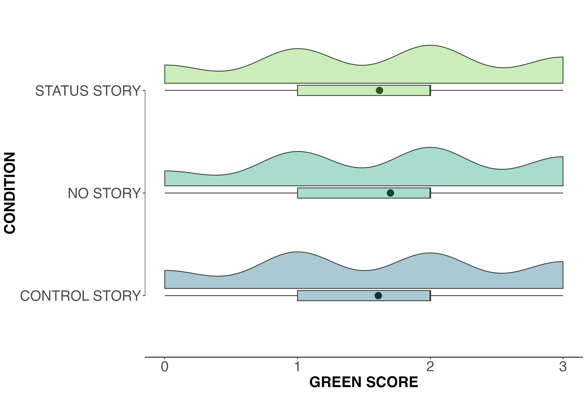
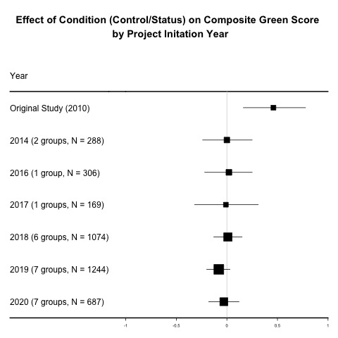
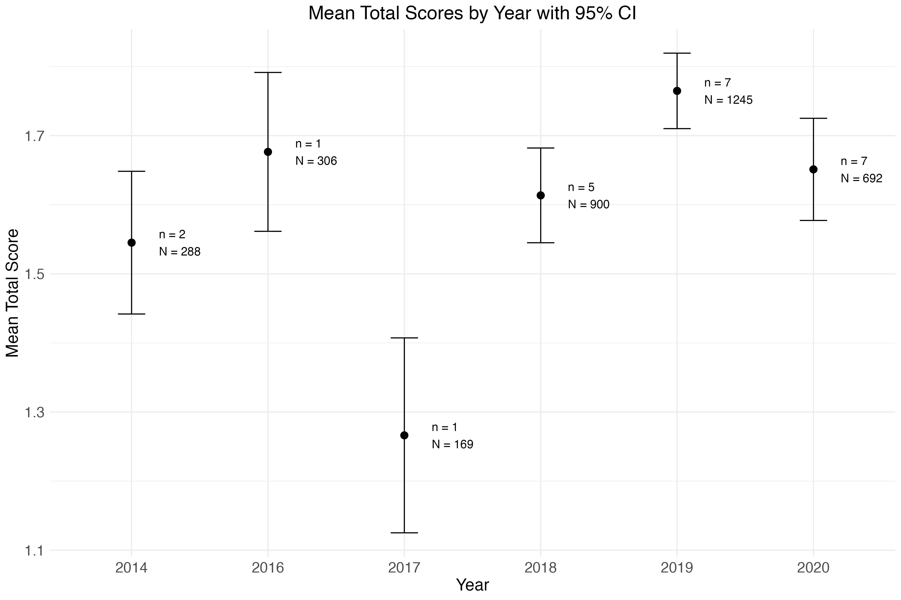

---
output:
  word_document: 
    highlight: monochrome
  html_document: 
    toc_float: yes
    highlight: monochrome
    theme: journal
  pdf_document: 
    highlight: tango
---

```{r packages, include=FALSE}
packages = c("ggplot2", "pwr","tidyverse","forestplot","sjmisc","statpsych","ltm","effsize","papaja","psych","misty","afex","lsr")

## Packages I'm not sure we're using: "viridis", "colorspace","gghalves","ggthemes","skimr","tidyr",  "dplyr", "", "janitor", "rcompanion", "", "", "afex", "ltm"

options(repos = c(CRAN = "https://cran.rstudio.com/"))

## Now load or install&load all
package.check <- lapply(
  packages,
  FUN = function(x) {
    if (!require(x, character.only = TRUE)) {
      install.packages(x, dependencies = TRUE)
      library(x, character.only = TRUE)
    }
  }
)
```

```{r setup, echo = FALSE, include = FALSE}

# Loading data from source
url <- "https://raw.githubusercontent.com/jorowags/crep_griskevicius/main/All%20data%20without%20extension%20variables.csv"
data <- read.csv(url)
orig.data <- data

# Define a function to format the p-values
format_p <- function(p_value) {
  if (p_value < .001) {
    return("*p* < .001")
  } else {
    return(paste0("*p* = ", round(p_value, 3)))
  }
}

data[data == ""] <- NA  

#correct institution names
data <- data %>%
  mutate(institution = ifelse(institution == "Pasific Lutheran University", 
                              "Pacific Lutheran University", 
                              institution))

```


# Collaborative registered replication of Griskevicius et al. (2010): Can pro-environmental behavior be promoted by priming status motivation?

Ljiljana B. Lazarević^[First and second author equally contributed to the manuscript and share first authorship.], Department of Psychology, University of Belgrade

Jordan R. Wagge, School of Psychology, Avila University

Busra Bahar Balci, Department of Psychology, Samsun University

Erin M. Buchanan, Analytics, Harrisburg University

Nathaniel R. Greene, Department of Psychology, University of Pennsylvania

Michał Folwarczny, Discipline of Marketing, J.E. Cairnes School of Business & Economics, University of Galway

Aleksandra Lazić, Department of Psychology, University of Belgrade

Stephen C. Want, Department of Psychology, Toronto Metropolitan University

Seungyeon Lee, Department of Psychology & Counseling, University of Central Arkansas

Megan C. Raddatz, Department of Psychology, Utah State University

Eric Hehman, Department of Psychology, McGill University 

Adriana Gentile, Department of Psychology, McGill University

Marija B. Petrović, Department of Psychology, University of Belgrade

Paul De Luca, Department of Psychology, York University

Andrew J. Kelly, Department of Psychology, Georgia State University

Karine Talbot, Department of Psychology, McGill University

Jessica Tobia, Department of Psychology, McGill University

Lisa Chalik, Department of Psychology, Skidmore College

Lily Tsoi, School of Psychology and Counseling, Caldwell University

Joey H. Florence, Department of Psychology, Toronto Metropolitan University

Sophia C. Weissgerber, Institut of Psychology, University of Kassel

Niklas Schouler, University of Heidelberg

Laurianne Buron, Department of Psychology, McGill University

Cody D. Christopherson, Department of Psychology, Southern Oregon University

Johanna Richter, No affiliation

Karina Senftner, No affiliation

Adam D. Pazda, University of South Carolina Aiken

Peter J. Allen, School of Psychological Science, University of Bristol

Francesca Kingston, School of Psychological Science, University of Bristol

Valdimar Sigurdsson, Department of Business Administration, Reykjavik University

Jon Grahe, Pacific Lutheran University

## Author Note
We have no known conflict of interest to disclose.
Correspondence concerning this article should be addressed to Ljiljana B. Lazarević, Faculty of Philosophy, University of Belgrade Čika Ljubina 18-20, 11000 Belgrade, Serbia Email: ljiljana.lazarevic@f.bg.ac.rs, phone: +381 64 1287 614.

\newpage

## Abstract

The present study presents the results of a collaborative registered replication of Griskevicius et al. (2010, Experiment 1).  As part of the Collaborative Replication and Education Project, 24 student groups from six countries (N = 3,774) investigated whether pro-environmental behavior can be promoted by priming status motives (desires for social status and prestige). This large, multi-site replication showed no evidence to support the hypothesis that hypothetical pro-environmental behavior can be stimulated by having participants read a story designed to prime status motives. We performed several exploratory analyses to investigate whether extension variables (i.e., equating “green” choices with prosocial behavior, political beliefs, sampling methods, location, duration of data collection, and gender) moderated the hypothesized effect of status motives on pro-environmental choices, but these analyses produced null results. One limitation of the study is that most data collection sites did not include a manipulation check, and the one site that did found a much weaker effect (d = 0.32) than the extremely large effect originally reported (d = 3.69). As a result, it remains unclear whether the null result reflects a failure of this specific priming method or a challenge to the underlying theory.
Key words: pro-environmental behavior; status motives; CREP; replication; meta-analysis


```{r descriptives, echo = FALSE, include = FALSE}

# Descriptive statistics for project characteristics
# Frequency tables for project code, survey language, countries, institute code, setting, and condition
frq(data$project_code)
frq(data$survey_language)
frq(data$country)
frq(data$institute_code)
frq(data$setting)
frq(data$condition)

# Counting number of unique projects, survey languages, institutes, and countries to report in manuscript
n_projects <- length(unique(data$project_code[data$project_code != "NANA"]))
n_survey_language <- length(unique(data$survey_language[data$survey_language != "NANA"]))
n_institutes <- length(unique(data$institute_code[data$institute_code != "NANA"]))
n_country <- length(unique(data$country[data$country != "NANA"]))
```

## Introduction 

Environmental and climate changes are considered one of the most urgent global challenges that we currently face (Van Der Linden, 2015; Steg, 2023). They substantially  influence health, economic prosperity, and access to basic resources such as food and water (IPCC, 2018, 2022). Some recent reports show that for a majority of citizens in the European Union (Eurobarometer, 2017) and the United States (Pew Research Report, 2019), protecting the environment is of high personal importance. Furthermore, pro-environmental behavior, such as recycling or selecting “green” products, is often shaped by social norms, which can serve as cues to what behaviors are socially approved or likely to be socially reinforced (e.g., Goldstein et al., 2008; Hamann et al., 2015; Nolan et al., 2008; Reese et al., 2014; see also Lange et al., 2020). Thus, understanding and explaining the motivational basis of pro-environmental behavior is of theoretical and practical importance. When pro-environmental behavior aligns with personal benefits and does not require substantial efforts (for example, if riding a bike to work is easier and faster than using a personal car), people engage in it willingly (Norlund & Garvill, 2002) . However, in many cases, pro-environmental behavior is very costly and time-consuming (for example, in comparison to regular cars, electric vehicles are expensive, have a rather limited driving range, and there are often sparsely distributed charging stations). What, then, makes people willing to engage in pro-environmental behavior despite these costs?

One of the reasons why people may be willing to engage in pro-environmental behavior is because of the social consequences it has. That is, because pro-environmental behaviors are considered good and are expected (Lange et al., 2020), people might be inclined to engage in pro-environmental behavior because this behavior might signal something positive about them.  For example, reputational benefits underlie some pro-environmental behaviors both in the lab (e.g., Griskevicius et al., 2010) and in field experiments where social interventions based on observability and descriptive norms were demonstrated as most effective for promoting cooperative behavior (Kraft-Todd et al., 2015). 

Griskevicius and colleagues (2010) reported the results of three experiments in which priming status motives seemed to promote certain hypothetical pro-environmental behaviors. Specifically, they argued that activating status motives (desires for social status and prestige) can lead people to choose “green” (indicated as environmentally-friendly) products over more luxurious non-green products that are associated with greater wealth (Study 1). The authors predicted that reading a second-person story about obtaining a prestigious job, but having to compete with others for a promotion or else be fired (thought to prime a status motive) might motivate people to engage in pro-environmental behavior (i.e., reading the story would increase the likelihood of choosing pro-environmental [green] products). In control conditions that did not activate status motives (e.g., reading a story of a similar length about losing tickets to an upcoming concert, or reading no story at all), non-green products were predicted to be more desirable than their green counterparts. Participants were assigned to either the status story or one of the two control conditions (non-status story, or no story). After reading their respective stories, participants were asked to imagine they were shopping and were asked, hypothetically, whether they would purchase green products (e.g., a low-emission car) or non-green products (e.g., a more luxurious sports car). Participants in the no-story control condition proceeded to the product selection phase of the study immediately. A composite “green” score was calculated by adding up the number of “green” choices the participant made (no green choices = 0; all green choices = 3). Participants in the status story condition were substantially more likely to choose hypothetical green products (d = 0.47) compared to participants in the control conditions (which were pooled for analyses).

In summary, Griskevicius and colleagues (2010) found that reading a story that activated status motives inclined people to choose pro-environmental products over more luxurious non-green products when given a hypothetical choice. Theoretically, this effect may reflect efforts to signal prosocial, self-sacrificing behavior. The authors interpreted their findings according to the “competitive altruism” hypothesis (see Van Vugt et al., 2007), which suggests that individuals attempt to appear more altruistic when competing for status. On this account, conspicuous consumption in humans serves to signal positive, socially relevant qualities. Given that people have an evolutionary drive to signal their worth as a potential mate or competitor, displaying altruism might be a cost-effective way of promoting reputation and prestige (Iredale & Van Vugt, 2012; Palovo-Velez et al., 2021). 

More specifically, publicly demonstrating pro-environmental behavior signals to others that someone prioritizes environmental concerns, indicating a willingness to incur costs (such as opting for a less luxurious product at a higher price) for the benefit of others. Accordingly, people who consume sustainable products are perceived as altruistic (Braun Kohlová & Urban, 2020), and those perceived as altruistic are viewed as having qualities desirable in a long-term mate (Phillips et al., 2008). Drawing on all of these ideas, Griskevicius and colleagues (2010) suggested that activating social motives, like concern for status, can serve as an effective strategy for promoting green (or other types of prosocial) behavior. 

While these theoretical accounts are compelling, it is a separate empirical question whether a minimal status prime (e.g., reading a short second-person story about competing for a promotion) is sufficient to activate these motives and alter behavior. For such an effect to occur, several conditions would need to be met: individuals must not be ordinarily or habitually motivated to signal their latent value, must possess mechanisms to identify contexts where such signaling is beneficial, and must interpret the priming narrative as a relevant social cue. These fairly strong assumptions may not always hold, and their plausibility warrants careful consideration. This distinction may help explain inconsistent findings in the literature and motivates our empirical re-examination of this effect.

The present multi-lab study aims to assess the robustness of the effect observed by Griskevicius and colleagues (2010) in their Experiment 1 and to provide a more precise estimation of size of this effect, through a multi-site collaborative project under the umbrella of the Collaborative Replication and Education Project (CREP). Per CREP procedures (see details in Method - CREP Procedures), only one study in a multi-study paper is typically selected for replication. In this case, the CREP team selected the first experiment from Griskevicius et al. (2010) as it was the focal study that was conceptually replicated and extended in their subsequent experiments (see Method for justification). Successful replication would entail that respondents in the social status condition (as compared to the pooled control conditions) would choose the less-luxurious but green products over the more luxurious but non-green alternatives, and would give empirical support to the hypothesis that pro-environmental behavior can be promoted by priming status motives. In addition to running direct replications, we also incorporated exploratory measures to assess the moderating role of factors such as changing attitudes toward pro-environmental behavior across time, or the country in which the study was conducted.

### About CREP

The Collaborative Replications and Education Project (Wagge, Brandt, et al., 2019), or CREP, is an initiative seeking to improve undergraduate training in research methods. CREP’s role includes selecting studies to be closely replicated by students, structuring the methods for the replication, reviewing projects both before and after data collection, and facilitating the publication of a pooled analysis (such as the present paper). Replications are regarded as a gold standard verifying the reliability of published findings (Open Science Collaboration, 2015). In addition, conducting replications of highly-cited studies is perceived as exciting by students, and gives students authentic, valuable opportunities to make substantial contributions to science (Grahe et al., 2012; Frank & Saxe, 2012).

CREP participants include students and instructors at institutions worldwide ^[As of October 2023, 480 projects at 174 institutions in 29 countries have been initiated.]. CREP offers several advantages over traditional undergraduate research experiences. First, the CREP model allows students to learn about best practices by directly replicating published work by scholars in their field. This active learning experience—also known in the education literature as mastery experience or high-impact learning practice—can be an important predictor of academic achievement (Loo & Choy, 2013). Second, students get to participate in authentic scientific research (Grahe, 2017) that may eventually be published in a pooled analysis and will also be openly available on the Open Science Framework (which is an open-source management tool that facilitates open and transparent collaboration in scientific research) for meta-analytic researchers in the future. Third, students have the option of performing a “replication+” study to add their own additional research question, condition, or measure to the replication study (assuming it does not interfere with the direct replication). Furthermore, students acquire an understanding of the importance of open science practices such as preregistration, replication, open methods, and open data, all foundational to research integrity (Kidwell et al., 2016). They actively engage with external reviewers (i.e., CREP team members), collaborating and learning beyond their institution through engagement with CREP members. Several CREP studies have been published (e.g., Ghelfi et al., 2020; Leighton et al., 2018; Wagge, Baciu, et al., 2019), with some included in meta-analyses (Lehmann et al., 2018). This underscores the project’s significant contributions to psychological science.

The present report documents a pooled analysis of data collected by 24 teams who signed up to replicate one of CREP’s earliest selections for replication: Experiment 1 from Griskevicius et al. (2010). First, we run preregistered analyses on the pooled data to directly replicate the  analyses performed by Griskevicius et al. Additionally, we present exploratory analyses to examine the potential for moderators of the effect of interest. Finally, we report the results of an internal meta-analysis of the effect size from each team. This collaborative approach not only enhances the robustness of our findings but also exemplifies the strength of collective efforts in advancing transparent and replicable research practices within the scientific community. In addition, the methodology employed in the analyses underscores the commitment to fostering a culture of openness and team building in psychological research.

## Method

### CREP Procedures

Experiment 1 of Griskevicius et al. (2010) was selected for replication through the standard CREP selection process, outlined by Wagge, Brandt, et al. (2019). This process, which took place in 2013, involved selecting the most-cited papers from the most-cited journals (e.g., Psychological Science, Journal of Personality and Social Psychology) in various subfields of psychology published in 2010. From those studies, several were deemed feasible for undergraduate research teams to attempt to replicate. Since its publication, now 15 years ago, Griskevicius et al. (2010) continues to garner significant attention, with an impressive citation count of over 2,500 and an average of nearly 300 citations per year since 2020, according to Google Scholar. The selection of Experiment 1 from this paper was thus heavily influenced by the number of citations it had received, which were taken as a valid, if imperfect, indicator of its importance, at least to researchers (for a deeper discussion of citation count as a valid metric for determining replication value, see Isager et al., 2021). 

In addition to citation count, there were a number of reasons that Griskevicius et al. (2010) warranted replication. Generally, findings from studies with smaller sample sizes and/or no existing replications are considered somewhat uncertain (Isager et al., 2021). The sample size of Griskevicius et al.’s Experiment 1 was not large (N = 168 across three between-participant conditions) and, when the current replication project began in 2013, the effect it demonstrated had not been replicated by any independent researchers ^[Marchand et al. (2020) tested whether activating status motives evokes increased desire for green products and they tested this hypothesis in two experiments: an online experiment with hypothetical consumption and a field experiment with actual consumption. Although the findings gave support to the original findings, this study revealed significantly reduced preference for green products in public settings that require actual consumption, compared with privately stated choice intentions. However, the authors note that the results might have been influenced by the fact that a different product category (i.e., ice cream) was used. This study therefore cannot be taken as strong support for Griskevicius and colleagues’ (2010) original findings.]. Moreover, doubts have been raised over the kind of priming methods used in Griskevicius et al.’s Experiment 1 (Shanks & Vadillo, 2021; Yong, 2012). Thus, the sustained value to the field of the Griskevicius et al. (2010) paper, despite the relative uncertainty resulting from the methods it used, warranted a new attempt to replicate its findings in a larger, multi-site study.

Once the focal study was selected, the CREP leadership team emailed the corresponding author of the original work. The CREP team communicated their process and goals and asked for input on possible extension hypotheses and guidance for replication teams. The key components of this correspondence are available here: https://osf.io/vdo0i/wiki/Original%20Study%20Information/. There are two key points from the correspondence. First, the main author noted that the effect may not replicate if participants do not equate “green” choices with prosocial behavior. Second, the original authors noted that the connection between “green” choices and status was unique to politically liberal groups. The former point provided us with a lens through which to interpret our results, and the latter point suggested an important extension hypothesis that many student teams chose to include.

Between 2014 and 2020, groups signed up for the project and prepared OSF project pages for pre-data collection review. These pre-data collection project pages were required to include materials, a planned analytical strategy, a video documenting the procedure, and local Institutional Review Board (IRB) approval. The project pages were examined by two reviewers and the executive reviewer, at which point projects were either approved or sent back for revisions until approval could be granted. Groups were asked to preregister project pages before data collection. After data collection was completed, project pages were again reviewed by two reviewers and the executive reviewer. At this stage, project pages were revised to include the dataset, a short report describing the obtained results, and a signed completion pledge confirming that the research followed ethical guidelines and the predefined study protocol. Following a positive review, individual projects were deemed complete.

#### Target sample size

Per early CREP policies, the required sample size was set as a rule of thumb to be at least half of the original study’s N. For this study, the targeted sample size should have been 84 (half of the original N of 168), but due to a typo in the documentation file the target sample size for each group was set to 82 respondents. There was no explicit stopping rule for individual teams–they simply needed to recruit the required minimum sample size–since CREP replication procedures do not require it. 

#### Differences from the original study

The original study was conducted in a lab, where participants were tested in small groups. Some of our data collection teams used a similar lab setting (37%), but some also collected data online (46%) or through some combination of in-lab and online testing (17%). Some groups conducted direct replications, and others included extension variables (e.g., pro-environmental literacy, political ideology) that had not been included in the original procedure, but these were always measured after the original protocol had been completed, ensuring that every team did conduct a direct replication. Characteristics of the individual replications can be found at https://osf.io/cghyv. 

### Disclosures

#### Preregistrations

Each lab preregistered its materials, protocol, and analytical strategy on the OSF before data collection. The primary analyses in this paper were also pre-registered: https://osf.io/ach3n.

#### Data, Materials, and Resources

The authors of the original study provided materials for replication. All groups who completed projects uploaded their data, analyses, and a short description of their results to their OSF project page. All datasets, materials, analytical scripts, and other materials can be found on the central project OSF page (https://osf.io/vdo0i/). The complete, anonymized dataset is available here: https://osf.io/dax6g. A codebook for our merged dataset with all variables collected as part of the project is available at https://osf.io/wdcmv. A readme file containing all information related to the project is at https://osf.io/vdo0i/wiki/home/.  

#### Reporting

We have reported all details of the sample size, data exclusions, manipulations, and measures.

#### Ethical approval

Data were collected following the 1964 Declaration of Helsinki. Overarching IRB approval for this study was obtained from the IRB of the Department of Psychology, University of Belgrade, Serbia (https://osf.io/7ehku). In addition, as part of the CREP procedure, all groups obtained local IRB approval when necessary.

### Sample

```{r, echo = TRUE, include = FALSE}
frq(data$gender)
describe(data$age)

gender <- table(data$gender)

n.gender.women <- as.numeric(gender[1])
n.gender.men <- as.numeric(gender[3])
n.gender.gendervariant <- as.numeric(gender[2])
n.gender.nonbinarytrans <- as.numeric(gender[4])
n.gender.prefernot <- as.numeric(gender[6])
n.gender.other <- as.numeric(gender[5])

n.gender.else <- n.gender.gendervariant+n.gender.nonbinarytrans+n.gender.other+n.gender.prefernot

n.gender.na <- as.numeric(sum(is.na(data$gender)))

mean.age <- round(mean(data$age, na.rm = TRUE), digits = 2)
n.age.na <- as.numeric(sum(is.na(data$age)))
sd.age <- round(sd(data$age, na.rm = TRUE), digits = 2)

```

From 2014 to 2020, 49 groups from nine countries expressed interest in conducting a CREP replication of Griskevicius et al. (2010) Experiment 1. Of these 49 groups, 25 did not contribute data to the final analysis: specifically, three did not create their OSF page, four did not begin data collection, five did not complete data collection, 11 did not provide their data, one did not provide their codebook, and one did not follow the CREP procedure. The final sample of completed projects included data collected by 24 groups from six countries: USA (*N* = 18), UK (*N* = 1), Germany (*N* = 1), Canada (*N* = 2), Netherlands (*N* = 1), and Iceland (*N* = 1). The overview of groups participating in this project can be found at https://osf.io/cghyv. Overall, the present project included approximately 30 reviewers, three CREP assistants, and three executive reviewers.

A total of 21 participants were excluded prior to publicly posting the compiled dataset because they reported ages of 16 (*N* = 3) or 17 (*N* = 18). The final data set consisted of data collected from `r format(count(orig.data), big.mark = ",", scientific = FALSE)` participants. All individual data sets are available here: https://osf.io/zqyw3. Each student group recruited at least 82 respondents, except for one group that recruited 70 (due to the COVID-19 outbreak that interfered with the project). Nine groups failed to collect data on at least one of the following demographic characteristics: age, gender, or race/ethnicity, and within each site, questions about these characteristics varied in how they were asked^[Regarding demographics, the original study reported only information about gender of the participants (male and female).]. Details about the missing data are available here: https://osf.io/pmgv2.

The final sample consisted of `r format(n.gender.women, big.mark = ",", scientific = FALSE)` individuals who identified as women and `r n.gender.men` who identified as men; `r n.gender.else` participants identified as gender variant/non-conforming, “other”, “prefer not to say,” or transgender/non-binary. An additional `r n.gender.na` participants did not indicate their gender. The mean reported age for participants was `r mean.age` years (*SD* = `r sd.age`), though age was not collected for `r n.age.na` of the participants.

```{r, include = FALSE}
frq(data$recoded_race)
race.table <- table(data$recoded_race)

n.race.na <- as.numeric(sum(is.na(data$recoded_race)))
n.race.african <- as.numeric(race.table[1])
n.race.hispanic <- as.numeric(race.table[5])
n.race.indigenous <- as.numeric(race.table[2])
n.race.asian <- as.numeric(race.table[3])
n.race.black <- as.numeric(race.table[4])
n.race.middleeastern <- as.numeric(race.table[6])
n.race.multiracial <- as.numeric(race.table[7])
n.race.pacific <- as.numeric(race.table[8])
n.race.other <- as.numeric(race.table[9])
n.race.white <- as.numeric(race.table[10])

n.total.reported.race <- n.race.african + n.race.hispanic + n.race.asian + n.race.black + n.race.indigenous + n.race.middleeastern + n.race.multiracial + n.race.other + n.race.pacific + n.race.white

prop.race.white <- round(100*(n.race.white / n.total.reported.race), digits = 1)
prop.race.black <- round(100*(n.race.black + n.race.african) / n.total.reported.race, digits = 1)
prop.race.asian <- round(100*(n.race.asian / n.total.reported.race), digits = 1)
prop.race.hispanic <- round(100*(n.race.hispanic / n.total.reported.race), digits = 1)
prop.race.middleeastern <- round(100*(n.race.middleeastern / n.total.reported.race), digits = 1)
prop.race.multiracial <- round(100*(n.race.multiracial / n.total.reported.race), digits = 1)
prop.race.pacific <- round(100*(n.race.pacific / n.total.reported.race), digits = 1)
prop.race.other <- round(100*(n.race.other / n.total.reported.race), digits = 1)
prop.race.na <- round(100*(n.race.na / (n.total.reported.race+n.race.na)), digits = 1)

```

We re-coded the available race/ethnicity information to include the following categories: White (*N* = `r format(n.race.white, big.mark = ",", scientific = FALSE)`, `r prop.race.white`%), Black (*N* = `r sprintf("%.1f", n.race.black)`, `r prop.race.black`%), Asian (*N* = `r n.race.asian`, `r sprintf("%.1f", prop.race.asian)`%), Hispanic/Latino (*N* = `r n.race.hispanic`, `r prop.race.hispanic`%), Middle Eastern (*N* = `r n.race.middleeastern`, `r prop.race.middleeastern`%), Multiracial (*N* = `r n.race.multiracial`, `r prop.race.multiracial`%), Native Hawaiian or Pacific Islander (*N* = `r n.race.pacific`, `r prop.race.pacific`%), and "other" (*N* = `r n.race.other`, `r prop.race.other`%). These reported percentages do not include the participants who either did not report their race/ethnicity or were not asked this question (*N* = `r format(n.race.na, big.mark = ",", scientific = FALSE)`, `r prop.race.na`% of the total).

### Procedure

The experiment employed a between-subjects design and included one status and two control conditions, using the exact conditions from Experiment 1 of Griskevicius et al. (2010). In the status condition, participants read a “cover” story designed to prime “a desire for social status” (Griskevicius et al., 2010, p. 395), in which participants imagined graduating from college and obtaining a job with a prestigious company, but having to compete with others for the opportunity for promotion or else be fired. In one of the control conditions (control story condition), participants read a control story (involving losing and eventually finding tickets to a forthcoming concert and then attending the concert with a same-sex peer) intended to elicit similar affect as the status story without priming status motives. In the other control condition (no story condition), participants did not read any story at all and just indicated their product choices. In the original study, no differences were found between the two control conditions, and they were combined for analysis^[In our dataset, there were no significant pairwise differences between conditions (no story, control story, status) on any dependent variable after controlling for multiple comparisons, except in evaluating gender by condition; the gender x condition results are reported in the exploratory analysis section and include these findings.]. See Griskevicius et al. (2010) for more complete details of the cover stories. 

To eliminate potential suspicions about the purpose of the study, participants were told that they were participating in a study on memory and that they would be asked to recall information from the story later in the session. After reading their respective story (or in the no-story control condition, proceeding immediately to choosing products), participants were asked to imagine they were shopping and make a hypothetical choice between three pairs of products (cars, soaps, and dishwashers). For each product, participants could choose between a pro-environmental (green) and a conventional (the more luxurious non-green) version of the product, each of which was equally priced and manufactured by the same company.

The authors of the original study reported that the story manipulation had been extensively pretested in a prior study (Griskevicius et al., 2009) and was successful (see Griskevicius et al., 2010, Study 1). As per CREP procedures, selected studies are directly replicated as reported in the paper. Therefore, in keeping with the original paradigm, we did not include a manipulation check. Only one data collection team did decide to include a manipulation check, and found a much smaller, d = 0.32, difference in desire for status between the status story and control groups than that reported by Griskevicius et al. (2009), d = 3.69^[  This effect size was calculated from the data given in Table 1 of Griskevicius et al. (2009).]. However, we urge caution in interpreting this check given that it was only conducted by one out of 24 data collection teams. 

As noted above, data were collected in the lab and online, using various survey platforms; the majority (*N* = 15) of groups used Qualtrics, while three used paper surveys and one team used each of the following: Medialab, SuperLab, SurveyGizmo, SoSciSurvey, and PsyToolkit. One team used an unidentified online platform for data collection. Each group documented the mode of data collection that they used (online vs. in-person). Respondents were recruited from both student and general populations. Descriptions of individual datasets are available at https://osf.io/pmgv2.

### Treatment of missing data, data preparation, and data analysis

We excluded participants who did not respond to the dependent variables. To create a merged dataset, we accessed all individual datasets from each team’s OSF page or reached out directly to teams for data if it was not available on OSF. In cases where clarification was needed, we contacted groups to ascertain whether the dataset was in its raw form or transformed, and to request codebooks. Any instances of missing data were retained in the analysis.

We conducted the same analyses as the original paper: for each product (car, soap, and dishwasher) we reported percentages of “green” versus “non-green” selections by condition, Chi-square tests, and Phi coefficients. We also computed a composite green score, which we analyzed with a between-subject ANOVA across conditions (status story, control story and no story), and reported effect size and post-hoc comparisons using the Tukey Honestly Significant Difference (HSD) test.

One advantage of the multi-lab approach is that natural variation in the data collection process across different labs can be leveraged to test for moderators or boundary conditions (Klein et al., 2018). Accordingly, we also performed several exploratory analyses. First, as per the recommendation of the original authors, we tested whether participants equated “green” choices with prosocial behavior.  Second, we ran 2 x 2 factorial ANOVAs to determine whether political orientation (liberal/conservative) or political party (democrat/republican) interacted with condition (control/status). Third, we ran an ANOVA to explore whether different settings (online/lab) yielded different results. Fourth, we tested potential differences between the US and other countries. Fifth, the long-lasting nature of our project (data collection was done between 2014 and 2020) enabled testing whether the effects differed across time. Lastly, the original authors stated that it would be worth testing for potential gender differences; thus, as part of our exploratory analyses, we explored gender differences in status motives using a 2 x 2 factorial ANOVA (gender: woman or man; condition: control vs. status). For each of these exploratory analyses, we performed a sensitivity analysis to determine the smallest possible effect size that could have been detected with the collected data set, assuming a power level of .80 and an alpha level of .05. We also determined the sample size that would have been necessary to detect a significant effect, given the actual effect size documented. A script for the sensitivity analyses is available at: https://osf.io/5h6gc. 

Specific packages included for data processing and analysis included: ggplot2 (Wickham, 2016), tidyverse (Wickham et al., 2019), viridis (Garnier et al., 2024), colorspace (Zeileis et al., 2020), forestplot (Gordon & Lumley, 2024), gghalves (Tiedemann, 2024), ggthemes (Arnold, 2019), skimr (Waring et al., 2024), sjmisc (Lüdecke, 2018), statpsych (Bonett, 2024), ltm (Rizopoulos, 2006), effsize (Torchiano, 2016), pwr (Champely, 2020), papaja (Aust & Barth, 2024), psych (Revelle, 2024), misty (Yanagida, 2024), afex (Singmann et al., 2016), lsr (Navarro, 2015), and MOTE (Buchanan et al., 2019). 

After our primary analyses, we conducted an internal meta-analysis on the data collected across all of the teams using the *R*-package *metafor* (Viechtbauer, 2010). We also analyzed the moderating effects of extension variables separately. All analyses were performed with *R* markdown and *R*Studio (R Core Team, 2021; RStudio Team, 2020). The analysis code is available here: https://osf.io/hjrk8/.


## Results

### Confirmatory Analyses

#### Green car

```{r green_car, include = FALSE}
# From Experiment 1: 
# Original paper: 37.2% of participants chose the green car in the control condition, 54.5% of participants chose it in the status condition, chi2(1, N = 168) = 4.56, p = .033, phi = .165

# Combine no story & control story into a new variable, control
data$new_condition <- recode(data$condition, "control story" = "Control", "no story" = "Control", "status story" = "Status")

# Our results
# Percentage selected green car by condition
car_table <- table(data$new_condition, data$greencar)
prop.table(car_table, 1)
print(car_table)
  
# Chi square test with Phi
chisq.car <- chisq.test(car_table)

# Create reported values for r snippets
chisq.car.stat <- round(as.numeric(chisq.car[1]), digits = 2)
chisq.car.p <- format(round(as.numeric(chisq.car[3]), digits = 3), nsmall = 3)
chisq.car.df <- as.numeric(chisq.car[2])
car.phi <- round(phi(car_table, digits = 3), digits = 3)

n.control.car.no <- as.numeric(car_table[1,1])
n.control.car.yes <- as.numeric(car_table[1,2])
n.status.car.no <- as.numeric(car_table[2,1])
n.status.car.yes <- as.numeric(car_table[2,2])

total.car.yes <- n.control.car.yes + n.status.car.yes
total.car.no <- n.control.car.no + n.status.car.no
total.car.n <- total.car.yes + total.car.no

prop.status.car.yes <- format(round(100*n.status.car.yes/(n.status.car.yes + n.status.car.no), digits = 2), nsmall = 2)
prop.control.car.yes.1 <- format(round(100*n.control.car.yes/(n.control.car.yes + n.control.car.no), digits = 1), nsmall = 1)
prop.control.car.yes <- format(round(100*n.control.car.yes/(n.control.car.yes + n.control.car.no), digits = 2), nsmall = 2)

chisq.car.p.formatted <- sub("^0\\.", ".", as.character(chisq.car.p))

# Calculate the 95% Confidence Interval for Phi
ci_car_phi <- ci.phi(.05, 1064, 603, 1327, 732)
car_ci_lb <- sub("^-0\\.", "-.", as.character(round(ci_car_phi[1,3], digits = 3)))
car_ci_ub <- sub("^0\\.", ".", as.character(round(ci_car_phi[1,4], digits = 3)))

```

The original paper found that participants selected the green car more often in the status condition (54.5%) than in the control condition (37.2%), 𝛘^2^(1, *N* = 168) = 4.56, *p* = .033, ɸ = .165, 95% CI [.077, .326]. In our sample, `r prop.status.car.yes`% of participants in the status condition selected the green car, compared to `r prop.control.car.yes`% of participants in the control condition. We did not detect an effect of condition on green car selection, 𝛘^2^(`r chisq.car.df`, *N* = `r formatC(total.car.n, big.mark = ",")`) = `r chisq.car.stat`, *p* = `r chisq.car.p.formatted`, ɸ = `r car.phi`, 95% CI [`r car_ci_lb`, `r car_ci_ub`].

#### Green cleaner

```{r green_cleaner, include = FALSE}
# Original paper: choice of the green cleaner increased from 25.7% in the
# control condition to 41.8% in the status condition, chisq(1, N =
# 168) = 4.52, p = .034, phi = .164

# Our results: 
# Percentage selected green soap by condition
soap_table <- table(data$new_condition, data$greensoap)
print(soap_table)
prop.table(soap_table, 1)
  
# Chi square test
chisq.soap <- chisq.test(soap_table)
  
# Phi coefficient
phi(soap_table, digits = 3)

# Create reported values for r snippets
chisq.soap.stat <- round(as.numeric(chisq.soap[1]), digits = 2)
chisq.soap.p <- round(as.numeric(chisq.soap[3]), digits = 3)
chisq.soap.df <- as.numeric(chisq.soap[2])
soap.phi <- round(phi(soap_table, digits = 3), digits = 3)

n.control.soap.no <- as.numeric(soap_table[1,1])
n.control.soap.yes <- as.numeric(soap_table[1,2])
n.status.soap.no <- as.numeric(soap_table[2,1])
n.status.soap.yes <- as.numeric(soap_table[2,2])

total.soap.yes <- n.control.soap.yes + n.status.soap.yes
total.soap.no <- n.control.soap.no + n.status.soap.no
total.soap.n <- total.soap.yes + total.soap.no

prop.status.soap.yes <- round(100*n.status.soap.yes/(n.status.soap.yes + n.status.soap.no), digits = 2)
prop.control.soap.yes.1 <- round(100*n.control.soap.yes/(n.control.soap.yes + n.control.soap.no), digits = 1)
prop.control.soap.yes <- round(100*n.control.soap.yes/(n.control.soap.yes + n.control.soap.no), digits = 2)

chisq.soap.p.formatted <- sub("^0\\.", ".", as.character(chisq.soap.p))

# Calculate the 95% Confidence Interval for Phi
ci_soap_phi <- ci.phi(.05, 1034, 601, 1357, 733)
soap_ci_lb <- sub("^-0\\.", "-.", format(round(ci_soap_phi[1,3], digits = 3), nsmall = 3))
soap_ci_ub <- sub("^0\\.", ".", format(round(ci_soap_phi[1,4], digits = 3), nsmall = 3))

```

Similarly, the original paper found that participants selected the green cleaner more often in the status condition (41.8%) than in the control condition (25.7%), 𝛘^2^(1, *N* = 168) = 4.52, *p* = .034, ɸ = .164, 95% CI [.077, .325]. In our sample, `r prop.status.soap.yes`% of the participants in the status condition and `r prop.control.soap.yes`% of the participants in the control condition selected the green soap. As with the choice of car, we did not detect an effect of condition on the choice of cleaner, 𝛘^2^(`r chisq.soap.df`, *N* = `r formatC(total.soap.n, big.mark = ",")`) = `r chisq.soap.stat`, *p* = `r chisq.soap.p.formatted`, ɸ = `r soap.phi`, 95% CI [`r soap_ci_lb`, `r soap_ci_ub`].

#### Green dishwasher

```{r green_dishwasher, include = FALSE, echo = FALSE}
# Original paper: Choice of the green dishwasher also increased from 34.5% in the control condition to 49.1% in the status condition, chisq(1, N = 168) = 3.30, p = .069, eff size .140

# Our results: 
# Percentage selected green dishwasher by condition
dishwasher_table <- table(data$new_condition, data$greendishwasher)
print(dishwasher_table)
prop.table(dishwasher_table, 1)
  
# Chi square test
chisq.dishwasher <- chisq.test(dishwasher_table)
  
# Phi coefficient
phi(dishwasher_table, digits = 3)

# Create reported values for r snippets
chisq.dishwasher.stat <- round(as.numeric(chisq.dishwasher[1]), digits = 2)
chisq.dishwasher.p <- format(round(as.numeric(chisq.dishwasher[3]), digits = 3), nsmall = 3)
chisq.dishwasher.df <- as.numeric(chisq.dishwasher[2])
dishwasher.phi <- round(phi(dishwasher_table, digits = 3), digits = 3)

n.control.dishwasher.no <- as.numeric(dishwasher_table[1,1])
n.control.dishwasher.yes <- as.numeric(dishwasher_table[1,2])
n.status.dishwasher.no <- as.numeric(dishwasher_table[2,1])
n.status.dishwasher.yes <- as.numeric(dishwasher_table[2,2])

total.dishwasher.yes <- n.control.dishwasher.yes + n.status.dishwasher.yes
total.dishwasher.no <- n.control.dishwasher.no + n.status.dishwasher.no
total.dishwasher.n <- total.dishwasher.yes + total.dishwasher.no

prop.status.dishwasher.yes <- format(round(100*n.status.dishwasher.yes/(n.status.dishwasher.yes + n.status.dishwasher.no), digits = 2), nsmall = 2)
prop.control.dishwasher.yes.1 <- format(round(100*n.control.dishwasher.yes/(n.control.dishwasher.yes + n.control.dishwasher.no), digits = 1), nsmall = 1)
prop.control.dishwasher.yes <- format(round(100*n.control.dishwasher.yes/(n.control.dishwasher.yes + n.control.dishwasher.no), digits = 2), nsmall = 2)

chisq.dishwasher.p.formatted <- sub("^0\\.", ".", as.character(chisq.dishwasher.p))

# Calculate the 95% Confidence Interval for Phi
ci_dishwasher_phi <- ci.phi(.05, 1127, 646, 1266, 690)
dishwasher_ci_lb <- sub("^-0\\.", "-.", format(round(ci_dishwasher_phi[1,3], digits = 3), nsmall = 3))
dishwasher_ci_ub <- sub("^0\\.", ".", format(round(ci_dishwasher_phi[1,4], digits = 3), nsmall = 3))

```

Finally, in the original paper, participants selected the green dishwasher more in the status condition than the control condition (49.1% and 34.5%, respectively), 𝛘^2^(1, *N* = 168) = 3.30, *p* = .069, ɸ = .140, 95% CI [.077, .301]. We found no such effect when comparing the control participants who selected the green dishwasher (`r prop.control.dishwasher.yes`%) to the status condition participants who did the same (`r prop.status.dishwasher.yes`%), 𝛘^2^(`r chisq.dishwasher.df`, *N* = `r formatC(total.dishwasher.n, big.mark = ",")`) = `r chisq.dishwasher.stat`, *p* = `r chisq.dishwasher.p.formatted`, ɸ = `r dishwasher.phi`, 95% CI [`r dishwasher_ci_lb`, `r dishwasher_ci_ub`].


#### Composite Green Score

```{r composite, include = FALSE}
# Original paper: In addition to examining the influence of status motives on each product individually, we also analyzed the effect of status when the three products were combined into a composite. As predicted, a one-way analysis of variance (ANOVA) on the product composite showed a significant effect of status, F(1, 166) = 8.53, p = .004, d = 0.47.

# Our results
# Compute composite green score; recode Y as 1 and N as 0 for green products
data$greencar <- recode(data$greencar, "Yes" = 1, "No" = 0)
data$greendishwasher <- recode(data$greendishwasher, "Yes" = 1, "No" = 0)
data$greensoap <- recode(data$greensoap, "Yes" = 1, "No" = 0)

data$total <- data$greencar + data$greendishwasher + data$greensoap
describe(data$total)
mean.composite <- format(round(mean(data$total, na.rm = TRUE),digit = 2), nsmall = 2)
sd.composite <- format(round(sd(data$total, na.rm = TRUE), digit = 2), nsmall = 2)

# Subset the data for the green/not green choices
choicevars <- c("greencar", "greensoap", "greendishwasher")
choice.data <- data[choicevars]

cron <- cronbach.alpha(choice.data, standardized = FALSE, na.rm = TRUE)
cron.x <- cron[1]
cron.x <- as.numeric(cron.x)
cron.x <- round(cron.x, digits = 2)

```

We followed the procedure used in the original study and computed a composite green score by assigning a score of "1" to all "green" selections and a score of "0" to all non-"green" selections. Because participants made a dichotomous choice for each of the three products, scores ranged from 0 (no "green" products) to 3 (all "green" products). The mean composite score was `r mean.composite` (*SD* = `r sd.composite`). The distribution of composite scores can be seen in Figure 1. The distribution of mean choices for each data collection team (*N* = `r n_projects`) for each product, as well as for the composite score, is displayed in Figure 2. 





```{r main_anovas, include = FALSE, echo = FALSE}

# Do ANOVA by grouped condition (control v status) and get bits to report
grouped.aov <- aov(data$total ~ new_condition, data = data)
grouped.aov.summary <- summary(grouped.aov)
grouped.aov.df <- grouped.aov.summary[[1]]$Df
grouped.aov.F <- grouped.aov.summary[[1]]$`F value`
grouped.aov.ss.factor <- grouped.aov.summary[[1]]$'Sum Sq'[1]
grouped.aov.ss.total <- sum(grouped.aov.summary[[1]]$'Sum Sq')
grouped.aov.eta <- format(round(grouped.aov.ss.factor / grouped.aov.ss.total, 3), nsmall = 3)

grouped.aov.p <- grouped.aov.summary[[1]]$`Pr(>F)`[1]

# Get Cohen's d for grouped condition
data_grouped_d <- data
data_grouped_d$new_condition <- as.factor(data_grouped_d$new_condition)
data_grouped_d <- subset(data_grouped_d, !is.na(new_condition))
data_grouped_d$total<- as.numeric(data_grouped_d$total)
grouped.d <- cohen.d(total ~ new_condition, data = data_grouped_d)
grouped.d <- round(as.numeric(grouped.d$cohen.d), 2)

# Do ANOVA by ungrouped condition (status, no story, control story)
ungrouped.aov <- aov(data$total ~ condition, data = data)
ungrouped.aov.summary <- summary(ungrouped.aov)
ungrouped.aov.df <- ungrouped.aov.summary[[1]]$Df
ungrouped.aov.F <- ungrouped.aov.summary[[1]]$`F value`
ungrouped.aov.ss.factor <- ungrouped.aov.summary[[1]]$'Sum Sq'[1]
ungrouped.aov.ss.total <- sum(ungrouped.aov.summary[[1]]$'Sum Sq')
ungrouped.aov.eta <- format(round(ungrouped.aov.ss.factor / ungrouped.aov.ss.total, 3), nsmall = 3)

# post hoc testing
tukey.ungrouped <- TukeyHSD(ungrouped.aov)

# Ungrouped bar graph
ggplot(data[!is.na(data$condition), ], mapping=aes(x=condition, y=total))+
  stat_summary(fun.data=mean_sdl, geom="bar") +
  stat_summary(fun.data=mean_cl_boot, geom="errorbar", width = 0.3)

#formatting the pesky p values
nscs.p <- format(round(tukey.ungrouped$condition[10], digits = 3), nsmall = 3)
nscs.p.formatted <- sub("^0\\.", ".", as.character(nscs.p))

sscs.p <- format(round(tukey.ungrouped$condition[11], digits = 3), nsmall = 3)
sscs.p.formatted <- sub("^0\\.", ".", as.character(sscs.p))

ssns.p <- format(round(tukey.ungrouped$condition[12], digits = 3), nsmall = 3)
ssns.p.formatted <- sub("^0\\.", ".", as.character(ssns.p))

status_m_grouped <- format(round(mean(data$total[data$new_condition == "Status"], na.rm = TRUE), digits = 2), nsmall = 2)
status_sd_grouped <- format(round(sd(data$total[data$new_condition == "Status"], na.rm = TRUE), digits = 2), nsmall = 2)
control_m_grouped <- format(round(mean(data$total[data$new_condition == "Control"], na.rm = TRUE), digits = 2), nsmall = 2)
control_sd_grouped <- format(round(sd(data$total[data$new_condition == "Control"], na.rm = TRUE), digits = 2), nsmall = 2)

```

The original paper by Griskevicius and colleagues (2010) reported a significant effect of status on the composite score when the status prime condition was compared to both control conditions (control story and no story) combined, *F*(1, 166) = 8.53, *p* = .004, η^2^ = .05, 95% CI [.005, .129]. The same test on our data did not reveal a significant effect, *F*(`r grouped.aov.df[1]`, `r formatC(grouped.aov.df[2], big.mark = ",")`) = `r round(grouped.aov.F[1], 2)`, *p* = `r apa_num(grouped.aov.p, gt1 = F)`, η^2^ < .001, 95% CI [.000, .002], and in fact the green score was descriptively lower in the status condition (*M* = `r status_m_grouped`, *SD* = `r status_sd_grouped`) compared to the control condition (*M* = `r control_m_grouped`, *SD* = `r control_sd_grouped`), counter to the original hypothesis. 

### Exploratory Analyses

```{r green_nice, include = FALSE, echo=FALSE}
# sites #18-37 and #19-25 examined whether participants rated the people who owned the green products as nicer, more altruistic, and more caring. Adding that analysis here. Note: they did it in different ways

# Loading data from source
url2 <- "https://raw.githubusercontent.com/jorowags/crep_griskevicius/main/data_w_extension_variables.csv"
data.ext <- read.csv(url2)

# Subset projects 19-25 and 18-37
ext.prosocial <- subset(data.ext, project == "#19-25" | project == "#18-37")

# add up niceness, caring, and altruism score for green products for 1925
ext.prosocial$nice.green.total <- ext.prosocial$X1925_NiceGreenCar + ext.prosocial$X1925_NiceGreenCleaner + ext.prosocial$X1925_NiceGreenDishwasher

ext.prosocial$nice.notgreen.total <- ext.prosocial$X1925_NiceNonGreenCar + ext.prosocial$X1925_NiceNonGreenCleaner + ext.prosocial$X1925_NiceNonGreenDishwasher

ext.prosocial$caring.green.total <- ext.prosocial$X1925_CaringGreenCar + ext.prosocial$X1925_CaringGreenCleaner + ext.prosocial$X1925_CaringGreenDishwasher

ext.prosocial$caring.notgreen.total <- ext.prosocial$X1925_CaringNonGreenCar + ext.prosocial$X1925_CaringNonGreenCleaner + ext.prosocial$X1925_CaringNonGreenDishwasher

ext.prosocial$altruism.green.total <- ext.prosocial$X1925_AltruismGreenCar + ext.prosocial$X1925_AltruismGreenCleaner + ext.prosocial$X1925_AltruismGreenDishwasher

ext.prosocial$altruism.notgreen.total <- ext.prosocial$X1925_AltruismNonGreenCar + ext.prosocial$X1925_AltruismNonGreenCleaner + ext.prosocial$X1925_AltruismNonGreenDishwasher

# Rename 18-37 variables
names(ext.prosocial)[names(ext.prosocial) == "X18_37_AQ02_01_kauf_allg_Please.indicate.on.a.scale.from.1..disagree.completely..to.9..agree.completely..how.much.you.agree.with.the.following.statements...Choosing.to.buy.pro.environmental.products.is.a.behavior.that.is.beneficial.for.the.general.public.."] <- "X1837_prosocial"
names(ext.prosocial)[names(ext.prosocial) == "X18_37_AQ02_02_kauf_nett_.Consumers.of.pro.environmental.products.are.kinder.than.consumers.of.conventional.products.."] <- "X1837_nice"
names(ext.prosocial)[names(ext.prosocial) == "X18_37_AQ02_03_kauf_mitfue_.Consumers.of.pro.environmental.products.are.more.empathetic.than.consumers.of.conventional.products.."] <- "X1837_caring"
names(ext.prosocial)[names(ext.prosocial) == "X18_37_AQ02_04_kauf_altru_.Consumers.of.pro.environmental.products.are.more.altruistic.than.consumers.of.conventional.products.."] <- "X1837_altruistic"

# Descriptive stats on 1837 variables
nice.1837.mean <- format(round(mean(ext.prosocial$X1837_nice, na.rm = TRUE), 2), nsmall = 2)
nice.1837.sd <- format(round(sd(ext.prosocial$X1837_nice, na.rm = TRUE), 2), nsmall = 2)
caring.1837.mean <- format(round(mean(ext.prosocial$X1837_caring, na.rm = TRUE), 2), nsmall = 2)
caring.1837.sd <- format(round(sd(ext.prosocial$X1837_caring, na.rm = TRUE), 2), nsmall = 2)
altruistic.1837.mean <- format(round(mean(ext.prosocial$X1837_altruistic, na.rm = TRUE), 2), nsmall = 2)
altruistic.1837.sd <- format(round(sd(ext.prosocial$X1837_altruistic, na.rm = TRUE), 2), nsmall = 2)
prosocial.1837.mean <- format(round(mean(ext.prosocial$X1837_prosocial, na.rm = TRUE), 2), nsmall = 2)
prosocial.1837.sd <- format(round(sd(ext.prosocial$X1837_prosocial, na.rm = TRUE), 2), nsmall = 2)

# 1837 t-test
#first group condition
ext.prosocial$new_condition <- recode(ext.prosocial$condition, "control story" = "control", "no story" = "control", "status story" = "status")
#then the t-tests
nice.t.1837 <- t.test(X1837_nice ~ new_condition, data = ext.prosocial)
caring.t.1837 <- t.test(X1837_caring ~ new_condition, data = ext.prosocial)
altruistic.t.1837 <- t.test(X1837_caring ~ new_condition, data = ext.prosocial)
prosocial.t.1837 <- t.test(X1837_prosocial ~ new_condition, data = ext.prosocial)

#paired t comparing prosocial to next highest mean, caring
paired.t.1837 <- t.test(ext.prosocial$X1837_prosocial, ext.prosocial$X1837_caring, paired = TRUE, alternative = "two.sided")
paired.d.1837 <- cohens.d(ext.prosocial$X1837_prosocial, ext.prosocial$X1837_caring, paired = TRUE, alternative = "two.sided")

# any correlations with composite score?
# calculate composite in this data set
ext.prosocial$greencar <- recode(ext.prosocial$greencar, "Yes" = 1, "No" = 0)
ext.prosocial$greendishwasher <- recode(ext.prosocial$greendishwasher, "Yes" = 1, "No" = 0)
ext.prosocial$greensoap <- recode(ext.prosocial$greensoap, "Yes" = 1, "No" = 0)

ext.prosocial$total <- ext.prosocial$greencar + ext.prosocial$greendishwasher + ext.prosocial$greensoap

#now the correlations
variables_to_correlate <- ext.prosocial[c("total", "X1837_nice", "X1837_caring", "X1837_altruistic")]

# Calculate the correlation matrix and do significance tests
correlation_matrix <- cor(variables_to_correlate, use = "complete.obs")
pairwise_cor_test <- function(data) {
  combn(names(data), 2, function(x) {
    test <- cor.test(data[[x[1]]], data[[x[2]]])
    return(data.frame(var1 = x[1], var2 = x[2], cor = test$estimate, p.value = test$p.value, df = test$parameter))
  }, simplify = FALSE)
}

cor_test_results <- do.call(rbind, pairwise_cor_test(variables_to_correlate))
cor_test_results$cor <- round(cor_test_results$cor, 2)
cor_test_results$p.value <- round(cor_test_results$p.value, 3)

cor_test_results$df <- as.integer(cor_test_results$df)


# subset 1837 and look for an overall effect
ext.prosocial.1837 <- ext.prosocial[ext.prosocial$project == "#18-37", ]

# anova
aov.1837 <- aov(total ~ new_condition, data = ext.prosocial.1837)
aov.1837.results <- apa_print(aov.1837)

# formatting rs and ps for manuscript
# composite/kind correlation and p-value
cor.1837.ck.r <- cor_test_results[1,3] 
cor.1837.ck.r.formatted <- sub("^0\\.", ".", as.character(cor.1837.ck.r))
cor.1837.ck.p <- cor_test_results[1,4]
cor.1837.ck.p.formatted <- sub("^0\\.", ".", as.character(cor.1837.ck.p))

# composite/caring correlation and p-value
cor.1837.cc.r <- format(cor_test_results[2,3], nsmall = 2)
cor.1837.cc.r.formatted <- sub("^0\\.", ".", as.character(cor.1837.cc.r))
cor.1837.cc.p <- cor_test_results[2,4]
cor.1837.cc.p.formatted <- sub("^0\\.", ".", as.character(cor.1837.cc.p))

# composite/altruistic correlation and p-value
cor.1837.ca.r <- format(cor_test_results[3,3], nsmall = 2)
cor.1837.ca.r.formatted <- sub("^0\\.", ".", as.character(cor.1837.ca.r))
cor.1837.ca.p <- cor_test_results[3,4]
cor.1837.ca.p.formatted <- sub("^0\\.", ".", as.character(cor.1837.ca.p))


# do paired-samples t-test on "nice"
# lower scores indicate greater ratings of altruism, 1 totally agree that the typical owner has this quality to 9 totally disagree (see https://osf.io/kwugc)
nice.t.1925 <- t.test(ext.prosocial$nice.green.total, ext.prosocial$nice.notgreen.total, paired = TRUE, alternative = "two.sided")
nice.d.1925 <- cohens.d(ext.prosocial$nice.green.total, ext.prosocial$nice.notgreen.total, paired = TRUE, alternative = "two.sided")
nice.green.mean <- format(round(mean(ext.prosocial$nice.green.total, na.rm = TRUE), 2), nsmall = 2)
nice.notgreen.mean <- format(round(mean(ext.prosocial$nice.notgreen.total, na.rm = TRUE), 2), nsmall = 2)
nice.green.sd <- format(round(sd(ext.prosocial$nice.green.total, na.rm = TRUE), 2), nsmall = 2)
nice.notgreen.sd <- format(round(sd(ext.prosocial$nice.notgreen.total, na.rm = TRUE), 2), nsmall = 2)

caring.t.1925 <- t.test(ext.prosocial$caring.green.total, ext.prosocial$caring.notgreen.total, paired = TRUE, alternative = "two.sided")
caring.d.1925 <- cohens.d(ext.prosocial$caring.green.total, ext.prosocial$caring.notgreen.total, paired = TRUE, alternative = "two.sided")
caring.green.mean <- format(round(mean(ext.prosocial$caring.green.total, na.rm = TRUE), 2), nsmall = 2)
caring.notgreen.mean <- format(round(mean(ext.prosocial$caring.notgreen.total, na.rm = TRUE), 2), nsmall = 2)
caring.green.sd <- format(round(sd(ext.prosocial$caring.green.total, na.rm = TRUE), 2), nsmall = 2)
caring.notgreen.sd <- format(round(sd(ext.prosocial$caring.notgreen.total, na.rm = TRUE), 2), nsmall = 2)

altruism.t.1925 <- t.test(ext.prosocial$altruism.green.total, ext.prosocial$altruism.notgreen.total, paired = TRUE, alternative = "two.sided")
altruism.d.1925 <- cohens.d(ext.prosocial$altruism.green.total, ext.prosocial$altruism.notgreen.total, paired = TRUE, alternative = "two.sided")
altruism.green.mean <- format(round(mean(ext.prosocial$altruism.green.total, na.rm = TRUE), 2), nsmall = 2)
altruism.notgreen.mean <- format(round(mean(ext.prosocial$altruism.notgreen.total, na.rm = TRUE), 2), nsmall = 2)
altruism.green.sd <- format(round(sd(ext.prosocial$altruism.green.total, na.rm = TRUE), 2), nsmall = 2)
altruism.notgreen.sd <- format(round(sd(ext.prosocial$altruism.notgreen.total, na.rm = TRUE), 2), nsmall = 2)

# 1925 ANOVA comparing composite score across grouped condition
ext.prosocial.1925 <- ext.prosocial[ext.prosocial$project == "#19-25", ]

aov.1925 <- aov(total ~ new_condition, data = ext.prosocial.1925)
aov.1925.results <- apa_print(aov.1925)

#participants in 1837
n_1837 <- length(unique(ext.prosocial.1837$participant_id[ext.prosocial.1837$participant_id != "NANA"]))

#participants in 1925
n_1925 <- length(unique(ext.prosocial.1925$participant_id[ext.prosocial.1925$participant_id != "NANA"]))

```
#### Prosociality

The original authors made two important notes regarding conditions that might influence the replicability of the key effect: the prosociality of “green” choices and politics. Regarding prosociality, they stressed that participants' tendency to equate “green” choices with prosocial behavior is fundamental for replication. That is, if participants do not equate “green” choices with prosocial behavior, the effects might be weakened (resulting in an unsuccessful replication attempt). We are able to offer a limited response to this issue, as two of our 24 teams added an extension variable to determine whether participants found owners of the green products in the study to be more nice, caring, or altruistic than owners of the non-green products; because these questions were structured differently across the two sites, we examined each separately.

The first site (project #15, *N* = `r n_1837`) asked participants to respond to the following question, translated from German: "Please indicate on a scale from 1 (disagree completely) to 9 (agree completely) how much you agree with the following statements: 'Consumers of pro-environmental products are [kinder/more empathetic/more altruistic] than consumers of conventional products.'" Here, the terms "kind" and "more empathetic" are used as measures of "nice" and "caring," respectively. The means for each rating were below the midpoint of the scale (kind/nice: *M* = `r nice.1837.mean`, *SD* = `r nice.1837.sd`; empathetic/caring: *M* = `r caring.1837.mean`, *SD* = `r caring.1837.sd`; altruistic: *M* = `r altruistic.1837.mean`, *SD* = `r altruistic.1837.sd`). Importantly, the correlations between the total composite score (the extent to which people made "green" choices) and these characteristic ratings were small and nonsignificant (kind/nice: *r*(`r cor_test_results[1,5]`) = `r cor.1837.ck.r.formatted`, 95% CI [-.07, .28], *p* = `r cor.1837.ck.p.formatted`; empathetic/caring: *r*(`r cor_test_results[2,5]`) < .01, 95% CI [-.16, .18], *p* = `r cor.1837.cc.p.formatted`; altruistic: *r*(`r cor_test_results[3,5]`) = `r cor.1837.ca.r.formatted`, 95% CI [-.12, .23], *p* = `r cor.1837.ca.p.formatted`). Thus, these data do not provide evidence that perceiving green product choices as altruistic is associated with choosing green products.

The researchers at this site also included a general question assessing people's perceptions of the prosociality of green choices. Using the same rating scale as above, they asked to what extent participants agreed with this statement (again, translated from German): 'Choosing to buy pro-environmental products is a behavior that is beneficial for the general public.' Participant ratings for this question were much higher (*M* = `r prosocial.1837.mean`, *SD* = `r prosocial.1837.sd`) than those for the above questions about specific characteristics (empathic/caring, reported above), *t*(`r paired.t.1837$parameter`) = `r format(round(paired.t.1837$statistic, 2), nsmall = 2)`, *p* < .001, *d* = -0.98, 95% CI [-1.19, -0.77]. 


```{r 1837 moderation, include = FALSE, echo = FALSE}
ext.prosocial.1837$new_condition <- as.factor(ext.prosocial.1837$new_condition)
model.1837 <- lm(total ~ new_condition + X1837_prosocial + new_condition * X1837_prosocial, data = ext.prosocial.1837)
summary(model.1837)

# scale variables for standardized betas
ext.prosocial.1837$X1837_prosocial_std <- scale(ext.prosocial.1837$X1837_prosocial)
model.1837.std <- lm(total ~ new_condition + X1837_prosocial_std + new_condition:X1837_prosocial_std, 
                 data = ext.prosocial.1837)
model_summary_1837<- summary(model.1837.std)
p_values.model.1837.std <- coef(model_summary_1837)[, "Pr(>|t|)"]
p_values.model.1837.std <- round(p_values.model.1837.std, 3)

prosocial_1837_summary_stats <- ext.prosocial.1837 %>%
  group_by(new_condition) %>%
  summarise(
    Mean_total = mean(total, na.rm = TRUE),
    SD_total = sd(total, na.rm = TRUE),
    Mean_prosocial = mean(X1837_prosocial, na.rm = TRUE),
    SD_prosocial = sd(X1837_prosocial, na.rm = TRUE)
  )

clean_data <- ext.prosocial.1837 %>%
  filter(!is.na(X1837_prosocial) & !is.na(total) & is.finite(X1837_prosocial) & is.finite(total))

ggplot(clean_data, aes(x = X1837_prosocial, y = total, color = new_condition)) +
  geom_point(alpha = 0) + # Scatter points with transparency
  geom_smooth(method = "lm", se = TRUE, fullrange = TRUE) + # Regression lines extended to full range of x-axis
  labs(
    title = "Moderation Analysis: Relationship between Prosocial Ratings and Total Score",
    x = "Prosocial Ratings (X1837_prosocial)",
    y = "Total Score",
    color = "Condition"
  ) +
  coord_cartesian(xlim = c(min(clean_data$X1837_prosocial, na.rm = TRUE), 
                           max(clean_data$X1837_prosocial, na.rm = TRUE))) + # Control x-axis limits
  theme_minimal() +
  theme(
    plot.title = element_text(hjust = 0.5),
    legend.position = "top" # Adjust legend if necessary
  )


# to-do: remove 0s from front of p-values in next paragraph

```


We also tested whether this site's participants' ratings of prosociality moderated the relationship between condition and composite scores. We found that participants who rated green choices as more prosocial did tend to have higher composite scores ($\beta$ = `r round(model.1837.std$coefficients[3], 2)`, *p* < .001), but there was no association between condition and scores ($\beta$ = `r round(model.1837.std$coefficient[2], 2)`, *p* = `r p_values.model.1837.std[2]`), and there was no interaction between condition and ratings of prosociality. In other words, participants who rated green choices as more prosocial were not more or less likely to choose those products across the different conditions (control and status) ($\beta$ = `r round(model.1837.std$coefficients[4], 2)`), *p* = `r p_values.model.1837.std[4]`). Summary statistics for this analysis can be found in Table 1.

This site did not replicate the main findings of the original study (results of a one-way ANOVA comparing composite scores across conditions [status/control]: *F*(`r aov.1925.results$table$df`, `r aov.1925.results$table$df.residual`) = `r aov.1925.results$table$statistic`, *p* = `r aov.1925.results$table$p.value`, η^2^) = `r aov.1925.results$table$estimate`, 95% CI [<.001, .024]. Using the *pwr* package in *R* (Champely, 2020), we performed a sensitivity analysis to determine the smallest effect size that could have been detected with this site's sample size, as well as the sample size that they would have needed to detect a significant effect (given the actual effect size that they found). This site had the power to detect an effect size of η^2^ = .03, and the necessary sample size to detect a significant effect would have been *n* = 7,843.

The second site (project #13, *N* = `r n_1925`) had participants rate the same three characteristics from 1 (totally agree that the owner has this quality) to 9 (totally disagree that the owner has this quality). This group used the same items as had been used by the authors of the original study to pre-test perceptions of owners of green and non-green products. We added the ratings of the three green products and the three non-green products together for each participant and found that participants rated the owners of green products as nicer (*M* = `r nice.green.mean`, *SD* = `r nice.green.sd`) than owners of non-green products (*M* = `r nice.notgreen.mean`, *SD* = `r nice.notgreen.sd`), *t*(`r nice.t.1925$parameter`) = `r format(round(nice.t.1925$statistic, 2), nsmall = 2)`, *p* < .001, *d* = -`r format(round(nice.d.1925$result$d, 2), nsmall = 2)`, 95% CI [-0.87, -0.57]. Likewise, participants rated green product owners as more caring (*M* = `r caring.green.mean`, *SD* = `r caring.green.sd`) than non-green product owners (*M* = `r caring.notgreen.mean`, *SD* = `r caring.notgreen.sd`), *t*(`r caring.t.1925$parameter`) = `r format(round(caring.t.1925$statistic, 2), nsmall = 2)`, *p* < .001, *d* = -`r format(round(caring.d.1925$result$d, 2), nsmall = 2)`, 95% CI [-1.25, -0.92], and more altruistic (*M* = `r altruism.green.mean`, *SD* = `r altruism.green.sd`) than non-green product owners (*M* = `r altruism.notgreen.mean`, *SD* = `r altruism.notgreen.sd`) as well, *t*(`r altruism.t.1925$parameter`) = `r format(round(altruism.t.1925$statistic, 2), nsmall = 2)`, *p* < .001, *d* = -`r format(round(altruism.d.1925$result$d, 2), nsmall = 2)` 95% CI [-0.82, -0.53]. This site did not replicate the main findings of the original study (results of a one-way ANOVA comparing composite scores across conditions [status/control]: *F*(`r aov.1837.results$table$df`, `r aov.1837.results$table$df.residual`) = `r aov.1837.results$table$statistic`, *p* = `r aov.1837.results$table$p.value`, η^2^ = `r aov.1837.results$table$estimate`, 95% CI [<.001, .024]), despite having the power to detect an effect size of η^2^ = .03 (the necessary sample size to significantly find the effect that was actually detected would have been *n* = 2,610. 

Therefore, of the two sites that tested whether green consumption was associated with prosociality, one of them did not find evidence of an association, and one did find such evidence. Both, however, failed to replicate the original effect. Thus, it is unlikely that participants’ perceptions of green products as associated with prosociality can account for whether we did or did not (in actuality, we did not) replicate Griskevicius and colleagues’ (2010) findings. However, we have to be cautious regarding the conclusions because our results are based on the very limited number of groups that added these extension variables.

Next, the original authors regarded political ideology as a relevant factor in explaining prosocial behavior. Thus, many student teams included political ideology as extension variables. 

#### Political orientation and party affiliation 
When the CREP team first contacted the original authors about the replication, the original authors recommended examining political orientation as a possible extension variable. A recent meta-analysis by Cruz (2017) suggested that both political ideology and party affiliation have associations with environmental concerns. Political orientation describes where someone falls on the spectrum of political beliefs ranging from strongly liberal to strongly conservative, and political party affiliation specifies the major political party with which someone identifies (Cruz, 2017). However, defining political orientation is complex, as specific attitudes and beliefs associated with it vary across time and place (Jost et al., 2003). For example, the liberal/conservative dimension conveys different political attitudes in the US versus in European countries (Greenberg & Jonas, 2003). 

```{r, include = FALSE}
n.conservative = sum(data$LiborCon=='Conservative', na.rm = TRUE)
n.liberal = sum(data$LiborCon=='Liberal', na.rm = TRUE)
```


```{r, include = FALSE}
# Insert 2 x 2 factorial ANOVA with condition & political orientation on composite green score

aov.out <- aov(total ~ LiborCon * new_condition, data = data)
apa_anova <- apa_print(aov.out)

mean.liberal <- mean(data$total[data$LiborCon=="Liberal"], na.rm = TRUE)
mean.conservative <- mean(data$total[data$LiborCon=="Conservative"], na.rm = TRUE)
sd.liberal <- sd(data$total[data$LiborCon=="Liberal"], na.rm = TRUE)
sd.conservative <- sd(data$total[data$LiborCon=="Conservative"], na.rm = TRUE)

mean.control <- mean(data$total[data$new_condition=="Control"], na.rm = TRUE)
mean.status <- mean(data$total[data$new_condition=="Status"], na.rm = TRUE)
sd.control <- sd(data$total[data$new_condition=="Control"], na.rm = TRUE)
sd.status <- sd(data$total[data$new_condition=="Status"], na.rm = TRUE)

# Get group means
mean.lib.control <- mean(data$total[data$new_condition=="Control"&data$LiborCon=="Liberal"], na.rm = TRUE)
sd.lib.control <- sd(data$total[data$new_condition=="Control"&data$LiborCon=="Liberal"], na.rm = TRUE)

mean.lib.status <- mean(data$total[data$new_condition=="Status"&data$LiborCon=="Liberal"], na.rm = TRUE)
sd.lib.status <- sd(data$total[data$new_condition=="Status"&data$LiborCon=="Liberal"], na.rm = TRUE)

mean.cons.control <-  mean(data$total[data$new_condition=="Control"&data$LiborCon=="Conservative"], na.rm = TRUE)
sd.cons.control <- sd(data$total[data$new_condition=="Control"&data$LiborCon=="Conservative"], na.rm = TRUE)

# Let's report if there are any differences between the two control conditions - "no story" and "control"
aov.outUP <- aov(total ~ LiborCon * condition, data = data)
apa_anovaUP <- apa_print(aov.outUP)

LiborConNs <- table(
  data$new_condition, 
  data$LiborCon
)

# Adjust the order of rows and columns
LiborConNs <- LiborConNs[c("Control", "Status"), c("Conservative", "Liberal")]

# Convert to a data frame (optional) for easier visualization
LiborConNs_df <- as.data.frame.matrix(LiborConNs)

LiborCon_Ms_SDs <- data %>%
  group_by(new_condition, LiborCon) %>%
  summarise(
    Mean = mean(total, na.rm = TRUE),  # Replace 'total' with your target variable
    SD = sd(total, na.rm = TRUE),
    N = n()  # Number of participants in each group
  )
print(LiborCon_Ms_SDs)

# Extract interaction effect size (partial eta-squared)
anova_table <- summary(aov.out)[[1]]
interaction_effect <- anova_table["LiborCon:new_condition", ]
ss_effect <- interaction_effect[["Sum Sq"]]
ss_total <- sum(anova_table[["Sum Sq"]])

partial_eta_squared <- ss_effect / ss_total

# Convert partial eta-squared to Cohen's f
f_effect <- sqrt(partial_eta_squared / (1 - partial_eta_squared))

# Degrees of freedom for the interaction
df_effect <- interaction_effect[["Df"]]
df_error <- anova_table["Residuals", "Df"]

# Total sample size
n_total <- nrow(data)

# Observed power calculation for interaction
observed_power <- pwr.f2.test(
  u = df_effect,  # Numerator degrees of freedom
  v = df_error,   # Denominator degrees of freedom
  f2 = f_effect^2, # Effect size (f-squared)
  sig.level = 0.05
)$power

# Print observed power
print(paste("Observed power to detect the interaction:", round(observed_power, 3)))

```

In our study, many data collection teams (*N* = 10) added a question about political orientation (liberal/conservative), and some (*N* = 4) added a question about political party affiliation (Republican/Democrat/Independent); some groups added both questions (*N* = 4), and some groups added similar questions with response options that were more fitting to their particular country of origin (e.g., Canada) (more information on characteristics of datasets and extension variables is available here: https://osf.io/m8uda). We used these data to test whether green product selections differed for liberals and conservatives. Some institutions measured political orientation with a continuous scale (e.g., from very liberal to very conservative), whereas others measured it using categorical response options (e.g., liberal, conservative, neutral). We collapsed over these different response types to create a novel variable with two levels: a “liberal” level that included all responses indicating any degree of being liberal, and a “conservative” level that included all responses indicating any degree of being conservative. We excluded any “neutral” or “other” responses. Using this method of collapsing data, we found that *N* = `r n.conservative` participants were classified as conservative, while *N* = `r n.liberal` participants were classified as liberal. Since this constitutes just 34.3% of the overall sample of `r count(orig.data)` participants, it is unknown whether the effects of political beliefs on status motives, if detected, would hold for the remaining 65.7% of participants. Descriptive statistics for this and all following exploratory analyses can be found in Table 2.

##### Liberal/Conservative

We conducted a 2 x 2 factorial ANOVA (political orientation: liberal vs. conservative; condition: control vs. status) to determine whether political orientation interacted with condition to predict the composite green score. 

We found a main effect of political orientation such that participants who identified as liberal selected significantly more green products on average (*M* = 1.87, *SD* = 0.98) than participants who identified as conservative (*M* = 1.25, *SD* = 0.97), *F*(1, 1,287) = 130.73, *p* < .001, η^2 = .092, 95% CI [.064, .124]. As we found earlier, there was no main effect of condition; the mean scores for participants in the grouped control condition (*M* = 1.65, *SD* = 0.99) did not differ from those in the status condition (*M* = 1.61, *SD* = 1.00), *F*(1, 1,287) = 0.41, *p* = .522, η^2 < .001, 95% CI [<.001, .005]. There was also no interaction between the two variables, *F*(1, 1,287) = 0.28, *p* = .597, η^2 < .001, 95% CI [<.001, .005]. This analysis had the power to detect an effect size of η^2^ = .006, and the necessary sample size to significantly find the effect detected would have been *n* = 7,845. 

```{r, include = FALSE}
n.republican = sum(data$RorD=='Republican', na.rm = TRUE)
n.democrat = sum(data$RorD=='Democrat', na.rm = TRUE)
```

```{r, include = FALSE}
# Insert 2 x 2 factorial ANOVA with condition & political party on composite green score

aov.out2 <- aov(total ~ RorD * new_condition, data = data)
apa_anova2 <- apa_print(aov.out2)

RorDeta <- etaSquared(aov.out2)

mean.rep <- mean(data$total[data$RorD=="Republican"], na.rm = TRUE)
mean.dem <- mean(data$total[data$RorD=="Democrat"], na.rm = TRUE)

sd.rep <- sd(data$total[data$RorD=="Republican"], na.rm = TRUE)
sd.dem <- sd(data$total[data$RorD=="Democrat"], na.rm = TRUE)

RorDtable <- table(data$RorD, data$new_condition)

RorD_m_sd <- table(
  data$new_condition, 
  data$RorD
)

party_Ms_SDs <- data %>%
  group_by(new_condition, RorD) %>%
  summarise(
    Mean = mean(total, na.rm = TRUE),  # Replace 'total' with your target variable
    SD = sd(total, na.rm = TRUE),
    N = n()  # Number of participants in each group
  )
print(party_Ms_SDs)

# Extract interaction effect size (partial eta-squared)
anova_table2 <- summary(aov.out2)[[1]]
interaction_effect2 <- anova_table2["RorD:new_condition", ]
ss_effect2 <- interaction_effect2[["Sum Sq"]]
ss_total2 <- sum(anova_table2[["Sum Sq"]])

partial_eta_squared2 <- ss_effect2 / ss_total2

# Convert partial eta-squared to Cohen's f
f_effect2 <- sqrt(partial_eta_squared2 / (1 - partial_eta_squared2))

# Degrees of freedom for the interaction
df_effect2 <- interaction_effect2[["Df"]]
df_error2 <- anova_table2["Residuals", "Df"]

# Total sample size
n_total2 <- nrow(data)

# Observed power calculation for interaction
observed_power2 <- pwr.f2.test(
  u = df_effect2,  # Numerator degrees of freedom
  v = df_error2,   # Denominator degrees of freedom
  f2 = f_effect2^2, # Effect size (f-squared)
  sig.level = 0.05
)$power

# Print observed power
print(paste("Observed power to detect the interaction:", round(observed_power2, 3)))


```

##### Democrat/Republican

Similarly, for political party affiliation (“Democrat” or “Republican”), we conducted a 2 x 2 factorial ANOVA (political party: Democrat *N* = `r n.democrat` vs. Republican *N* = `r n.republican`; condition: control vs. status) including only participants from the US.

We found a main effect of political party such that participants who identified as Democrat selected significantly more green products (*M* = `r round(mean.dem, digits = 2)`, *SD* = `r round(sd.dem, digits = 2)`) than participants who identified as Republican (*M* = `r round(mean.rep, digits = 2)`, *SD* = `r round(sd.rep, digits = 2)`), *F*(1, 505) = 51.95, *p* <.001, η^2 = 0.093, 95% CI [.050, .146]. We detected no main effect of condition (control: *M* = 1.65, *SD* = 0.99); status: *M* = 1.61, *SD* = 1.00), *F*(1, 505) = 0.80, *p* = .370, η^2 = .002, 95% CI [<.001, .016]), and we did not detect an interaction between political party and condition, *F*(1, 505) = 0.14, *p* = .709, η^2 < .001, 95% CI [<.001, .010]. This analysis had the power to detect an effect size of η^2^ = .015, and the necessary sample size to significantly find the effect detected would have been *n* = 7,845. 

```{r, include= FALSE}

## SETTING FOR RESEARCH
# Make a variable that combines lab, lab individual and lab groups and compare results across that with in-person

data$Groups.New <- 0
data$Groups.New <- ifelse(data$setting=="Online",1,0)
frq(data$Groups.New)

# Chi square test of independence for green car across lab/in-person
test.groups.car <- chisq.test(table(data$Groups.New, data$greencar))
test.groups.car
chisq.groups.car.p <- sub("^0", "", format(round(as.numeric(test.groups.car[3]), digits = 3), nsmall = 3))

# Chi square test of independence for green soap across lab/in-person
test.groups.soap <- chisq.test(table(data$Groups.New, data$greensoap))
test.groups.soap
chisq.groups.soap.p <- sub("^0", "", format(round(as.numeric(test.groups.soap[3]), digits = 3), nsmall = 3))

# Chi square test of independence for green dishwasher across lab/in-person
test.groups.dishwasher <- chisq.test(table(data$Groups.New, data$greendishwasher))
test.groups.dishwasher
chisq.groups.dishwasher.p <- sub("^0", "", format(round(as.numeric(test.groups.dishwasher[3]), digits = 3), nsmall = 3))

# 2 x 2 ANOVA comparing composite score across conditions (status and control) and settings (lab and online)
aov.out.2 <- aov(total ~ Groups.New * new_condition, data = data)
apa_anova.2 <- apa_print(aov.out.2)

mean.online <- mean(data$total[data$Groups.New=="1"], na.rm = TRUE)
mean.lab <- mean(data$total[data$Groups.New=="0"], na.rm = TRUE)
sd.online <- sd(data$total[data$Groups.New=="1"], na.rm = TRUE)
sd.lab <- sd(data$total[data$Groups.New=="0"], na.rm = TRUE)

mean.control <- mean(data$total[data$new_condition=="Control"], na.rm = TRUE)
mean.status <- mean(data$total[data$new_condition=="Status"], na.rm = TRUE)
sd.control <- sd(data$total[data$new_condition=="Control"], na.rm = TRUE)
sd.status <- sd(data$total[data$new_condition=="Status"], na.rm = TRUE)

n.online <- sum(data$Groups.New == 1, na.rm = TRUE)
n.lab <- sum(data$Groups.New == 0, na.rm = TRUE)

setting_Ms_SDs <- data %>%
  group_by(Groups.New, new_condition) %>%
  summarise(
    Mean = mean(total, na.rm = TRUE),  # Replace 'total' with your target variable
    SD = sd(total, na.rm = TRUE),
    N = n()  # Number of participants in each group
  )
print(setting_Ms_SDs)


```

#### Lab vs. Online
To determine whether there were differences in results across different testing settings, we first collapsed all reported lab settings (group, individual, and just "lab" without specifying whether data were collected in a group or individually) into one variable level. We then conducted chi-square tests of independence using a dichotomous setting variable (lab [*N* = `r n.lab`] versus online [*N* = `r n.online`]). We found no relationship between green choice and setting for any of the three types of products (*p*s of `r chisq.groups.car.p`, `r chisq.groups.soap.p`, and `r chisq.groups.dishwasher.p` for the green car, soap, and dishwasher, respectively).

To see if there was an interaction between condition and setting, we conducted a 2 (condition: status vs. control) x 2 (lab vs. online) ANOVA using the composite score as a dependent variable. We did not detect a mean difference in composite score between those who completed the study in the lab (*M* = 1.66, *SD* = 0.98) and those who completed the study online (*M* = 1.64, *SD* = 1.01), *F*(1, 3,547) = 0.09, *p* = .766, η^2 < .001, 95% CI [<.001, .001]. As we found earlier, there was also no main effect of condition; the mean scores for participants in the grouped control condition (*M* = 1.65, *SD* = 0.99) did not differ from those in the status condition (*M* = 1.61, *SD* = 1.00), *F*(1, 3547) = 1.27, *p* = .260, η^2^ < .001, 95% CI [<.001, .003]. There was also no interaction between the two variables, *F*(1, 3,547) = 1.19, *p* = .275, η^2 < .001, 95% CI [<.001, .003]. This analysis had the power to detect an effect size of η^2^ = .002, and the necessary sample size to significantly find the effect detected would have been *n* = 7,845. 

```{r, include = FALSE}
## LOCATION - US/OTHER
# Make a variable to see if there are differences for US versus elsewhere on prefs
data$US_or_other <- recode(data$country, "USA" = "USA", "The Netherlands" = "other", "Germany" = "other", "UK" = "other", "Iceland" = "other", "Canada" = "other")
test.location.car <- chisq.test(table(data$US_or_other, data$greencar))
test.location.car
table(data$US_or_other, data$greencar)

test.location.soap <- chisq.test(table(data$US_or_other, data$greensoap))
test.location.soap
table(data$US_or_other, data$greensoap)

test.location.dishwasher <- chisq.test(table(data$US_or_other, data$greendishwasher))
test.location.dishwasher
table(data$US_or_other, data$greendishwasher)

# Looks like there are stronger preferences for green items outside of the US. Will break down relationship between items and condition both in the US and outside

# Subset just the US participants
usa.data <- data[which(data$US_or_other == 'USA'),]
other.location.data <- data[which(data$US_or_other != 'USA'),]

# Do chi squares for just the US participants
test.groups.car <- chisq.test(table(usa.data$new_condition, usa.data$greencar))
test.groups.car
usa.car.table <- table(usa.data$new_condition, usa.data$greencar)
chisq.groups.usa.car.stat <-round(as.numeric(test.groups.car[1]), digits = 2)
chisq.groups.usa.car.p <- round(as.numeric(test.groups.car[3]), digits = 3)
chisq.groups.usa.car.p.formatted <- sub("^0\\.", ".", as.character(chisq.groups.usa.car.p))
chisq.groups.usa.car.df <- round(as.numeric(test.groups.car[2]), digits = 2)
total.usa.car.n <- as.numeric(usa.car.table[1] + usa.car.table[2] + usa.car.table[3] + usa.car.table[4])

test.groups.soap <- chisq.test(table(usa.data$new_condition, usa.data$greensoap))
test.groups.soap
usa.soap.table <- table(usa.data$new_condition, usa.data$greensoap)
chisq.groups.usa.soap.stat <-as.numeric(test.groups.soap[1])
chisq.groups.usa.soap.p <- round(as.numeric(test.groups.soap[3]), digits = 3)
chisq.groups.usa.soap.p.formatted <- sub("^0\\.", ".", as.character(chisq.groups.usa.soap.p))
chisq.groups.usa.soap.df <- as.numeric(test.groups.soap[2])
total.usa.soap.n <- as.numeric(usa.soap.table[1] + usa.soap.table[2] + usa.soap.table[3] + usa.soap.table[4])

test.groups.dishwasher <- chisq.test(table(usa.data$new_condition, usa.data$greendishwasher))
test.groups.dishwasher
usa.dishwasher.table <- table(usa.data$new_condition, usa.data$greendishwasher)
chisq.groups.usa.dishwasher.stat <-round(as.numeric(test.groups.dishwasher[1]), digits = 2)
chisq.groups.usa.dishwasher.p <- round(as.numeric(test.groups.dishwasher[3]), digits = 3)
chisq.groups.usa.dishwasher.p.formatted <- sub("^0\\.", ".", as.character(chisq.groups.usa.dishwasher.p))
chisq.groups.usa.dishwasher.df <- round(as.numeric(test.groups.dishwasher[2]), digits = 2)
total.usa.dishwasher.n <- as.numeric(usa.dishwasher.table[1] + usa.dishwasher.table[2] + usa.dishwasher.table[3] + usa.dishwasher.table[4])

# Do chi squares for just the "other" participants
test.groups.car2 <- chisq.test(table(other.location.data$new_condition, other.location.data$greencar))
test.groups.car2
table(other.location.data$new_condition, other.location.data$greencar)

test.groups.soap2 <- chisq.test(table(other.location.data$new_condition, other.location.data$greensoap))
test.groups.soap2
table(other.location.data$new_condition, other.location.data$greensoap)

test.groups.dishwasher2 <- chisq.test(table(other.location.data$new_condition, other.location.data$greendishwasher))
test.groups.dishwasher2
table(other.location.data$new_condition, other.location.data$greendishwasher)

# Looks like people outside of the US just like the green products more; no interaction with status prime

# control conditions + US/other -> composite?
test.grouped.location <- aov(total ~ US_or_other * new_condition, data = data)
summary(test.grouped.location)
p_value_me_location <-summary(test.grouped.location)[[1]]$`Pr(>F)`[1]
p_value_me_condition <-summary(test.grouped.location)[[1]]$`Pr(>F)`[2]
p_value_me_condition.formatted <- format(round(p_value_me_condition, 3), nsmall = 3)
p_value_me_condition.formatted <- sub("^0\\.", ".", as.character(p_value_me_condition.formatted))

p_value_me_int <-summary(test.grouped.location)[[1]]$`Pr(>F)`[3]
p_value_me_int.formatted <- format(round(p_value_me_int, 3), nsmall = 3)
p_value_me_int.formatted <- sub("^0\\.", ".", as.character(p_value_me_int.formatted))
loc.eta <- etaSquared(test.grouped.location)

other.green.m <- round(mean(data$total[data$US_or_other=="other"], na.rm = TRUE), digits = 2)
other.green.sd <- round(sd(data$total[data$US_or_other=="other"], na.rm = TRUE), digits = 2)
USA.green.m <- round(mean(data$total[data$US_or_other=="USA"], na.rm = TRUE), digits = 2)
USA.green.sd <- round(sd(data$total[data$US_or_other=="USA"], na.rm = TRUE), digits = 2)

apa.anovaUL <- apa_print(test.grouped.location)

n.USA <- sum(data$country == "USA", na.rm = TRUE)

geo_Ms_SDs <- data %>%
  group_by(US_or_other, new_condition) %>%
  summarise(
    Mean = mean(total, na.rm = TRUE),  # Replace 'total' with your target variable
    SD = sd(total, na.rm = TRUE),
    N = n()  # Number of participants in each group
  )
print(geo_Ms_SDs)


```

#### US vs. others
The original study was conducted only with individuals in the United States. Here, we conducted an exploratory analysis to determine whether the tested effects differed for US-based participants versus participants from other countries. Using data from US-based participants only (*N* = `r formatC(n.USA, big.mark = ",")`), we found no association between condition (control versus status) and green car selection (𝛘^2^(`r chisq.groups.usa.car.df`, *N* = `r formatC(total.usa.car.n, big.mark = ",")`)) = `r chisq.groups.usa.car.stat`, *p* = `r chisq.groups.usa.car.p.formatted`, ɸ = `r round(phi(usa.car.table), digits = 2)`, 95% CI [<.001, .053]), green cleaner selection (𝛘^2^(`r chisq.groups.usa.soap.df`, N = `r formatC(total.usa.soap.n, big.mark = ",")`)) = 0.004, *p* = `r chisq.groups.usa.soap.p.formatted`, ɸ = 0.001, 95% CI [<.001, .034]), or green dishwasher (𝛘^2^(`r chisq.groups.usa.dishwasher.df`, N = `r formatC(total.usa.dishwasher.n, big.mark = ",")`)) = `r format(chisq.groups.usa.dishwasher.stat, nsmall = 3)`, *p* = `r chisq.groups.usa.dishwasher.p.formatted`, ɸ <.001, 95% CI [<.001, .022]) selection.

We then conducted a 2 x 2 ANOVA to test whether there was a main effect of condition (control or status) or interaction with geographic setting (US or non-US). We detected no significant main effect of condition (*p* = `r p_value_me_condition.formatted`) or interaction (*p* = `r p_value_me_int.formatted`). We found a small main effect of location, such that individuals from non-US countries selected significantly more green products (*M* = `r other.green.m`, *SD* = `r other.green.sd`) than individuals from the US (*M* = `r USA.green.m`, *SD* = `r USA.green.sd`), *F*(1, 3,714) = 115.62, *p* < .001, η^2^ = .030, 95% CI [.020, .042]. This analysis had the power to detect an effect size (for the interaction) of η^2^ = .002, and the necessary sample size to significantly find the effect detected would have been *n* = 7,845.

#### Stability of effect over time.
To determine whether any effects differed over the time period in which we collected data, we examined effects across projects that were started in different years, as determined by their project codes assigned at the time the teams signed up for the study (e.g., project #14-3 was initiated in 2014). With year treated as a factor, we examined whether there were any differences in composite green scores across conditions (control and status). As demonstrated in Figure 3, we did not detect any meaningful change in effect size over time. If we used a linear regression model to predict effect size by year, we would need 7,843 teams to detect an effect of η^2^ = .001, and the analysis with *n* = 24 teams had the power to detect an effect of η^2^ = .26.

```{r, include = FALSE}

# Calculate effect sizes over time -> Projects that start with 14, then 15, etc.

# First subset the projects by year

df.14.projects <- c("#14-3","#14-4")
df.14.subset <- subset(data, project %in% df.14.projects)

df.16.projects <- c("#16-18")
df.16.subset <- subset(data, project %in% df.16.projects)

df.17.projects <- c("#17-33")
df.17.subset <- subset(data, project %in% df.17.projects)

df.18.projects <- c("#18-10","#18-17","#18-20","#18-23","18-30","#18-37")
df.18.subset <- subset(data, project %in% df.18.projects)

df.19.projects <- c("#19-04","#19-24","#19-25","#19-33","#19-35","#19-52","#19-56")
df.19.subset <- subset(data, project %in% df.19.projects)

df.20.projects <- c("#20-04","#20-13","#20-22","#20-34","#20-56","#20-58","#20-59")
df.20.subset <- subset(data, project %in% df.20.projects)


# Then get effect sizes for each project year and store their estimates & bounds
# 2014
data$total <- as.numeric(data$total)
cohen.14 <- psych::cohen.d(total ~ new_condition, data = df.14.subset)
cohen.14.lower <- round(cohen.14$cohen.d[1], digits = 2)
cohen.14.estimate <- round(cohen.14$cohen.d[2], digits = 2)
cohen.14.upper <- round(cohen.14$cohen.d[3], digits = 2)

# 2016
cohen.16 <- psych::cohen.d(total ~ new_condition, data = df.16.subset)
cohen.16.lower <- round(cohen.16$cohen.d[1], digits = 2)
cohen.16.estimate <- round(cohen.16$cohen.d[2], digits = 2)
cohen.16.upper <- round(cohen.16$cohen.d[3], digits = 2)

# 2017
cohen.17 <- psych::cohen.d(total ~ new_condition, data = df.17.subset)
cohen.17.lower <- round(cohen.17$cohen.d[1], digits = 2)
cohen.17.estimate <- round(cohen.17$cohen.d[2], digits = 2)
cohen.17.upper <- round(cohen.17$cohen.d[3], digits = 2)

# 2018
cohen.18 <- psych::cohen.d(total ~ new_condition, data = df.18.subset)
cohen.18.lower <- round(cohen.18$cohen.d[1], digits = 2)
cohen.18.estimate <- round(cohen.18$cohen.d[2], digits = 2)
cohen.18.upper <- round(cohen.18$cohen.d[3], digits = 2)

# 2019
cohen.19 <- psych::cohen.d(total ~ new_condition, data = df.19.subset)
cohen.19.lower <- round(cohen.19$cohen.d[1], digits = 2)
cohen.19.estimate <- round(cohen.19$cohen.d[2], digits = 2)
cohen.19.upper <- round(cohen.19$cohen.d[3], digits = 2)

# 2020
cohen.20 <- psych::cohen.d(total ~ new_condition, data = df.20.subset)
cohen.20.lower <- round(cohen.20$cohen.d[1], digits = 2)
cohen.20.estimate <- round(cohen.20$cohen.d[2], digits = 2)
cohen.20.upper <- round(cohen.20$cohen.d[3], digits = 2)

# Original Paper
# Given values
d <- 0.47        # Reported Cohen's d
n <- 167         # Total sample size
z <- 1.96        # Critical value for 95% CI

# Assuming equal group sizes
n1 <- n / 2
n2 <- n / 2

# Calculate the standard error (SE) for d
se_d <- sqrt((n1 + n2) / (n1 * n2) + (d^2) / (2 * (n1 + n2)))

# Calculate confidence intervals
cohen.original.lower <- d - z * se_d
cohen.original.estimate <- .46
cohen.original.upper <- d + z * se_d

# Create a forest plot with effect sizes
effect.time <- 
  structure(list(
    mean  = c(NA,cohen.original.estimate, cohen.14.estimate,cohen.16.estimate, cohen.17.estimate, cohen.18.estimate, cohen.19.estimate, cohen.20.estimate), 
    lower = c(NA,cohen.original.lower, cohen.14.lower,cohen.16.lower,cohen.17.lower, cohen.18.lower, cohen.19.lower, cohen.20.lower),
    upper = c(NA, cohen.original.upper, cohen.14.upper, cohen.16.upper, cohen.17.upper, cohen.18.upper, cohen.19.upper, cohen.20.upper)),
    .Names = c("estimate", "lower", "upper"), 
    row.names = c(NA, "Original Study (2010)","2014", "2016", "2017", "2018", "2019", "2020"), 
    class = "data.frame")

tabletext<-cbind(
  c("Year", "Original Study (2010)", "2014 (2 groups, N = 288)", "2016 (1 group, N = 306)", "2017 (1 groups, N = 169)", "2018 (6 groups, N = 1074)", "2019 (7 groups, N = 1244)", "2020 (7 groups, N = 687)"))

jpeg(file='../figures/forestplot.jpg') # Open JPEG device with specific file name

forestplot(tabletext, 
           hrzl_lines = list("2" = gpar(lwd=2),
                             "9" = gpar(lwd=2)),
           line.margin = .1,
           xticks = c(-1.00, -.50, 0, .50, 1.00),
           lwd.zero = 1, 
           graph.pos = 2,
            effect.time,new_page = TRUE,
           is.summary=FALSE,
           clip=c(-1,1), 
           title="Effect of Condition (Control/Status) on Composite Green Score \n by Project Initation Year",
           xlog=FALSE, 
           col=fpColors(box="black",line="black", summary="black"))

dev.off()

# Create the `year` variable
data$year <- paste0("20", substr(data$project, 2, 3))

# Verify the new variable
head(data$year)

year_Ms_SDs <- data %>%
  group_by(year, new_condition) %>%
  summarise(
    Mean = mean(total, na.rm = TRUE),  # Replace 'total' with your target variable
    SD = sd(total, na.rm = TRUE),
    N = n()  # Number of participants in each group
  )


print(year_Ms_SDs)

```



```{r, include = FALSE, echo = TRUE}
# Insert 2 x 2 factorial ANOVA with condition & gender on composite green score

# Filter out participants who don't identify as Male or Female
mf_data <- subset(data, gender == "Male" | gender == "Female")

aov.out3 <- aov(total ~ gender * new_condition, data = mf_data)
apa_anova3 <- apa_print(aov.out3)

mfeta <- etaSquared(aov.out3)

mean.male <- mean(mf_data$total[mf_data$gender=="Male"], na.rm = TRUE)
mean.female <- mean(mf_data$total[mf_data$gender=="Female"], na.rm = TRUE)

sd.male <- sd(mf_data$total[mf_data$gender=="Male"], na.rm = TRUE)
sd.female <- sd(mf_data$total[mf_data$gender=="Female"], na.rm = TRUE)

mftable <- table(mf_data$gender, mf_data$new_condition)

# do ungrouped condition, same thing
aov.outUG <- aov(total ~ gender * condition, data = mf_data)
summary(aov.outUG)
apa_anovaUG <- apa_print(aov.outUG)
mfetaUG <- etaSquared(aov.outUG)

mean.nostory <- round(mean(mf_data$total[mf_data$condition=="no story"], na.rm = TRUE), digits = 2)
mean.control <- round(mean(mf_data$total[mf_data$condition=="control story"], na.rm = TRUE), digits = 2)
mean.status <- round(mean(mf_data$total[mf_data$condition=="status story"], na.rm = TRUE), digits = 2)


sd.nostory <- round(sd(mf_data$total[mf_data$condition=="no story"], na.rm = TRUE), digits = 2)
sd.control <- round(sd(mf_data$total[mf_data$condition=="control story"], na.rm = TRUE), digits = 2)
sd.status <- round(sd(mf_data$total[mf_data$condition=="status story"], na.rm = TRUE), digits = 2)

tukeyUG <- TukeyHSD(aov.outUG)

gender_Ms_SDs <- mf_data %>%
  group_by(gender, new_condition) %>%
  summarise(
    Mean = mean(total, na.rm = TRUE),  # Replace 'total' with your target variable
    SD = sd(total, na.rm = TRUE),
    N = n()  # Number of participants in each group
  )


print(gender_Ms_SDs)


```

#### Gender differences
In their original paper, Griskevicius and colleagues (2010) stated that exploring gender differences would be interesting in future studies. Although they did not find any gender differences, Griskevicius et al. (2010) hypothesized that men could be more likely to engage in pro-environmental “showing-off” behavior than women because men are generally more concerned about status motives. Because of the increased statistical power that our large sample provided, we sought to test these potential gender differences as part of our exploratory analyses.

To test this question, we conducted a 2 x 2 factorial ANOVA (gender: woman or man; condition: control vs. status). We found a main effect of gender, such that participants who identified as women selected significantly more green products (*M* = `r round(mean.female, digits = 2)`, *SD* = `r round(sd.female, digits = 2)`) than participants who identified as men (*M* = `r round(mean.male, digits = 2)`, *SD* = `r round(sd.male, digits = 2)`), *F*(1, 3,263) = 36.22, *p* < .001, η^2 = 0.010, 95% CI [.005, .019]. We did not detect an interaction between gender and condition, *F*(1, 3,263) = 0.00, *p* = .964, η^2^ < .001, 95% CI [<.001, <.001]. This analysis had the power to detect an effect size (for the interaction) of η^2^ = .002, and the necessary sample size to significantly find the effect detected would have been *n* = 7,845.

```{r, include = FALSE, echo = TRUE}

#formatting p values for next paragraph
aov2x3.nscs.p <- round(tukeyUG$condition[1,4], digits = 3)
aov2x3.nscs.p.formatted <- sub("^0\\.", ".", as.character(aov2x3.nscs.p))

aov2x3.nsss.p <- round(tukeyUG$condition[3,4], digits = 3)
aov2x3.nsss.p.formatted <- sub("^0\\.", ".", as.character(aov2x3.nsss.p))

aov2x3.csss.p <- round(tukeyUG$condition[2,4], digits = 3)
aov2x3.csss.p.formatted <- sub("^0\\.", ".", as.character(aov2x3.csss.p))

```


When we conducted a 2 x 3 factorial ANOVA with the independent conditions (control, status, and no story), we found an effect of condition, *F*(2, 3,261) = 4.23, *p* = .015, η^2 = .001, η^2^ = .010, 95% CI [<.001, .005]. Post-hoc testing with Tukey's HSD correction revealed significant differences between the "no story" condition and the other two conditions (95% CI of the difference for no story vs. control story: [`r round(tukeyUG$condition[1,2], digits = 2)`, `r round(tukeyUG$condition[1,3], digits = 2)`], *p* = `r aov2x3.nscs.p.formatted`; 95% CI of the difference for no story vs. status: [`r round(tukeyUG$condition[3,2], digits = 2)`, `r round(tukeyUG$condition[3,3], digits = 2)`], *p* = `r aov2x3.nsss.p.formatted`). There was no difference between the control story and the status story conditions, *p* = `r aov2x3.csss.p.formatted`. Participants in the "no story" condition made more "green" choices (*M* = `r mean.nostory`, *SD* = `r sd.nostory`) than participants in the control condition (*M* = `r mean.control`, *SD* = `r sd.control`) or status condition (*M* = `r mean.status`, *SD* = `r format(sd.status, nsmall = 2)`). This effect was not detected when the ungrouped conditions were examined in the entire data set; it was detected only when we excluded participants who did not respond to the question about gender or listed a gender other than "Male" or "Female."

### Internal meta-analysis
To synthesize data collected in all groups, and investigate whether the tested effects varied across data collection sites, we performed a random effects internal meta-analysis for the overall model with no moderators and then separately for each moderator included in the model. The results from these analyses corroborated the analyses reported above: None of the tested effects were significant (see Table 3). The same was true for all of the moderating effects of extension variables.

## Discussion

In their original study, Griskevicius et al. (2010) suggested that hypothetical pro-environmental behavior can be promoted by priming status motives. They linked this finding to the “competitive altruism” hypothesis, according to which individuals’ altruistic behaviors arise from status competition (i.e., attempts to be perceived as good; Hardy & Van Vugt, 2006). In essence, cultivating a positive reputation through prosocial and pro-environmental behavior and action, coupled with a demonstrated willingness to incur costs for the public good, can elevate an individual’s standing within a group. The original study revealed a higher preference for all three hypothetical green products (green car, green cleaner, green dishwasher) in the status condition compared to the control conditions.

In this multi-lab replication study, we recruited a large sample of participants across six different countries. We employed the same methods and analytical strategy as the original study. As part of our pre-registered confirmatory analysis, we tested whether an effect of reading the status story on pro-environmental choice behavior existed when the green score was calculated as a composite. Critically, this analysis did not detect a statistically significant effect of the status story, failing to replicate the original findings from Experiment 1 of Griskevicius et al. (2010). We also analyzed whether an effect of reading the status story existed for each of the green vs. non-green products separately. For all three products, we failed to detect a significant effect of the status story. Participants in the status condition and the control conditions did not differ in their tendency to select hypothetical green products. As in the original study, we found no differences in green choice behavior between the two control conditions (non-status story vs. no story). Thus, overall, we did not replicate the main conclusion of Experiment 1 from Griskevicius et al. (2010) with a much more highly powered analysis (original *N* = 168, present *N* = `r count(orig.data)`). 

There are several possible explanations for this difference in results. The most straightforward is simply that the original study was a false positive, and there was no true effect of priming status motives. The broader literature on the “going green to be seen” effect does include some null results (see Brick et al., 2017; Brick & Sherman, 2021; Lange et al., 2020). In an effort to provide an additional assessment of the effect using the methods of Griskevicius et al. (2010), our results fail to provide evidence that pro-environmental behavior is driven by status motives. 
Another explanation for the present null results might lie in the decision to use the same priming technique as Griskevicius and colleagues (2010) to induce status motives. The literature in this area examining pro-environmental behavior has produced a variety of findings, depending on the method used. Some studies have demonstrated that reputational cues can increase pro-environmental behavior, particularly when behavior is observable or occurs in public contexts. For example, public goods games and reputation-based interventions have shown that when individuals can gain social standing from their choices, pro-environmental behavior tends to increase (Barclay & Barker, 2020; Milinski et al., 2006). Similarly, recent work has shown that priming the future or evoking social comparison can activate status concerns and promote sustainable choices (Essl et al., 2024). In contrast, other studies using priming or visibility manipulations have failed to find such effects (Brick & Sherman, 2021; Lange et al., 2020; Henkel et al., 2019). While these studies are not direct replications of Griskevicius et al. (2010), they test closely related theoretical claims. Therefore, these competing results warrant further investigation into the appropriateness of the variety of methods that have been used to study pro-environmental behavior.

In the present research, Griskevicius et al.’s (2010) priming manipulation had a much weaker effect than in the original study (see “Limitations”), such that the current failure to replicate might constitute a failure to replicate the priming manipulation, rather than a failure of the theory. However, it is unclear why the status story prime worked so effectively, with such a very large effect size, at priming desire for status in the original study and yet was so much weaker - to the point where it had no detectable influence on participants' product choices - in replications conducted just a few years later (i.e., in our earliest replications dating from 2014).

One more explanation for our null results hinges on the finding that our control participants selected the green products at much higher rates than in the original study. Our control participants’ rates of selecting the green car, soap, and dishwasher were 55.5%, 56.8%, and 52.9%, respectively, while the original control participants’ rates were much lower at 37.2%, 25.7%, and 34.5%, respectively. Green products may have been perceived as more novel when Griskevicius and colleagues ran their study (~2008) relative to when we ran ours (2014-2020), so that a smaller group of the population would buy them when given the choice. In this case, perhaps status primes moved some people’s preferences from that low baseline. On the other hand, perhaps by the time our data collection occurred, the people who could have been persuaded by a status prime to buy green products were already making these choices because of those products’ popularity in broader culture.

Given this possible alternative explanation, we examined whether there appeared to be any overall pattern in the total composite score over time (collapsing across conditions). Extended duration of data collection, spanning several years, allowed us to investigate potential variations in the tested effects over time. As shown in Figure 4, the scores documented in some years did differ from others, but the early years (2014 and 2016) did not yield significantly different scores from the last two years (2019 and 2020). Nevertheless, it is still possible that attitudes toward pro-environmental behaviors had sufficiently changed between the time when Griskevicius et al. (2010) conducted their study (which appeared to have occurred in 2008 or earlier, based on the date of original submission to the *Journal of Personality and Social Psychology*) and 2014, the earliest starting date of data collection in our study.



```{r echo=FALSE, warning=FALSE, message=FALSE, fig.cap="Forest plot example"}
library(ggplot2)

# Assuming we have a data frame 'df' with columns 'Year', 'Mean', 'Lower_CI', and 'Upper_CI'
datasets <- list(df.14.subset, df.16.subset, df.17.subset, df.18.subset, df.19.subset, df.20.subset)

# Function to calculate mean and CI
calculate_stats <- function(data) {
  mean_value <- mean(data$total, na.rm = TRUE) # Add na.rm = TRUE to handle NAs
  sd_value <- sd(data$total, na.rm = TRUE) # Add na.rm = TRUE to handle NAs
  n <- sum(!is.na(data$total)) # Only count non-NA values for n
  error_margin <- 1.96 * (sd_value / sqrt(n)) # Use non-NA n for error margin calculation
  sample_size <- nrow(data)
  projects <- length(unique(data$project))
  
  return(c(Mean = mean_value, Lower_CI = mean_value - error_margin, Upper_CI = mean_value + error_margin, Sample_Size = sample_size, Projects = projects))
}

# Apply the function to each dataset
stats <- do.call(rbind, lapply(datasets, calculate_stats))

# Create the final data frame
df <- data.frame(
  Year = as.factor(c("2014", "2016", "2017", "2018", "2019", "2020")),
  Mean = stats[, "Mean"],
  Lower_CI = stats[, "Lower_CI"],
  Upper_CI = stats[, "Upper_CI"],
  Sample_Size = stats[ , "Sample_Size"],
  Projects = stats[ , "Projects"]
)

# Add a label column combining project count and sample size
df$Label <- paste0("n = ", df$Projects, "\nN = ", df$Sample_Size)

# Create the forest plot with dual annotations
p <- ggplot(df, aes(x = Year, y = Mean, ymin = Lower_CI, ymax = Upper_CI)) +
  geom_errorbar(width = 0.2, color = "black") +
  geom_point(size = 3, color = "black") +
  geom_text(aes(label = Label), 
            hjust = 0,     # Align text to the left of its anchor
            vjust = 0.5,   # Vertically center the label with the point
            nudge_x = 0.2, # Push label slightly to the right
            size = 4) +
  theme_minimal() +
  theme(
    axis.text.x = element_text(size = 14),
    axis.text.y = element_text(size = 14),
    axis.title.x = element_text(size = 16),
    axis.title.y = element_text(size = 16),
    plot.title = element_text(size = 18, hjust = 0.5)
  ) +
  labs(x = "Year", y = "Mean Total Score", title = "Mean Total Scores by Year with 95% CI")

# Save the plot as a jpg file
ggsave("../figures/fig4.jpg", plot = p, device = "jpg", width = 12, height = 8, units = "in", bg = "white")

# Save processed data
write.csv(data, "../data/processed_data.csv", row.names = TRUE)


```

The original authors stressed that to document an effect of status motives on pro-environmental choices, it is essential that participants equate these choices with prosocial behavior. Despite being recommended by the original authors, only two groups decided to explore this issue directly, and their findings suggested that whether participants thought of pro-environmental choices in this way was unrelated to those participants’ responses. Thus, although the original authors’ claim was only tested in a limited subset of our sample, we have not found support for it.  

Per the recommendation of the original authors, we also performed exploratory analyses to test whether political beliefs significantly moderated the effect of reading the status story on pro-environmental choices. In this study, some testing sites collected data on political orientation (e.g., liberal/conservative) and/or political party (e.g., Democrat/Republican) as extension variables. We found that participants who identified as liberal or as Democrats selected more green products than participants who identified as conservatives or as Republicans. These independent effects of political belief (either orientation or party affiliation) did not, however, interact with any effect of reading the status story on green choice behavior. Although pro-environmental behavior is typically associated with left-wing orientation (at least in the United States), Barclay and Barker (2020) offered an alternative explanation. Namely, they suggest that people of more conservative ideologies might also regard pro-environmental behavior highly, because according to their model, behind it lies a cooperative reputation. 

One difference between the original study and our multi-site replication was that in the original study, participants were tested in small groups in a lab setting. Meanwhile, in our study, many sites tested participants in the lab, sometimes individually and sometimes in small groups, yet other sites tested participants online. It is conceivable that being tested in a laboratory context, which is presumably more social (in that, at minimum, the participant has some interaction with a research assistant, and possibly with other participants), may more strongly influence status motives on pro-environmental behaviors, compared to being tested online. If this is the case, then we would expect to have found differences in the proportion of green choice selections between in-person and online participants in our study (e.g., Belletier et al., 2015; Belletier & Camos, 2018). However, we found no significant difference in composite green scores across these settings when we explored whether the setting in which participants were tested (lab—presumably at least somewhat social—versus online) influenced the results. Thus, we cannot conclude that the difference between the present study and that of the original study can be explained by different testing environments. Online data collection has become increasingly popular over the last decade and offers several advantages over traditional lab settings, such as reduced costs, more effective testing, increased generalizability of results, and more efficient (i.e., automated) data collection (e.g., Buhrmester et al., 2011; Dandurand et al., 2008; Gosling et al., 2004; Nayak & Narayan, 2019). Our findings – that there were no differences in results between the lab and online contexts – are consistent with those of many previous studies comparing the quality of online and lab-based samples of participants (e.g., Peer et al., 2017; Riva et al., 2003). 

It is important to note that the original study was conducted in the US, while this multi-site replication project collected data in five other countries: Canada, the Netherlands, the UK, Germany, and Iceland. We found no significant differences in results between the samples from different countries. This is not surprising given that all of the countries included here are WEIRD (Western, Educated, Industrialized, Rich, and Democratic; Henrich et al., 2010), with similar environmental policies according to the Fragile State Index (Fund for Peace, 2022). Whether the relation between status motives and pro-environmental behaviors differs in non-WEIRD populations is an important area for future work.

Finally, in their paper, Griskevicius and associates stated that gender differences in status motives would be worth exploring. Our findings indicate a greater preference for green products among women compared to men, but a moderating effect of gender on the relationship between the experimental conditions and product preference was not detected.

All of the results that we documented with our pooled data were corroborated by the internal meta-analysis that we performed. The primary effect and any moderating effects of extension variables were all non-significant, and did not vary across the different testing sites. Taken together, these findings fail to suggest that pro-environmental behavior can be promoted by priming status motives, at least using the present priming paradigm.  

### Limitations of the study

The present study has some limitations. First, as noted above, all of the countries in which the study was conducted are WEIRD and have similar environmental policies. Thus, we urge caution in generalizing these findings to other populations. One possibility is that participants from non-WEIRD and fragile countries, many of which have recently increased efforts to promote pro-environmental behaviors (e.g., Díaz et al., 2020), could be more sensitive to any potential relation between social status and pro-environmental action. Therefore, it will be worth exploring in future work whether the results of the original study replicate in non-WEIRD environments and countries that are considered fragile. Additionally, it is crucial to acknowledge the potential impact of socio-cultural factors in these diverse contexts. Pro-environmental behavior is influenced by social norms (e.g., Saracevic et al., 2022) and individual values (e.g., Nordlund & Garvill, 2002). Thus, we recommend that future researchers explore how local values and socio-economic conditions might influence the relationship between social status and pro-environmental actions in different regions.

Second, we tested moderation effects only for those variables for which we had sufficient statistical power. Therefore, most of the extension variables that were measured could not be used in the analyses (e.g., personality traits, altruism, empathy). To more thoroughly explore the role of extension variables in the effects being replicated, future CREP studies could pose stricter guidelines on the usage of extension variables in student groups. Furthermore, incorporating a comprehensive set of guidelines for the inclusion of extension variables would enhance the robustness and applicability of findings across diverse research settings, fostering a more nuanced understanding of moderation effects.

Third, there is a possibility that the minimal priming manipulation did not effectively induce status motives. The original Griskevicius et al. (2010) study did not include a manipulation check, instead referencing earlier work (Griskevicius et al., 2009) in which the manipulation produced very large effects on self-reported desire for status (e.g., d = 3.69). We conducted a direct replication following the CREP protocol, requiring fidelity to the original methods as closely as possible, and so like Griskevicius et al. (2010), our sites were not required to include a manipulation check. However, one team did include such a check and found that while the manipulation had a statistically detectable effect, the effect size was substantially smaller than that reported in the original study (d = 0.32 vs. d = 3.69 for the composite measure), suggesting that the manipulation was not as psychologically potent in the replication. At the same time, there are reasons to be cautious about interpreting the original effect size, which is higher than the 99th percentile of all effects observed within social psychology (Lovakov & Agadullina, 2021). Manipulation check effect sizes might be expected to be larger than the effects of manipulations on dependent variables, as any presumed effects on the dependent variable occur via the manipulation. However, this reported effect is very large, arose from reading short (approximately 700-word) stories, and is dependent on a control group mean (1.95 on a 7-point scale; see Griskevicius et al., 2009, Table 1) that suggests an implausibly low baseline desire for status. Together, the results of 24 replications suggest that these stories do not cause changes in choosing to purchase a green product in the same manner as originally reported in Griskevicius et al., 2010, but it is unclear to what extent the null results reflect a failure of the original manipulation or a challenge to the underlying theory.

### Conclusion

One goal for this project was to provide a medium for students to engage in high-quality replication research while contributing to psychological science. Student-led projects can and do offer rigorous experience, and the present work is no exception; the quality of the studies was ensured by continuous and careful supervision of senior researchers (faculty members, two reviewers, one CREP board member), recommendations from the original first author, and documentation of the research process (e.g., Grahe et al., 2020; Wagge, Brandt, et al., 2019, Wagge, Hurst, et al., 2023).

The primary goal of this project, however, was to investigate the possibility that pro-environmental behavior can be promoted by priming status motivations. This study presents a large sample, multi-site replication of the Griskevicius et al. (2010) study, conducted by student teams at various institutions. Overall, our study did not replicate the original work, as we observed no evidence supporting the notion that hypothetical pro-environmental behavior can be stimulated by reading a story designed to prime status motives. While these results do not dismiss the theoretical framework proposed by Griskevicius et al., they do, at the very least, indicate that there are substantial boundary conditions for the expected effect. Given our inability to demonstrate a reliable effect, proponents of the original theory should reconsider which populations may still exhibit an effect using the present methods, as well as potential explanations for why the effect may have diminished in the intervening years. The time lapse between the original study and our replications, spanning from 4 to 10 years, has seen increased attention directed toward climate change and environmental choices in many communities. It is conceivable that the heightened awareness of this topic in the general population has tempered the likelihood of the effect to emerge. Regardless of cause, it seems the original effect – or the effect of priming manipulation – is either very sensitive to the conditions in which it is tested or cannot be reliably detected in modern times. 

\newpage
## References

Arnold, J. B. (2019). ggthemes: Extra Themes, Scales and Geoms for 'ggplot2'. R package version 4.2.0. https://CRAN.R-project.org/package=ggthemes

Aust, F., & Barth, M. (2024). *papaja: Prepare reproducible APA journal articles with R Markdown*. doi:10.32614/CRAN.package.papaja, R package version 0.1.3, https://github.com/crsh/papaja.

Barclay, P., & Barker, J. L. (2020). Greener than thou: people who protect the environment are more cooperative, compete to be environmental, and benefit from reputation. *Journal of Environmental Psychology*, 72, 101441. https://doi.org/10.1016/j.jenvp.2020.101441

Belletier, C., & Camos, V. (2018). Does the experimenter presence affect working memory? *Annals of the New York Academy of Sciences, 1424,* 212–220. https://doi.org/10.1111/nyas.13627

Belletier, C., Davranche, K., Tellier, I. S., Dumas, F., Vidal, F., Hasbroucq, T., & Huguet, P. (2015). Choking under monitoring pressure: Being watched by the experimenter reduces executive attention. *Psychonomic Bulletin & Review, 22,* 1410–1416. https://doi.org/10.3758/s13423-015-0804-9

Bonett, D. (2024). statpsych: Statistical Methods for Psychologists. R package version 1.6.0,  https://CRAN.R-project.org/package=statpsych.

Braun Kohlová, M., & Urban, J. (2020). Buy green, gain prestige and social status. *Journal of Environmental Psychology*, 69, 101416. https://doi.org/10.1016/j.jenvp.2020.101416

Brick, C., Sherman, D. K., & Kim, H. S. (2017). “Green to be seen” and “brown to keep down”: Visibility moderates the effect of identity on pro-environmental behavior. *Journal of Environmental Psychology*, 51, 226-238. https://doi.org/10.1016/j.jenvp.2017.04.004 

Brick, C., & Sherman, D. K. (2021). When does being watched change pro-environmental behaviors in the laboratory?. *Sustainability*, 13(5), 2766. https://doi.org/10.3390/su13052766

Buchanan, E., Gillenwaters,  A., Scofield, J., & Valentine,  K (2019). *MOTE: Measure of the Effect: Package to assist in effect size calculations and their confidence intervals*. R package version 1.0.2, http://github.com/doomlab/MOTE.

Buhrmester, M., Kwang, T., & Gosling, S. D. (2011). Amazon’s Mechanical Turk: A new source of inexpensive, yet high-quality, data? *Perspectives on Psychological Science, 6*(1), 3–5. https://doi.org/10.1177/1745691610393980

Champely, S. (2020). *pwr: Basic Functions for Power Analysis*. R package version 1.3-0, https://github.com/heliosdrm/pwr.

Cruz, S. M. (2017). The relationships of political ideology and party affiliation with environmental concern: A meta-analysis. *Journal of Environmental Psychology, 53,* 81-91. https://doi.org/10.1016/j.jenvp.2017.06.010 

Dandurand, F., Shultz, T. R., & Onishi, K. H. (2008). Comparing online and lab methods in a problem-solving experiment. *Behavior Research Methods, 40*(2), 428–434. https://doi.org/10.3758/BRM.40.2.428

Díaz, M. F., Charry, A., Sellitti, S., Ruzzante, M., Enciso, K., & Burkart, S. (2020). Psychological factors influencing pro-environmental behavior in developing countries: Evidence from Colombian and Nicaraguan students. *Frontiers in Psychology, 11,* 580730. https://doi.org/10.3389/fpsyg.2020.580730

Eurobarometer (2017). Attitudes of European citizens towards the environment. Retrieved from https://data.europa.eu/euodp/data/dataset/S2156_88_1_468_ENG  

Essl, A., Hauser, D., & von Bieberstein, F. (2024). Let's think about the future: The effect of positive and negative future primes on pro-environmental behavior. *Journal of Behavioral and Experimental Economics*, 109, 102166. https://doi.org/10.1016/j.socec.2024.102166  

Frank, M. C., & Saxe, R. (2012). Teaching Replication. *Perspectives on Psychological Science, 7*(6), 600–604. https://doi.org/10.1177/1745691612460686

Fund for Peace (2022). Fragile State Index 2022 - Annual Report. Retrieved from https://fragilestatesindex.org/2022/07/13/fragile-states-index-2022-annual-report/

Garnier, S., Ross, N., Rudis, R., Camargo, P. A., Sciaini, M., & Scherer, C. (2024). *viridis(Lite) - Colorblind-Friendly Color Maps for R*. doi:10.5281/zenodo.4679423, viridis package version 0.6.5, https://sjmgarnier.github.io/viridis/.

Ghelfi, E., Christopherson, C. D., Urry, H. L., Lenne, R. L., Legate, N., Ann Fischer, M., Wagemans, F. M. A., Wiggins, B., Barrett, T., Bornstein, M., de Haan, B., Guberman, J., Issa, N., Kim, J., Na, E., O’Brien, J., Paulk, A., Peck, T., Sashihara, M., … Sullivan, D. (2020). Reexamining the effect of gustatory disgust on moral judgment: A multilab direct replication of Eskine, Kacinik, and Prinz (2011). *Advances in Methods and Practices in Psychological Science, 3*(1), 3–23. https://doi.org/10.1177/2515245919881152

Goldstein, N. J., Cialdini, R. B., & Griskevicius, V. (2008). A room with a viewpoint: Using social norms to motivate environmental conservation in hotels. *Journal of Consumer Research*, 35(3), 472-482. https://doi.org/10.1086/586910

Gordon. M., & Lumley, T. (2024). *forestplot: Advanced Forest Plot Using 'grid' Graphics*. R package version 3.1.6, https://github.com/gforge/forestplot.

Gosling, S. D., Vazire, S., Srivastava, S., & John, O. P. (2004). Should We Trust Web-Based Studies? A Comparative Analysis of Six Preconceptions About Internet Questionnaires. *American Psychologist, 59*(2), 93–104. https://doi.org/10.1037/0003-066X.59.2.93

Grahe, J. E. (2017). Authentic research projects benefit students, their instructors, and science. In How we teach now: The GSTA guide to student-centered teaching. (pp. 352–368). Society for the Teaching of Psychology. Retrieved from https://teachpsych.org/ebooks/howweteachnow 

Grahe, J. E., Cuccolo, K., Leighton, D. C., & Cramblet Alvarez, L. D. (2020). Open science promotes diverse, just, and sustainable research and educational outcomes. *Psychology Learning & Teaching, 19*(1), 5–20. https://doi.org/10.1177/1475725719869164

Grahe, J. E., Reifman, A., Hermann, A. D., Walker, M., Oleson, K. C., Nario-Redmond, M., & Wiebe, R. P. (2012). Harnessing the undiscovered resource of student research projects. *Perspectives on Psychological Science, 7*(6), 605-607. https://doi.org/10.1177/1745691612459057

Greenberg, J., & Jonas, E. (2003). Psychological motives and political orientation--the left, the right, and the rigid: Comment on Jost et al.(2003). Psychological Bulletin, 129(3), 376-382. https://doi.org/10.1037/0033-2909.129.3.376 

Griskevicius, V., Tybur, J. M., & Van den Bergh, B. (2010). Going green to be seen: Status, reputation, and conspicuous conservation. *Journal of Personality and Social Psychology, 98*(3), 392–404. https://doi.org/10.1037/a0017346

Hamann, K. R., Reese, G., Seewald, D., & Loeschinger, D. C. (2015). Affixing the theory of normative conduct (to your mailbox): Injunctive and descriptive norms as predictors of anti-ads sticker use. *Journal of Environmental Psychology*, 44, 1-9. https://doi.org/10.1016/j.jenvp.2015.08.003  

Hardy, C. L., & Van Vugt, M. (2006). Nice guys finish first: The competitive altruism hypothesis. *Personality and Social Psychology Bulletin, 32*(10), 1402–1413. https://doi.org/10.1177/0146167206291006

Henkel, Christopher; Seidler, Anna-Raissa; Kranz, Johann; and Fiedler, Marina, (2019). How to nudge pro-environmental behaviour: An experimental study. In *Proceedings of the 27th European Conference on Information Systems (ECIS)*, Stockholm & Uppsala, Sweden, June 8-14, 2019. ISBN 978-1-7336325-0-8 Research Papers.
https://aisel.aisnet.org/ecis2019_rp/134 

Henrich, J., Heine, S. J., & Norenzayan, A. (2010). The weirdest people in the world?. *Behavioral and Brain Sciences, 33*(2-3), 61-83. https://doi.org/10.1017/s0140525x0999152x

IPCC (Intergovermental Panel Climate Change).2018. Special report: global warming of 1.5°C.Rep., Intergovermental Panel Climate. Change, Geneva, Switz. https://www.ipcc.ch/sr15/  

IPCC (Intergovermental Panel Climate Change). 2022a. Climate Change 2022: Impacts, Adaptation, and Vulnerability. Geneva, Switz.: IPCC

Iredale, W., & van Vugt, M. (2012). Altruism as showing off: A signalling perspective on promoting green behaviour and acts of kindness. In Roberts, C. S (Ed.). *Applied Evolutionary Psychology*, 1(1), Oxford University Press, (pp. 173-185).

Isager, P. M., van 't Veer, A. E., & Lakens, D. (2021, August 24). *Replication value as a function of citation impact and sample size*. MetaArXiv. https://doi.org/10.31222/osf.io/knjea 

Jost, J. T., Glaser, J., Sulloway, F. J., & Kruglanski, A. W. (2003). Political conservatism as motivated social cognition. *Psychological Bulletin, 129*(3),339–375. https://doi.org/10.1037/0033-2909.129.3.339 

Kidwell, M. C., Lazarević, L. B., Baranski, E., Hardwicke, T. E., Piechowski, S., Falkenberg, L.-S., Kennett, C., Slowik, A., Sonnleitner, C., Hess-Holden, C., Errington, T. M., Fiedler, S., & Nosek, B. A. (2016). Badges to acknowledge open practices: A simple, low-cost, effective method for increasing transparency. *PLoS Biology, 14*(5), e1002456. https://doi.org/10.1371/journal.pbio.1002456

Klein, R. A., Vianello, M., Hasselman, F., Adams, B. G., Adams Jr, R. B., Alper, S., … & Sowden, W. (2018). Many Labs 2: Investigating variation in replicability across samples and settings. *Advances in Methods and Practices in Psychological Science, 1*(4), 443-490. https://doi.org/10.1177/2515245918810225 

Kraft-Todd, G., Yoeli, E., Bhanot, S., & Rand, D. (2015). Promoting cooperation in the field. *Current Opinion in Behavioral Sciences*, 3, 96-101. https://doi.org/10.1016/j.cobeha.2015.02.006 

Lakens, D., & Caldwell, A. R. (2021). Simulation-Based Power Analysis for Factorial Analysis of Variance Designs. *Advances in Methods and Practices in Psychological Science, 4*(1), 251524592095150. https://doi.org/10.1177/2515245920951503

Lange, F., Brick, C., & Dewitte, S. (2020). Green when seen? No support for an effect of observability on environmental conservation in the laboratory: a registered report. *Royal Society Open Science*, 7(4), 190189. http://dx.doi.org/10.1098/rsos.190189 

Lehmann, G. K., Elliot, A. J., & Calin-Jageman, R. J. (2018). Meta-analysis of the effect of red on perceived attractiveness. *Evolutionary Psychology, 16*(4), 1474704918802412. https://doi.org/10.1177/1474704918802412

Leighton, D. C., Legate, N., LePine, S., Anderson, S. F., & Grahe, J. (2018). Self-esteem, self-disclosure, self-expression, and connection on Facebook: A collaborative replication meta-analysis. Psi Chi *Journal of Psychological Research, 23*(2), 98–109. https://doi.org/10.24839/2325-7342.JN23.2.98

Loo, C. W., & Choy, J. L. F. (2013). Sources of self-efficacy influencing academic performance of engineering students. *American Journal of Educational Research, 1*(3), 86-92. https://doi.org/10.12691/education-1-3-4 

Lovakov, A. & Agadullina, E.R. (2021). Empirically derived guidelines for effect size interpretation in social psychology. *European Journal of Social Psychology, 51*(3), 485-504. https://doi.org/10.1002/ejsp.2752

Lüdecke, D. (2018). “sjmisc: Data and Variable Transformation Functions.” I, 3(26), 754. doi:10.21105/joss.00754.

Malkewitz, C. P., Schwall, P., Meesters, C., & Hardt, J. (2023). Estimating reliability: A comparison of Cronbach’s α, McDonald’s ωt and the greatest lower bound. *Social Sciences & Humanities Open, 7*(1). https://doi.org/10.1016/j.ssaho.2022.100368 
Marchand, A., Schöndeling, A., Gros, E., Schaeffer, D., & Kirsch, S.D. (2020). Revisiting the phenomenon of “going green to be seen” with actual consumption. *Social Business*, 10(1), 35-46. https://doi.org/10.1362/204440820X15813359568237 

Milinski, M., Semmann, D., Krambeck, H. J., & Marotzke, J. (2006). Stabilizing the Earth’s climate is not a losing game: Supporting evidence from public goods experiments. *Proceedings of the National Academy of Sciences*, 103(11), 3994-3998. https://doi.org/10.1073/pnas.0504902103

Navarro, D. (2015). *Learning statistics with R: A tutorial for psychology students and other beginners. (Version 0.5)*. University of Adelaide. http://ua.edu.au/ccs/teaching/lsr

Nayak, M. S. D. P., & Narayan, K. A. (2019). Strengths and weaknesses of online surveys. *Technology, 6*(7). https://www.iosrjournals.org/iosr-jhss/papers/Vol.%2024%20Issue5/Series-5/E2405053138.pdf 

Nolan, J. M., Schultz, P. W., Cialdini, R. B., Goldstein, N. J., & Griskevicius, V. (2008). Normative social influence is underdetected. *Personality and Social Psychology Bulletin*, 34(7), 913-923. https://doi.org/10.1177/0146167208316691 

Nordlund, A. M., & Garvill, J. (2002). Value structures behind proenvironmental behavior. *Environment and Behavior, 34*(6), 740-756. http://dx.doi.org/10.1177/001391602237244  

Open Science Collaboration. (2015). Estimating the reproducibility of psychological science. *Science, 349*(6251), https://doi.org/10.1126/science.aac4716 

Palomo-Vélez, G., Tybur, J. M., & van Vugt, M. (2021). Is green the new sexy? Romantic of conspicuous conservation. *Journal of Environmental Psychology*, 73, 101530. https://doi.org/10.1016/j.jenvp.2020.101530 

Phillips, T., Barnard, C., Ferguson, E., & Reader, T. (2008). Do humans prefer altruistic mates? Testing a link between sexual selection and altruism towards non‐relatives. *British Journal of Psychology*, 99(4), 555-572. https://doi.org/10.1348/000712608x298467 

Peer, E., Brandimarte, L., Samat, S., & Acquisti, A. (2017). Beyond the Turk: Alternative platforms for crowdsourcing behavioral research. *Journal of Experimental Social Psychology, 70,* 153–163. https://doi.org/10.1016/j.jesp.2017.01.006

Pew Research Center (2019). U.S. Public Views on Climate and Energy. Retrieved from https://www.pewresearch.org/science/2019/11/25/u-s-public-views-on-climate-and-energy/ 
Rammstedt, B. & Beierlein, C. (2014). Can’t We Make It Any Shorter?. *Journal of Individual Differences, 35*(4), 212-220. https://doi.org/10.1027/1614-0001/a000141 

R Core Team. (2021). R: A Language and Environment for Statistical Computing. R Foundation for Statistical Computing. https://www.R-project.org/

Reese, G., Loew, K., & Steffgen, G. (2014). A towel less: Social norms enhance pro-environmental behavior in hotels. *The Journal of Social Psychology*, 154(2), 97-100.  https://doi.org/10.1080/00224545.2013.855623

Revelle, W. (2024). *psych: Procedures for Psychological, Psychometric, and Personality Research*. Northwestern University, Evanston, Illinois. R package version 2.4.6, https://CRAN.R-project.org/package=psych.

Riva, G., Teruzzi, T., & Anolli, L. (2003). The use of the Internet in psychology research: Comparison of online and offline questionnaires. *CyberPsychology & Behavior, 6*(1), 73–80. https://doi.org/10.1089/109493103321167983

Rizopoulos, D. (2006). “ltm: An R package for Latent Variable Modelling and Item Response Theory Analyses.” *Journal of Statistical Software*, 17(5), 1–25. https://doi.org/10.18637/jss.v017.i05

RStudio Team. (2020). RStudio: Integrated Development Environment for R. RStudio, PBC. http://www.rstudio.com/

Saracevic, S., Schlegelmilch, B. B., & Wu, T. (2022). How normative appeals influence pro-environmental behavior: The role of individualism and collectivism. *Journal of Cleaner Production, 344,* 131086. https://doi.org/10.1016/j.jclepro.2022.131086

Shanks, D.R. & Vadillo, M.A. (2021). Publication bias and low power in field studies on goal priming. *Royal Society Open Science*, 8(210544). https://doi.org/10.1098/rsos.210544 

Singmann, H., Bolker, B., Westfall, J. & Aust, F. (2016). *afex: Analysis of Factorial Experiments*. R package version 0.16-1. https://CRAN.R-project.org/package=afex

Steg, L. (2023). Psychology of climate change. *Annual Review of Psychology*, 74(1), 391-421. https://doi.org/10.1146/annurev-psych-032720042905 

Tiedemann, F. (2024). *gghalves: Compose Half-Half Plots Using Your Favourite Geoms*. R package version 0.1.4, https://github.com/erocoar/gghalves

Torchiano, M. (2016). *Effsize - A package for efficient effect size computation*. Zenodo. https://doi.org/10.5281/ZENODO.1480624

Van Der Linden, S. (2015). Intrinsic motivation and pro-environmental behaviour. *Nature Climate Change*, 5(7), 612-613. https://doi.org/10.1038/nclimate2669 

Van Vugt, M., Roberts, G., & Hardy, C. (2007). Competitive altruism: Development of reputation-based cooperation in groups. In R. Dunbar & L. Barrett (Eds.), *Handbook of evolutionary psychology* (pp. 531–540). Oxford, England: Oxford University Press. https://doi.org/10.1093/oxfordhb/9780198568308.013.0036

Viechtbauer, W. (2010). Conducting Meta-analyses in R with the *Metafor* Package. *Journal of Statistical Software*, 36(3), 1–48. https://doi.org/10.18637/jss.v036.i03

Wagge, J. R., Baciu, C., Banas, K., Nadler, J. T., Schwarz, S., Weisberg, Y., IJzerman, H., Legate, N., & Grahe, J. (2019). A demonstration of the Collaborative Replication and Education Project: Replication attempts of the red-romance effect. *Collabra: Psychology, 5*(1), 5. https://doi.org/10.1525/collabra.177

Wagge, J. R., Brandt, M. J., Lazarevic, L. B., Legate, N., Christopherson, C., Wiggins, B., & Grahe, J. E. (2019). Publishing research with undergraduate students via replication work: The Collaborative Replications and Education Project. *Frontiers in Psychology, 10,* 247. https://doi.org/10.3389/fpsyg.2019.00247

Wagge, J. R., Hurst, M. A., Brandt, M. J., Lazarevic, L. B., Legate, N., & Grahe, J. E. (2023). Teaching research in principle and in practice: What do psychology instructors think of research projects in their courses? *Psychology Learning & Teaching, 22*(1), 4–19. https://doi.org/10.1177/14757257221101942

Waring, E., Quinn, M., McNamara, A., Arino de la Rubia, E., Zhu, H., & Ellis, S. (2024). *skimr: Compact and Flexible Summaries of Data*. R package version 2.1.5, https://github.com/ropensci/skimr/, https://docs.ropensci.org/skimr/ (website).

Wickham, H. (2016). *ggplot2: Elegant Graphics for Data Analysis*. Springer-Verlag New York. https://ggplot2.tidyverse.org.

Wickham, H., Averick, M., Bryan, J., Chang, W., McGowan, L.D., François, R., Grolemund, G., Hayes, A., Henry, L., Hester, J., Kuhn, M., Pedersen, T.L., Miller, E., Bache, S.M., Müller, K., Ooms, J., Robinson, D., Seidel, D.P., Spinu, V., Takahashi, K., Vaughan, D., Wilke, C., Woo, K., & Yutani, H. (2019). “Welcome to the tidyverse.” *Journal of Open Source Software*, 4(43), 1686. doi:10.21105/joss.01686.

Yanagida, T. (2024). *misty: Miscellaneous Functions 'T. Yanagida'*. R package version 0.6.8, https://CRAN.R-project.org/package=misty

Yong, E. (2012, October 3). Nobel laureate challenges psychologists to clean up their act. *Nature.* https://doi.org/10.1038/nature.2012.11535

Zeileis, A., Fisher, J. C., Hornik, K., Ihaka, R., McWhite, C. D., Murrell, P., Stauffer, R., & Wilke, C. O. (2020). colorspace: A Toolbox for Manipulating and Assessing Colors and Palettes. *Journal of Statistical Software*, 96(1), 1–49. https://doi.org/10.18637/jss.v096.i01 


\newpage
**Corresponding author**:

Ljiljana B. Lazarević, Faculty of Philosophy, University of Belgrade Čika Ljubina 18-20, 11000 Belgrade, Serbia Email: [ljiljana.lazarevic\@f.bg.ac.rs](mailto:ljiljana.lazarevic@f.bg.ac.rs) Phone: +381 64 1287 614

**Contributions:** 
Conceptualization: LBL, JRW, JG, and SL
Data curation: LBL, JRW, BB, EMB, VS, MF, and JG
Formal analysis: JRW, MF, AL, and EMB
Funding acquisition: JRW
Investigation: SCW, PD, AJK, KT, JT, LS, JHF, SCW, NS, EH, LB, CDC, AG, JR, KS, LC, ADP, PJA, and FK.
ADP
Methodology: LBL, JRW, and MF
Project Administration: LBL, BB, SCW, AJK, JHF, SCW, MBP, EH, JG, and CDC
Resources: SCW, PD, AJK, KT, JT, JHF, SCW, EH, LB, JG, AG, and ADP
Supervision: LBL, VS, SCW, AJK, SCW, EH, JG, CDC, MCR, PJA, and FK
Validation: JRW, BB, EMB, LT, and VS
Visualization: JWR, MF, EMB
Writing - Original draft: LBL and JWR
Writing - Review and Editing: LBL, JWR, MF, AL, SCW, PD, AJK, KT, JT, LC, LT, SL, JHF,
SCW, NS, MBP, EH, EMB, LB, JG, CDC, BB, MCR, NRG, and AG

**Acknowledgments:** 
The authors would like to thank all students, supervisors, and reviewers who contributed to this CREP project. The authors would like to specifically thank Dr. Mark Brandt and Dr. Hans Rocha IJzerman for their vision and early dedication to the CREP.

**Funding Information:** 
This project was funded in part by NSF Award 2141930 to J. Wagge.

**Competing Interests:** 
The authors have no competing interests to declare.

**Data Accessibility Statement:**
All the stimuli, presentation materials, participant data, and analysis scripts can be found on this paper’s project page on the Open Science Framework: https://osf.io/vdo0i/.

**Ethics committee approval:** 
This research was approved under an “umbrella” ethics proposal at the Institutional Review Board of the Department of Psychology, University of Belgrade (Protocol #2021-069). At each site where there was a local ethics board and where ethics approval was required, the local board approved the study. This study complied with the ethics code outlined in the Declaration of Helsinki.
